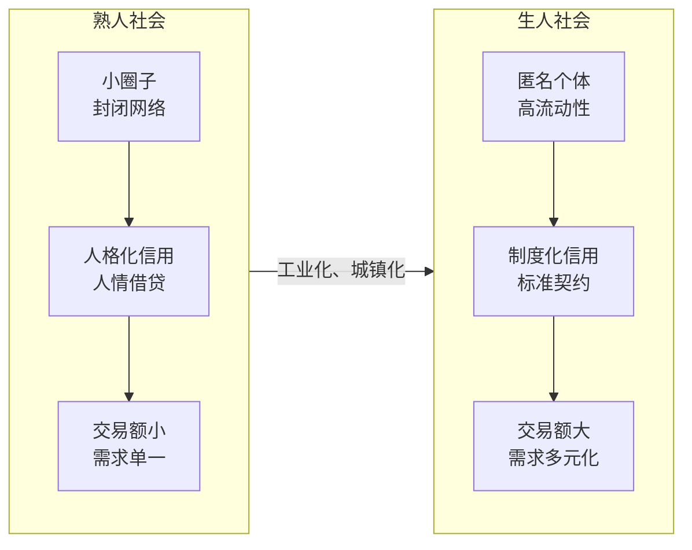
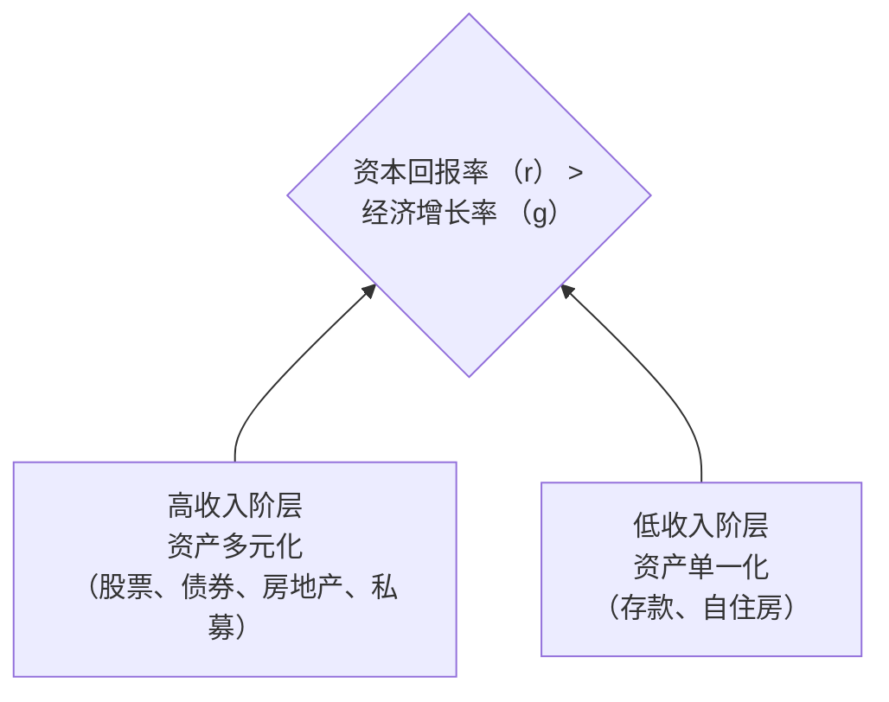
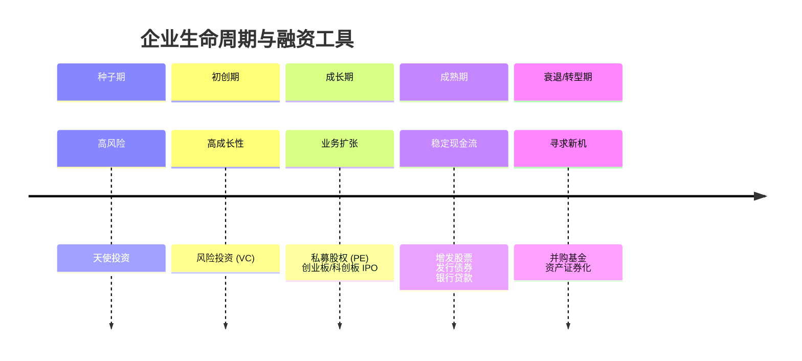
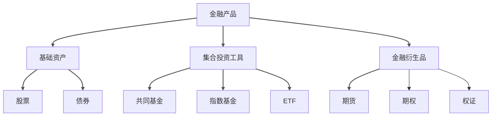
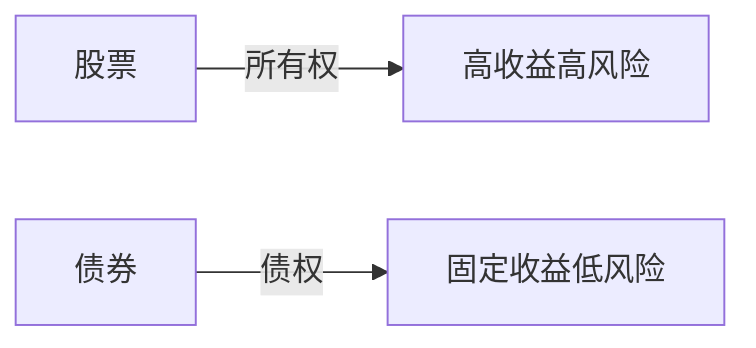
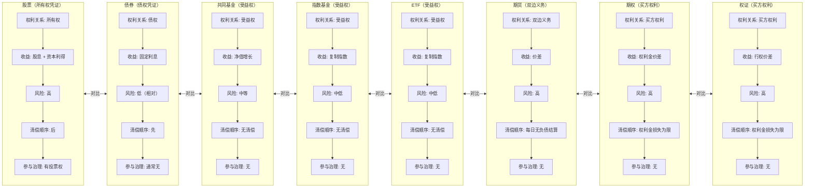

# 金融产品的多维透视：从宏观历史到社会需求的深度解析

## 1. 金融产品演进的宏观逻辑与历史脉络

### 1.1 宏观视角：金融产品在现代经济体系中的核心功能

金融产品在现代经济体系中扮演着至关重要的角色，其功能远不止于简单的资金融通。它们构成了经济运行的“血液系统”，通过多种机制深刻地影响着资源配置、风险管理、价格发现以及宏观经济政策的传导效率。

#### 1.1.1 资源配置与资本形成

金融产品在资源配置与资本形成方面发挥着核心作用。通过股票、债券等直接融资工具，金融产品为企业和政府提供了从社会储蓄中获取长期资本的渠道。这一过程，即 **“金融脱媒”** ，使得资金能够绕过传统的银行中介，直接从资金盈余方（如居民）流向资金需求方（如企业），从而提高了资本配置的效率和市场化程度 。一个发达的资本市场能够识别并引导资金流向最具增长潜力的行业和企业，例如，通过设立**科创板**，资本市场能够更有效地支持科技创新型企业，推动经济结构的转型升级 。这种市场化的资源配置机制，相较于行政指令，更能适应复杂多变的经济环境，促进经济的长期健康发展。

#### 1.1.2 风险分散与管理

金融产品在风险分散与管理方面发挥着不可替代的作用。衍生品市场，如期货和期权，为企业和投资者提供了对冲风险的工具。例如，一家出口企业可以通过外汇期货合约锁定未来的汇率，从而规避汇率波动带来的不确定性 。同样，大宗商品生产商和消费者可以利用商品期货来对冲价格波动的风险。这种风险转移功能不仅保护了微观经济主体的利益，也增强了整个经济体系的稳定性。通过将风险转移给那些更愿意或更有能力承担风险的参与者，衍生品市场使得资源分配决策可以在不确定性较低的环境下进行，从而提高了经济运行的效率 。此外，资产证券化等金融创新通过将缺乏流动性的资产（如住房抵押贷款）打包成可交易的证券，不仅盘活了存量资产，也将信用风险分散给了更广泛的投资者，尽管这一过程在2008年金融危机中也暴露了其潜在的系统性风险 。

#### 1.1.3 价格发现与信息传递

金融产品是价格发现和信息传递的核心载体。金融市场通过汇集大量参与者的买卖行为，形成了能够反映资产内在价值和市场预期的价格。例如，股票价格的波动不仅反映了公司的经营状况，也包含了投资者对未来宏观经济、行业前景和公司治理的预期。期货市场的价格则反映了市场对未来商品或金融资产供需关系的判断，为生产者和消费者提供了重要的决策参考 。这种价格发现机制是市场经济有效运行的基础。一个信息效率高、价格发现功能健全的金融市场，能够引导资源流向最有效率的地方，并为宏观经济政策的制定提供重要的市场信号。例如，国债收益率曲线的形状可以为货币当局判断市场对未来利率和通胀的预期提供依据。

#### 1.1.4 宏观经济政策的传导渠道

金融产品是宏观经济政策传导至实体经济的关键渠道。中央银行通过货币政策工具（如调整基准利率、公开市场操作）影响金融市场上的资金成本和流动性，进而通过信贷、股票、债券等渠道传导至企业和居民，最终影响投资、消费和总产出。例如，当央行降低利率时，企业发债融资成本下降，可能会刺激其扩大投资；同时，低利率环境也可能推高股票等风险资产的价格，通过财富效应刺激居民消费。因此，金融市场的健康发展和金融产品的有效运作，直接关系到宏观经济政策的传导效率和最终效果。一个结构合理、功能完善的金融市场体系，能够确保宏观政策的意图被准确、高效地传递到实体经济的各个层面，从而实现稳增长、调结构、防风险的政策目标 。

### 1.2 历史演变：从古代契约到现代金融工程

金融产品的历史演变是一部人类为应对经济不确定性、追求资本增值而不断创新的史诗。其源头可追溯至古代文明，早期的金融工具以简单的借贷契约和汇票形式出现，旨在解决跨地区贸易中的支付和信用问题。例如，在13至14世纪的欧洲，商人之间就已签订远期羊毛购买合同，而17世纪日本的商人则开始买卖未来交割的大米 。这些早期的实践虽然原始，但已经蕴含了现代金融衍生品的核心思想——通过合约锁定未来的交易条件，以规避价格波动风险。这些工具的出现，标志着人类开始尝试用制度化的方式管理经济活动中的不确定性，为后来复杂金融体系的诞生奠定了基础。

工业革命的到来，极大地推动了金融产品的演进。随着工厂制度的建立和大规模生产的兴起，企业对长期资本的需求急剧增加，传统的个人合伙或家族企业模式已无法满足工业化生产的资金需求。这催生了现代意义上的股票和债券市场。**1602年成立的荷兰东印度公司**被认为是第一家发行股票的公司，它通过向公众募集资金，为远洋贸易提供了雄厚的资本支持。股票作为一种所有权凭证，使得普通民众能够参与到大型商业冒险中，分享企业成长的收益，同时也承担了相应的风险。债券则作为一种债权凭证，为政府和企业提供了另一种重要的融资方式。19世纪，随着铁路等基础设施建设的浪潮，债券市场得到了空前的发展。股票和债券的出现，不仅解决了工业化的资本瓶颈，也催生了现代证券交易所的诞生，如**1792年成立的纽约证券交易所**，为证券的集中交易和流通提供了制度化的平台 。

20世纪是金融创新空前活跃的时期，两次世界大战、经济大萧条以及布雷顿森林体系的崩溃等宏观事件，深刻地改变了全球经济金融格局，也催生了大量新型金融产品。20世纪70年代，随着固定汇率制度的瓦解和利率市场化的推进，汇率和利率的剧烈波动给企业和金融机构带来了巨大的风险。为了对冲这些风险，金融衍生品市场应运而生。**1972年，芝加哥商品交易所（CME）推出了全球首个外汇期货合约**，标志着金融期货的诞生 。随后，利率期货、股票指数期货以及各种期权产品相继问世。这些衍生品工具通过标准化的合约，为市场参与者提供了高效、低成本的风险管理手段。与此同时，资产证券化技术也开始兴起，特别是20世纪80年代以后，以住房抵押贷款支持证券（MBS）为代表的证券化产品迅速发展，极大地提高了金融资产的流动性，但也为2008年的全球金融危机埋下了伏笔 。

进入21世纪，全球化和金融深化成为金融产品发展的主要趋势。金融市场的全球化使得资本可以在全球范围内自由流动，跨国投资和融资活动日益频繁。金融产品的种类和结构也变得更加复杂和多样化，以满足不同投资者和融资者的个性化需求。例如，结构化产品通过将不同风险收益特征的资产进行组合和分层，创造出具有特定风险回报模式的新型证券 。**交易所交易基金（ETF）的兴起**，则为投资者提供了一种低成本、高流动性的指数化投资工具 。近年来，随着大数据、人工智能和区块链等金融科技的发展，金融产品创新进入了新的阶段。智能投顾、数字货币、P2P借贷等新型金融服务模式不断涌现，正在深刻地改变着传统金融业的生态。然而，金融产品的复杂化也带来了新的风险，如信息不对称加剧、系统性风险累积等，对金融监管提出了更高的要求。

### 1.3 制度变迁：金融创新与监管博弈

金融产品的演进并非一个纯粹的技术或市场过程，它始终与制度变迁紧密交织，呈现出市场需求、政府干预和监管规避三者之间复杂的互动关系。制度变迁理论将这一过程分为 **“诱致性制度变迁”** 和 **“强制性制度变迁”** 两种主要类型 。诱致性制度变迁是指由市场参与者自发倡导、组织和实行的制度变革，其根本动因在于现有制度安排下，市场主体无法获得潜在的经济利益，从而产生了改变现有规则的内在需求。这种变迁是自下而上的，通常表现为金融产品的创新。例如，20世纪70年代，面对利率和汇率的剧烈波动，市场自发地创造了可变利率抵押贷款、金融期货和期权等新型工具，以满足规避风险的迫切需求 。同样，计算机和通讯技术的进步，极大地降低了金融交易的成本，催生了银行卡、证券化等一系列金融创新，这些都是典型的由供给条件变化驱动的诱致性制度变迁 。

与诱致性制度变迁相对应的是强制性制度变迁，它指的是由政府通过命令或法律强制推行的制度变革，其发生与否并不完全取决于市场主体的意愿 。在中国，金融体系的建立和发展在很大程度上体现了强制性制度变迁的特征。改革开放初期，政府通过设立“工农中建”四大国有银行，并逐步建立分业经营、分业监管的金融格局，构建了现代金融体系的基本框架 。金融产品的引入和发展也遵循了这一路径，从最初的股票、债券，到后来的基金、银行理财产品、信托产品等，都是在政府主导下逐步开放和规范的。这种自上而下的制度安排，有助于在较短时间内建立起一个相对完整的金融市场体系，但也可能存在与市场实际需求脱节、效率不高等问题。

在金融创新的过程中，规避现有监管法规是一个重要的驱动力，这通常被称为 **“监管套利”** 。当现有的金融管制（如利率管制、业务范围限制）阻碍了金融机构的盈利空间时，它们便有强烈的动机通过产品创新来绕过这些限制 。一个经典的案例是20世纪60至80年代的美国。当时，Q条例对银行存款利率设定了上限，为了吸引资金，金融机构创造了大额可转让定期存单（CDs）、货币市场共同基金（MMMFs）等产品，这些产品不受利率上限的约束，从而成功地从传统银行体系中吸引了大量存款 。同样，为了规避准备金要求和跨州经营的限制，欧洲美元市场和金融控股公司也应运而生 。这种规避监管的创新，一方面推动了金融市场的深化和效率提升，但另一方面也可能削弱监管的有效性，积累新的金融风险，甚至引发金融危机。

近年来，**技术驱动的制度变革**成为金融创新的新引擎。以大数据、人工智能、区块链为代表的金融科技（FinTech），正在从根本上改变金融服务的供给方式和金融产品的形态 。例如，移动支付和数字钱包的普及，使得金融服务能够覆盖到传统银行难以触及的偏远地区和低收入人群，极大地推动了普惠金融的发展 。智能投顾利用算法为投资者提供个性化的资产配置建议，降低了专业理财服务的门槛。而区块链技术则有望通过去中心化的方式，重塑支付清算、资产登记和交易等金融基础设施。这些技术驱动的创新，不仅提高了金融服务的效率和可及性，也对现有的金融监管框架构成了挑战。如何在鼓励创新的同时，有效防范新技术带来的风险（如数据隐私、网络安全、算法歧视等），成为各国监管机构面临的共同课题。

## 2. 社会变迁与金融产品的互动关系

### 2.1 社会结构转型：从熟人社会到生人社会的金融需求演变

社会结构的深刻转型，特别是从传统的“熟人社会”向现代的“生人社会”的演进，是驱动金融需求和行为模式变迁的根本力量。在传统的农村熟人社会中，经济活动主要围绕基本生产生活展开，交易金额小，社会关系网络封闭且稳定。在这种环境下，金融需求主要通过非正规的、基于人情和地缘关系的渠道来满足，例如亲戚、朋友之间的无息或低息借贷 。这种“人格化信用”的交易模式，信息对称程度高，交易成本低，但其规模和范围受到熟人圈子大小的严格限制，难以满足大额化、多样化的现代经济需求。随着工业化和城镇化的推进，大量农村人口涌入城市，社会流动性加剧，传统的熟人社会结构逐渐解体，取而代之的是以契约和制度为基础的“生人社会” 。

在生人社会中，经济活动的主体是匿名的、流动的个体和组织，传统的基于人际信任的借贷模式难以为继。这催生了对制度化、契约化金融服务的巨大需求。金融机构，如银行、证券公司等，作为专业的信用中介，通过建立标准化的信用评估体系、风险评估模型和法律契约，解决了陌生人之间交易的信任问题。例如，在现代商业银行的信贷业务中，贷款的发放不再依赖于借贷双方的个人关系，而是基于对借款人信用记录、还款能力和抵押物的客观评估。这种“间接信任”模式，虽然增加了信息搜集和合约执行的成本，但极大地扩展了金融服务的覆盖范围和交易规模，能够满足现代经济中大额、长期的资金需求 。这种转变也体现在农村金融的演变中，随着农户生产经营规模的扩大，其信贷需求也日益大额化，传统的亲友借贷已无法满足其扩大再生产的需要，从而转向寻求正规金融机构的支持 。

城镇化与人口流动进一步加剧了对金融服务可及性的挑战。在特大型城市中，庞大的人口规模和高度动态的社会结构，使得金融服务的需求呈现出前所未有的复杂性和多样性。一方面，大量新市民（如进城务工人员）需要基础的金融服务，如工资发放、汇款、小额信贷等；另一方面，城市中产阶级则需要更为复杂的财富管理、投资咨询和风险管理服务。为了满足这些多元化的需求，金融机构必须不断创新服务模式，利用数字技术降低服务成本，提高服务效率。例如，通过手机银行、网上银行等电子渠道，金融机构可以突破物理网点的限制，为偏远地区和流动人口提供便捷的金融服务 。同时，针对新市民在安居、创业、医疗等方面的特定需求，金融机构也推出了定制化的金融产品和服务体系 。这种从满足基本金融需求到提供全方位、个性化金融解决方案的转变，正是社会结构变迁对金融业提出的必然要求。

### 2.2 金融化对社会文化观念的渗透

随着金融市场的不断发展和金融产品的日益普及，金融化的浪潮已经超越了纯粹的经济领域，深刻地渗透到社会文化观念之中，重塑着人们的价值观、行为方式和日常生活。一个显著的变化是投资理念的普及和“财富管理”文化的兴起。自20世纪90年代以来，特别是在《富爸爸穷爸爸》等理财书籍的推动下，“让钱为你工作”的观念开始深入人心 。人们不再仅仅满足于将闲置资金存入银行获取微薄的利息，而是越来越积极地寻求通过股票、基金、房地产等多种投资渠道实现财富的保值增值。这种转变的背后，是居民财富水平的稳步攀升和对未来生活（如养老、子女教育）的财务规划需求。金融机构也顺势而为，大力推广财富管理业务，从过去以产品销售为导向的“卖方模式”，转向以客户为中心的“买方投顾”模式，为投资者提供专业的资产配置建议 。

金融化的影响还体现在金融术语对日常生活的渗透上。如今，人们习惯于用“投资回报率”、“杠杆”、“风险敞口”等金融概念来思考和规划自己的生活。例如，在选择职业时，人们会考虑其“人力资本”的投资回报；在消费决策中，会权衡“机会成本”；甚至在人际关系中，也可能出现“情感投资”的说法。这种“金融逻辑”的泛化，使得人们的行为更加理性化和策略化，但也可能导致人际关系的工具化和功利化。此外，消费信贷文化的兴起也是金融化影响社会观念的重要体现。信用卡、消费贷、分期付款等金融产品的普及，极大地改变了人们的消费习惯和储蓄观念。传统的“量入为出”的节俭观念受到挑战，“超前消费”、“信用消费”成为新的生活方式，这在刺激经济增长的同时，也可能导致个人和家庭债务水平的上升，埋下金融风险的隐患 。

金融化对社会文化观念的渗透，还引发了关于社会公平和伦理的深刻讨论。当金融逻辑主导了社会生活的方方面面，那些无法有效参与金融市场、缺乏金融知识和资源的群体，可能会在社会竞争中处于更加不利的地位，从而加剧社会不平等。例如，一些金融产品如“恋爱保险”、“教育保险”等，将原本属于情感和家庭领域的亲密关系也纳入了金融化的范畴，引发了关于其是否物化了人类情感的伦理争议 。同时，金融市场的波动和危机，如2008年的国际金融危机，也对社会文化产生了巨大冲击，催生了“占领华尔街”等社会运动，反映了公众对金融资本过度逐利、加剧社会不公的强烈不满 。这些现象表明，金融化对社会文化的影响是复杂且双重的，它既带来了效率的提升和观念的更新，也伴随着新的社会问题和价值冲突。

### 2.3 金融化与社会不平等

金融化，即金融部门在经济中地位和影响力的不断上升，对社会不平等产生了深远且复杂的影响。其中一个核心机制是金融资产的持有不均与财富差距的扩大。在金融化时代，财富的增长越来越依赖于金融资产的增值，而非传统的劳动收入。然而，不同社会阶层在金融资产的持有量和结构上存在巨大差异。高收入群体通常拥有更多元化的资产组合，包括股票、债券、房地产和各类复杂的金融产品，他们能够从金融市场的上涨中获得丰厚的资本利得。相比之下，低收入群体的资产结构则相对单一，主要以银行存款和房产为主，其财富增长的速度远不及高收入群体 。这种差异导致财富不平等状况持续恶化。法国经济学家托马斯·皮凯蒂在其著作《21世纪资本论》中指出，资本的回报率长期高于经济增长率，这是导致财富集中的根本原因，而金融化无疑加速了这一进程 。

金融化还通过影响收入分配，加剧了社会分层。首先，金融部门本身的高薪酬是加剧不平等的重要因素。随着金融业的扩张，金融从业人员，特别是高级管理人员和交易员，在社会收入分配中占据了越来越大的份额，其收入水平远高于其他行业的同等职位 。其次，金融市场的发展推动了公司高管薪酬体系的变革，股票期权、股权激励等金融工具被广泛应用，使得高管的收入与公司的股价表现紧密挂钩。这种薪酬结构虽然旨在激励管理层为股东创造价值，但也可能导致高管过度关注短期股价波动，甚至通过财务造假等手段操纵股价，从而获取巨额个人收益，进一步拉大了与普通员工的收入差距 。此外，金融化还影响了不同行业之间的工资水平。那些与金融市场联系紧密的行业（如科技、咨询）往往能够提供更高的薪酬，而传统制造业的工资增长则相对缓慢。

金融危机的发生，往往以一种极端的方式揭示了金融化对社会不平等的加剧作用。在2008年的国际金融危机中，底层家庭由于资产结构单一，且大量参与了次级贷款等高风险金融产品，当房地产泡沫破裂时，他们不仅失去了房产，还背负了沉重的债务，财富大幅缩水。而富裕阶层虽然也遭受了损失，但他们多元化的资产组合使其能够更快地恢复元气，甚至在危机后的市场复苏中获利。这种差异化的冲击，使得危机后的财富不平等状况进一步加剧 。此外，金融化还可能通过影响地方政府的财政决策，加剧区域发展的不平衡。例如，地方政府可能过度依赖土地出让和房地产开发来获取财政收入，这种“土地金融”模式在推高房价的同时，也使得地方经济与金融市场的波动紧密相连，一旦市场下行，地方财政将面临巨大压力，公共服务的提供也会受到影响，最终损害普通民众的利益 。

### 2.4 金融与科技创新的共生关系

金融与科技创新之间存在着一种深刻的共生关系，二者相互促进，共同塑造着现代经济的面貌。一方面，金融资本是科技创新不可或缺的“燃料”。从基础研究到商业化应用，科技创新的每一个环节都需要大量的资金投入，而金融市场正是为这些高风险、高投入的活动提供资金支持的主要渠道。特别是对于初创型科技企业，它们往往缺乏稳定的现金流和足够的抵押物，难以从传统银行获得贷款。此时，风险投资（VC）和私募股权（PE）等金融工具就发挥了关键作用。这些投资机构通过专业的尽职调查，筛选出具有高增长潜力的科技项目，并为其提供早期发展所需的资金、管理和市场资源。一个成熟的、多层次的资本市场，能够为科技创新企业提供从种子期、初创期到成长期、成熟期全生命周期的融资支持，形成“股债联动”的多层次融资体系，从而加速科技成果的转化和产业化进程 。

另一方面，科技创新也为金融创新提供了强大的技术支撑和广阔的应用场景。信息技术的发展，特别是互联网、大数据、人工智能和区块链技术的兴起，正在深刻地改变金融服务的供给方式和金融产品的形态。例如，大数据分析技术使得金融机构能够更精准地评估借款人的信用风险，从而为中小企业和个人提供更便捷、更低成本的信贷服务，这在一定程度上缓解了传统金融体系中的“融资难、融资贵”问题 。人工智能技术在智能投顾、量化交易、风险监控等领域的应用，极大地提高了金融服务的效率和智能化水平 。区块链技术则以其去中心化、不可篡改的特性，为构建更加安全、透明、高效的金融基础设施（如跨境支付、数字身份认证、供应链金融等）提供了新的可能性。这种“金融科技化”的趋势，不仅催生了新的金融业态，也迫使传统金融机构加快数字化转型的步伐。

然而，金融与科技创新的共生关系并非总是和谐的。金融资本的逐利本性也可能对科技创新产生负面影响。金融投资者往往追求短期、高额的回报，这可能导致他们过度关注那些能够快速商业化的“风口”项目，而忽视那些需要长期、持续投入的基础研究和“卡脖子”技术。这种“短期主义”倾向，可能会扭曲科技创新的方向，使得企业更倾向于进行应用层面的“微创新”，而非颠覆性的原始创新 。此外，在资本市场上，一些创业者和高管可能更擅长“讲故事”来吸引投资，而非踏踏实实地进行技术研发，这不仅可能导致投资泡沫，也会对真正的科技创新造成损害 。因此，如何构建一个既能有效动员金融资源支持科技创新，又能抑制金融投机和短期主义倾向的制度环境，是政策制定者和市场参与者需要共同面对的挑战。

## 3. 大众与资本需求：金融产品创新的根本动力

### 3.1 大众需求：个人投资者的理财目标与行为演变

大众投资者的需求是金融产品创新最根本、最持久的动力源泉。随着社会经济的发展和居民财富水平的提升，个人投资者的理财目标和行为模式也经历了深刻的演变。最初，大众对金融产品的需求主要集中在保值增值上，其核心目标是跑赢通货膨胀，实现财富的稳健增长。在金融市场发展初期，投资渠道相对匮乏，银行存款和国债是主要的选择 。然而，随着市场化改革的深入和资本市场的建立，股票、基金等新的投资产品相继涌现，为大众提供了更多元化的选择。特别是《富爸爸穷爸爸》等理财观念的普及，激发了大众“让钱生钱”的投资热情，越来越多的人开始将资金从储蓄转向投资，寻求更高的回报 。

随着投资经验的积累和市场环境的变化，大众投资者的需求也从单一的保值增值，转向更为复杂的风险分散和资产配置。在经历了股市的剧烈波动后，投资者逐渐认识到“不要把所有鸡蛋放在一个篮子里”的重要性。这推动了对能够提供风险分散功能的金融产品的需求，如共同基金、指数基金和ETF等。这些产品通过集合投资、专业管理的方式，将资金分散投资于多种资产，有效降低了单一资产波动带来的风险 。特别是指数基金和ETF，以其低成本、高透明度的特点，满足了大众投资者获取市场平均收益、降低交易成本的需求，成为近年来发展最快的投资工具之一 。此外，随着人口老龄化趋势的加剧，养老金融成为大众需求的新焦点。个人养老金制度的推出，将公募基金等权益类产品纳入投资范围，旨在通过长期投资和专业管理，为居民的退休生活提供保障，这进一步推动了金融产品向长期化、稳健化的方向发展 。

除了收益和风险，大众投资者对金融产品的流动性和便利性也提出了越来越高的要求。在快节奏的现代生活中，投资者希望能够随时随地、方便快捷地进行交易和查询。这催生了互联网金融和移动金融的快速发展。通过手机App，投资者可以轻松完成开户、交易、转账、查询等一系列操作，极大地提升了投资体验。同时，对交易成本的敏感性也促使金融机构不断降低费率。例如，许多指数基金和ETF的管理费率远低于主动管理型基金，而互联网金融平台的出现，也进一步降低了基金申购、赎回的费用。此外，普惠金融理念的兴起，也要求金融产品能够覆盖更广泛的人群，特别是那些传统金融体系服务不足的弱势群体，如农民、小微企业主和城镇低收入人群。通过发展小额信贷、移动支付、数字普惠金融等创新产品和服务，金融机构正在努力满足这些群体的基础金融服务需求，促进社会的公平与和谐 。

### 3.2 资本需求：企业与机构的融资与风险管理

企业和各类机构作为经济活动的主要参与者，其对资本和风险管理的需求是金融产品创新的另一大驱动力。企业在不同的发展阶段，面临着截然不同的融资需求。初创期的企业，通常具有高风险、高成长性的特点，其融资需求主要通过天使投资、风险投资（VC）等股权融资方式满足。这些投资者不仅提供资金，还带来行业资源和管理经验，帮助企业度过最脆弱的早期阶段。随着企业进入成长期和成熟期，其融资需求也趋于多样化。除了继续寻求股权融资外，企业还可以通过发行债券、申请银行贷款、资产证券化等方式获取资金，以支持业务扩张、技术改造和并购重组等活动。一个多层次、多元化的资本市场，能够为不同行业、不同规模、不同发展阶段的企业提供量身定制的融资解决方案，从而有效支持实体经济的发展 。

除了融资需求，企业和机构对风险管理的需求也日益精细化。在全球化和市场化的背景下，企业面临着来自利率、汇率、商品价格、股票价格等多方面的市场风险。为了对冲这些风险，金融衍生品市场应运而生。例如，一家航空公司可以通过购买燃油期货合约，来锁定未来的燃油成本，从而规避油价上涨的风险。一家出口企业可以通过外汇远期合约，来规避汇率波动对其利润的影响。这些衍生品工具，如期货、期权、互换等，为企业和机构提供了灵活、高效的风险管理手段，使其能够专注于自身的核心业务，而不必过度担忧外部市场环境的剧烈波动 。近年来，随着ESG（环境、社会和治理）理念的兴起，绿色金融和可持续金融产品也应运而生，满足了企业在履行社会责任、实现可持续发展方面的融资和风险管理需求 。

机构投资者，如养老金、保险公司、共同基金等，作为资本市场的重要参与者，其对长期、稳定收益的需求也推动了金融产品的创新。这些机构通常管理着巨额资金，其投资决策具有长期性和战略性的特点。它们需要能够匹配其长期负债、提供稳定现金流的金融产品。例如，长期国债、高等级公司债、基础设施REITs等产品，因其收益稳定、风险较低，深受机构投资者的青睐。同时，机构投资者也是推动指数化投资和ETF发展的重要力量。由于其资金规模大，通过投资指数基金和ETF，可以以较低的成本快速实现资产配置，并获得与市场基准相当的回报。此外，机构投资者对另类投资（如私募股权、对冲基金、大宗商品等）的需求也在不断增长，这推动了相关金融产品和服务的创新，进一步丰富了资本市场的产品供给。

最后，投机与套利需求也是金融产品创新不可忽视的动力。虽然投机行为常常带有负面色彩，但适度的投机活动对于维持市场的流动性和价格发现功能至关重要。投机者通过承担套期保值者转移的风险，为市场提供了必要的流动性，使得风险管理工具能够有效地发挥作用。同时，套利者的存在，通过在不同市场、不同产品之间寻找并利用价格差异，有助于消除市场的无效性，使价格更快地回归其内在价值。为了满足投机和套利的需求，金融市场不断推出新的交易工具和产品，如杠杆ETF、反向ETF、各种复杂的衍生品合约等。这些产品的出现，一方面为投资者提供了更多样化的交易策略和获利机会，另一方面也对市场的监管和风险控制提出了更高的要求。

### 3.3 需求驱动的金融产品创新路径

金融产品的创新并非凭空产生，而是深深植根于市场需求的变化之中。其创新路径主要可以归结为三种模式：顺应需求变化、利用技术供给以及规避监管约束。

#### 3.3.1 顺应需求变化：利率市场化与可变利率产品

20世纪70年代，美国面临着高通胀和高利率的经济环境，但银行存款利率仍受到管制。为了应对存款流失的压力，金融机构推出了可变利率的存款单（CDs）和可变利率的抵押贷款等产品 。这些产品的利率可以随市场利率的变动而调整，既保护了存款人的利益，也降低了银行的利率风险。这一创新，正是金融机构顺应利率市场化趋势和客户需求变化的结果。在中国，随着利率市场化改革的推进，银行理财产品、货币市场基金等产品的兴起，也是为了满足居民在存款利率管制下对更高收益的追求。

#### 3.3.2 利用技术供给：计算机技术与银行卡、证券化

技术进步是金融产品创新的重要催化剂。20世纪70年代，计算机和现代通讯技术的发展，极大地降低了信息处理和交易成本，为金融创新提供了技术基础 。例如，银行卡的出现，使得支付变得更加便捷和安全，催生了信用卡、借记卡等一系列新产品。同样，资产证券化技术的成熟，也离不开计算机强大的数据处理和建模能力。金融机构能够更快速、更精确地计算复杂产品的定价和风险，从而设计出满足特定需求的金融产品。

#### 3.3.3 规避监管约束：利率管制与货币市场基金

规避监管的创新，或称“监管套利”，是金融创新与制度变迁博弈过程中的一个突出特征。20世纪70年代，美国金融机构为了规避Q条例对存款利率的上限管制，进行了一系列经典的监管套利创新。例如，**货币市场共同基金（MMMFs）** 的兴起，就是利用了它们不属于银行存款，因此不受Q条例和存款保险制度约束的特点，为投资者提供了更具吸引力的收益率 。这些创新产品，虽然在短期内为金融机构带来了竞争优势，但也对金融稳定构成了潜在威胁，最终促使监管机构不得不调整原有的制度框架。

## 4. 主要金融产品深度解析

### 4.1 基础资产：股票与债券

股票和债券是资本市场最基础、最核心的两类金融产品，它们分别代表了==所有权和债权==两种不同的权利关系，构成了现代金融体系的价值基石。从历史发展、社会功能到满足的需求，二者既有显著区别，又相互补充，共同支撑着实体经济的运行和资本市场的繁荣。

#### 4.1.1 股票：所有权凭证与公司治理

股票是股份有限公司发行的所有权凭证，是股份公司为筹集资金而发行给各个股东、作为持股凭证并借以取得股息和红利的一种==有价证券==。每股股票都代表股东对企业拥有一个基本单位的所有权。股票持有者即为公司的股东，有权分享公司的利润（通过股息和红利），并承担公司经营失败的风险。

##### 4.1.1.1 历史发展：从东印度公司到现代证券交易所

股票的起源可以追溯到16世纪的欧洲。**1553年，俄罗斯的一家股份公司发行了历史上第一只股票**，标志着现代股份制公司的诞生 。然而，股票真正作为一种成熟的金融工具，是在17世纪的荷兰。**1602年，荷兰东印度公司（VOC）的成立及其股票的公开发行**，是股票发展史上的一个里程碑。VOC通过发行股票，成功地从社会各阶层募集了大量资金，用于远洋贸易和殖民扩张。更重要的是，VOC的股票在阿姆斯特丹形成了一个活跃的二级市场，投资者可以自由买卖股票，这极大地提高了股票的流动性，吸引了更多的投资者参与 。**1611年，世界上第一个证券交易所——阿姆斯特丹证券交易所成立**，为股票的集中交易提供了制度化的平台 。此后，随着工业革命的推进，股份制公司成为企业组织的主要形式，股票市场也得到了飞速发展。19世纪，美国铁路、钢铁等行业的兴起，催生了纽约证券交易所的繁荣。20世纪以来，随着信息技术的发展和全球化的推进，股票市场的规模、深度和复杂性都达到了前所未有的水平。

##### 4.1.1.2 社会变迁中的角色：财富效应与社会情绪

股票市场不仅是经济的“晴雨表”，也深刻地影响着社会财富分配和公众情绪。股市的上涨，会通过 **“财富效应”** 刺激消费和投资，推动经济增长。当股市持续向好时，投资者的账面财富增加，消费意愿增强，从而带动相关产业的发展。反之，股市的下跌则会抑制消费和投资，甚至引发经济衰退。此外，股市的波动也与社会情绪密切相关。牛市往往伴随着乐观、自信的社会氛围，而熊市则容易引发悲观、焦虑的情绪。社交媒体的出现，进一步放大了这种情绪效应。例如，**2021年美国散户通过Reddit论坛集体做多游戏驿站（GameStop）股票**，对抗华尔街空头，这一事件不仅引发了股价的剧烈波动，也反映了普通民众对金融精英阶层的不满情绪，成为社会矛盾在金融领域的一次集中爆发 。

##### 4.1.1.3 满足的需求：企业融资与大众参与经济增长

股票最核心的功能是满足企业的融资需求。通过发行股票，企业可以在不增加债务负担的情况下，获得长期、稳定的资本，用于扩大再生产、技术研发和市场开拓。这种直接融资方式，相比于银行贷款等间接融资，具有融资规模大、资金使用灵活、无需偿还本金等优点，特别适合于高成长、高风险、高投入的科技创新型企业。对于投资者而言，股票提供了一种分享企业成长和经济发展成果的渠道。通过购买股票，普通民众可以成为上市公司的股东，享受股息分红和股价上涨带来的资本利得，从而实现财富的保值增值。

#### 4.1.2 债券：债权凭证与固定收益

债券是政府、金融机构、工商企业等机构直接向社会借债筹措资金时，向投资者发行，并且承诺按一定利率支付利息并按约定条件偿还本金的债权债务凭证。债券的本质是债的证明书，具有法律效力。债券购买者与发行者之间是一种债权债务关系，债券发行人即债务人，投资者（或债券持有人）即债权人。

##### 4.1.2.1 历史发展：政府战争融资到企业债市场

债券的历史与国家的财政需求和战争融资紧密相连，其演变轨迹清晰地勾勒出从政府主导到市场多元化的发展路径。早在中世纪，意大利城邦国家如威尼斯、佛罗伦萨等，为了筹集战争经费，就开始向市民发行强制性公债，这可以被视为现代国债的雏形。然而，真正意义上的现代债券市场则形成于17世纪的欧洲。当时，荷兰和英国为了争夺海上霸权，频繁发动战争，巨大的军费开支使得政府不得不大规模举债。**1694年，为了支持对法战争，英国政府批准成立了英格兰银行**，该行通过发行股票和债券筹集资金，并向政府提供贷款，这标志着现代中央银行和国债市场的诞生 。这种以国家信用为背书的融资方式，因其相对较高的安全性和稳定的利息收入，迅速获得了商人和富裕阶层的青睐，为政府提供了一条重要的资金来源渠道。

进入19世纪，随着工业革命的深入和股份有限公司的普及，企业也开始利用债券进行融资。与股票不同，债券是一种债权凭证，投资者购买债券相当于向发行方（政府或企业）提供贷款，发行方承诺在约定的期限内支付固定的利息，并在到期时偿还本金。这种“固定收益”的特性，使得债券成为风险厌恶型投资者的重要选择。在美国，19世纪后期，铁路公司为了铺设横跨大陆的铁路网，发行了巨额的公司债券，吸引了大量国内外资本，极大地推动了美国工业化的进程 。20世纪以来，债券市场在全球范围内得到了长足发展，品种日益丰富，除了传统的国债和公司债，还出现了地方政府债、金融债、资产支持证券等多种类型。特别是20世纪70年代以后，随着利率市场化的推进和金融创新的加速，浮动利率债券、可转换债券等新品种不断涌现，满足了不同投资者和融资者的多样化需求，债券市场也由此成为全球金融体系中体量最大、流动性最强的市场之一 。

##### 4.1.2.2 社会变迁中的角色：利率市场化与信用体系

债券市场的发展与社会经济制度的变迁，特别是利率市场化和信用体系的建立，存在着深刻的互动关系。在利率管制的时代，债券的发行利率受到严格限制，无法真实反映市场资金的供求关系，这在一定程度上抑制了债券市场的发展。随着20世纪70年代以来全球范围内利率市场化改革的推进，债券的定价机制逐渐由市场决定，利率水平能够更灵敏地反映宏观经济状况、通货膨胀预期和发行主体的信用风险。这一变革极大地激发了债券市场的活力，使得债券的发行和交易更加市场化、高效化 。例如，在中国，2000年以后，随着利率市场化进程的加快，债券市场才真正步入快速发展的轨道，市场规模迅速扩大，产品种类日益丰富 。

与此同时，一个健全的信用体系是债券市场健康发展的基石。债券的本质是基于信用的借贷关系，投资者购买债券的前提是相信发行方有能力并愿意按时还本付息。因此，一个客观、公正的信用评级体系对于降低信息不对称、揭示信用风险至关重要。在成熟的债券市场中，专业的信用评级机构（如穆迪、标普、惠誉）会对债券发行主体进行信用评级，评级结果直接影响债券的发行利率和市场接受度。社会信用文化的普及和法律制度的完善，也为债券市场的运行提供了保障。例如，对违约行为的惩戒机制、破产清算程序的规范等，都有助于增强投资者信心，维护市场秩序。在中国，随着市场经济的发展，社会信用体系建设被提上日程，征信系统的完善和“失信惩戒”机制的建立，为债券市场的深化发展创造了有利条件。近年来，中国债券市场也出现了一些违约事件，这在一定程度上是市场走向成熟、打破“刚性兑付”的必然过程，有助于培育市场化的风险定价意识和信用文化。

##### 4.1.2.3 满足的需求：政府与企业的低成本融资

债券市场的核心功能在于为政府和企业提供了一条低成本、高效率的直接融资渠道。对于政府而言，发行国债是弥补财政赤字、进行宏观调控和实施重大公共项目（如基础设施建设）的重要手段。与向中央银行透支或增税相比，发行国债是一种更为市场化、对经济运行冲击更小的融资方式。通过向广大投资者（包括个人、机构、甚至外国政府）发行债券，政府能够以相对较低的成本筹集到巨额资金，用于支持经济发展和改善民生 。例如，在抗日战争时期，国民政府多次发行国防公债、救国公债，广泛动员了国内民众、港澳同胞和海外侨胞的资金，为抗战胜利提供了重要的财力支持 。

对于企业而言，债券融资是其资本结构中的重要组成部分。与股权融资相比，债券融资具有“财务杠杆”效应，即企业可以利用借入的资金扩大经营规模，如果投资回报率高于债券利率，就能为股东创造更高的收益。同时，债券的利息支出可以在税前扣除，具有“税盾”效应，这进一步降低了企业的融资成本。与银行信贷相比，发行债券通常能够筹集到更大规模、更长期限的资金，且资金使用更为灵活。特别是对于信用评级较高的大型企业，通过发行公司债、中期票据等工具，可以在资本市场上获得比银行贷款更低的融资成本。近年来，随着中国债券市场的不断发展和创新，中小企业也开始通过发行集合票据、私募债等方式进入债券市场，拓宽了融资渠道，降低了对银行信贷的过度依赖 。因此，债券市场通过连接资金盈余方和资金需求方，实现了社会资源的有效配置，满足了不同主体的融资和投资需求，是现代经济体系中不可或缺的一环。

### 4.2 集合投资工具：基金、指数基金与ETF

#### 4.2.1 共同基金：专业管理与风险分散

共同基金作为现代金融史上最具影响力的创新之一，其核心理念在于通过汇集众多投资者的资金，形成一个规模化的资产池，并由专业的投资管理人进行运作，从而实现风险分散和专业管理 。这一模式的出现，深刻地改变了普通民众参与资本市场的方式，使得即便是资金量有限、缺乏专业知识的投资者，也能够通过购买基金份额，间接投资于股票、债券等多种资产，分享经济增长的红利。共同基金的起源可以追溯到18世纪的荷兰，当时为了应对流动性危机，荷兰商人于1774年创建了最初的集合基金结构，旨在为小投资者提供一个多样化的投资渠道 。这种早期的投资信托形式，通过集合资金发挥规模效应，在增加投资回报的同时，有效降低了单一投资所带来的风险，为后来共同基金的发展奠定了基础。

进入19世纪，各类封闭式基金相继在欧洲和美国面世，成为当时流行的投资工具。然而，封闭式基金的份额在发行后数量固定，投资者若想买卖份额，只能在二级市场上进行交易，其价格受市场供求关系影响，常常出现折价或溢价，缺乏便利性，限制了投资者的增持或减持操作 。为了克服这一缺陷，**1924年，世界上第一只开放式共同基金——马萨诸塞投资者信托基金（Massachusetts Investors Trust）应运而生**。与封闭式基金不同，开放式基金的份额数量不固定，投资者可以随时向基金公司申购或赎回份额，价格以基金资产净值（NAV）为基础计算，极大地提高了投资的灵活性和便利性。这一创新迅速获得了投资者的青睐，并推动了开放式基金在全球范围内的普及和发展 。开放式基金的出现，标志着共同基金行业进入了一个新的发展阶段，其“自由增持和减持”的特点，使其能够更好地满足投资者对流动性的需求，也为后来基金产品的多样化发展铺平了道路。

共同基金的发展历程，也是一部与宏观经济环境、社会变迁和投资者需求紧密相连的历史。在美国，共同基金的发展大致可以分为三个阶段 。第一阶段是传统共同基金的发展期，以主动投资为主，基金经理的选股能力和市场判断成为基金业绩的关键，市场上主要以股票型和混合型基金为主。第二阶段是随着养老基金等机构投资者兴起，资产配置理念逐渐普及，买方投顾模式开始形成。第三阶段则是近年来逐步转向被动投资的趋势，指数基金和ETF等低费率产品受到市场追捧，投顾服务也日益智能化，基金公司开始从传统的基金管理向综合性的投顾服务转型 。这一演变过程，反映了市场有效性的提升、投资者认知的深化以及金融科技的推动作用。特别是在20世纪70年代，随着市场有效性的讨论和实证研究的深入，学者们发现大多数主动管理的共同基金难以长期战胜市场指数，这催生了指数基金的诞生，并推动了整个基金行业向低成本、高效率的方向发展 。

在中国，共同基金的发展历程同样具有鲜明的时代特征。**1998年3月，南方开元基金和国泰金泰基金的成立，标志着中国真正意义上的投资基金的诞生** 。在随后的二十多年里，伴随着中国经济的快速增长、居民财富的急剧增加以及资本市场的不断完善，公募基金行业实现了跨越式发展。基金规模从最初的40亿元增长到2020年9月底的17.80万亿元，产品种类日益丰富，从最初的封闭式基金，发展到开放式基金、债券基金、指数基金、ETF、QDII等多种类型，满足了不同风险偏好和投资目标的投资者需求 。公募基金已经成为中国资本市场最重要的机构投资者之一，通过汇集广大中小投资者的闲散资金，形成规模巨大的资本，投资于优秀的企业和企业家，有力地支持了科技创新和实体经济发展，促进了经济转型和资本市场的健康稳定 。同时，公募基金也日益成为社会公众实现财富长期保值增值的重要方式，投资者对基金的认知也从最初的陌生、半信半疑，转变为广泛认可和接受 。

##### 4.2.1.1 历史发展：从信托到现代基金业

共同基金（Mutual Fund）作为一种集合投资工具，其发展历程体现了金融市场从精英化走向大众化的重要趋势。其思想萌芽可以追溯到19世纪的欧洲，当时一些富裕家庭通过设立信托基金，将资产委托给专业人士进行管理。然而，现代意义上的共同基金诞生于20世纪20年代的美国。**1924年，马萨诸塞州投资者信托（Massachusetts Investors Trust）的成立，被认为是第一只面向公众发行的开放式共同基金**。它引入了“按净资产值（NAV）申购赎回”的机制，使得投资者可以随时加入或退出，极大地增强了基金的流动性。然而，1929年的股市大崩盘和随后的经济大萧条，使得基金业的发展一度陷入停滞。直到20世纪40年代，美国政府颁布了《1940年投资公司法》，对基金的运作、信息披露、治理结构等进行了严格规范，为基金业的健康发展奠定了法律基础，共同基金才开始进入稳步发展的轨道 。

二战后，随着美国经济的繁荣和居民财富的增长，共同基金迎来了黄金发展期。20世纪50至70年代，机构投资者（包括共同基金和养老基金）的力量迅速壮大，它们将大量长期资金注入股市，成为推动“成长年代”牛市的重要力量 。这一时期，基金的数量和规模都实现了快速增长，投资理念也从单纯的投机转向价值投资和长期投资。进入80年代以后，随着金融创新的加速，货币市场基金、债券基金、指数基金等新品种不断涌现，满足了投资者日益多样化的需求。特别是在中国，自1997年第一批规范的证券投资基金——开元基金和金泰基金成立以来，基金业经历了从无到有、从小到大的飞速发展 。截至2014年底，中国公募基金的数量已超过2700只，管理的资产规模突破4.5万亿元人民币，成为资本市场上一支举足轻重的力量 。

##### 4.2.1.2 社会变迁中的角色：理财观念普及与养老金体系

共同基金的发展与社会理财观念的变迁和养老金体系的建立密切相关，它扮演了金融知识普及者和财富管理工具提供者的双重角色。在传统社会，人们的财富主要以现金、存款和实物资产的形式存在，投资渠道单一，理财观念淡薄。共同基金的出现，以其“专家理财、分散风险”的特点，降低了普通民众参与资本市场的门槛。通过将众多投资者的资金汇集起来，由专业的基金经理进行投资管理，基金使得小额资金也能享受到专业的资产配置服务，从而分享到经济增长的成果。这种“普惠金融”的特性，极大地推动了现代理财观念在大众中的普及，使“投资”不再是少数富人的专利，而是成为普通家庭实现财富保值增值的重要手段。

与此同时，共同基金与养老金体系的结合，构成了现代社会保障体系的重要支柱。在许多发达国家，如美国，雇主发起的养老金计划（如401(k)计划）和个人退休账户（IRA）是居民退休储蓄的主要形式，而这些账户中的资金绝大部分都投资于共同基金 。这种制度安排，不仅为资本市场提供了长期、稳定的资金来源，也帮助普通民众通过长期投资，为退休生活积累了充足的财富。在中国，随着人口老龄化趋势的加剧和养老保障制度改革的深化，以企业年金、职业年金和个人养老金为代表的“第二、第三支柱”正在加快建设。公募基金凭借其专业的投资管理能力和丰富的产品线，成为养老金投资的重要载体。通过参与养老金投资，共同基金不仅服务于国家养老保障体系的建设，也进一步巩固了其在居民财富管理中的核心地位，深刻地影响着社会财富的积累和分配格局。

##### 4.2.1.3 满足的需求：大众投资者的“专家理财”需求

共同基金的核心价值在于满足了广大个人投资者在知识、时间和风险承受能力方面的多重需求。首先，对于大多数普通投资者而言，缺乏专业的金融知识和投资经验是参与资本市场的最大障碍。共同基金通过聘请专业的基金经理和研究团队，对宏观经济、行业趋势和上市公司进行深入分析，为投资者做出投资决策，这相当于为投资者提供了一种“专家理财”服务，弥补了他们在专业知识上的不足 。其次，现代生活节奏快，许多人没有足够的时间和精力去跟踪市场动态、研究个股。购买基金可以将这些繁琐的工作交给专业的基金管理人，投资者只需根据自己的风险偏好和投资目标选择合适的产品即可，极大地节省了时间和精力。

更重要的是，共同基金通过构建多元化的投资组合，有效地分散了投资风险。对于资金量较小的个人投资者而言，很难通过购买多只股票来分散风险，一旦某只股票出现“黑天鹅”事件，就可能遭受巨大损失。而基金将资金分散投资于数十甚至上百只不同的证券，单一证券的波动对整体组合的影响被大大降低，从而实现了风险的分散化 。此外，基金产品种类繁多，涵盖了从低风险的货币基金、债券基金，到高风险的股票基金、混合基金，以及投资于海外市场的QDII基金等，能够满足不同风险偏好和投资目标的投资者的需求 。因此，共同基金通过提供专业化管理、节省投资时间、分散投资风险以及提供多样化产品选择，精准地契合了大众投资者在财富管理方面的核心诉求。

#### 4.2.2 指数基金：被动投资与市场效率

指数基金的诞生，是金融理论与实践相结合的典范，它源于对市场有效性的深刻洞察和对主动管理型基金高成本的反思。20世纪70年代，在经历了市场的剧烈动荡后，一些学术研究对共同基金的历史表现进行了分析，结果令人大失所望：研究发现，**大约三分之二的主动管理型共同基金，其平均回报率未能击败市场基准指数** 。这一发现对传统基金行业构成了巨大挑战，也促使一些具有前瞻性的金融家开始思考一种全新的投资方式。**1975年，约翰·博格（John Bogle）受到这些研究报告的启发，决定将理论付诸实践，创建了世界上第一只面向个人投资者的指数基金——先锋500指数基金（Vanguard 500 Index Fund）** ，该基金旨在复制和跟踪标准普尔500指数（S&P 500）的表现 。博格的这一创举，不仅为投资者提供了一种低成本、高效率的投资工具，也开启了一场深刻影响全球资产管理行业的投资革命。

指数基金的核心理念是“被动投资”，即不试图通过主动选股或择时来战胜市场，而是通过复制特定市场指数的成分股和权重，来获取与该指数大致相同的收益率。这种策略的理论基础是市场有效性假说，即在信息充分流通的市场中，资产价格已经反映了所有可获得的信息，因此任何试图通过分析信息来获取超额收益的努力都是徒劳的。指数基金的出现，为普通投资者提供了一个简单、透明且成本低廉的方式来投资整个市场。投资者无需再费心挑选个股或评估基金经理的能力，只需购买一只指数基金，就能分享到整个市场的平均回报 。这种“无聊”的投资方式，最初并不被市场看好。1976年，先锋集团试图为“第一指数投资信托”募集1.5亿美元资金，但最终只募到了1130万美元，甚至不足以购买标普500指数中每只股票的100股 。然而，随着时间的推移，指数基金的优越性逐渐显现，其低费率、高透明度和稳定的业绩表现，吸引了越来越多的投资者。

指数基金的崛起，对传统的主动管理型基金构成了巨大的竞争压力。由于指数基金的管理费率远低于主动型基金，长期来看，费率的差异会累积成巨大的收益差距。根据美国共同基金行业协会的数据，主动管理股票型基金的平均费用率是指数型基金的12倍以上（0.64%对0.05%） 。这意味着，对于一笔1万美元的投资，主动型基金每年要收取64美元的费用，而指数基金只收取5美元。这种成本优势，使得指数基金在长期投资中更具吸引力。此外，随着市场有效性的不断提高，主动型基金想要持续战胜市场变得越来越困难，这也进一步推动了资金从主动型基金流向被动型基金。在过去几十年中，美国股票市场的投资者结构发生了显著变化，个人投资者的持股比例不断下降，而机构投资者的投资风格则由主动型向被动（指数）型转变 。到2012年，采用主动型投资策略的偏股型基金比例已经下降至83%，而主动型基金的管理费率也从1980年的2.3%下降至2012年的1.0% 。

##### 4.2.2.1 历史发展：从理论到实践的投资革命

指数基金的诞生与发展，是金融史上一次深刻的革命，其根源可追溯至20世纪30年代学术界对市场有效性的早期探讨。阿尔弗雷德·考尔斯三世（Alfred Cowles III）对数千条投资建议的分析显示，市场专家的表现与随机结果无异，这为后来的指数化投资理论奠定了基础 。然而，这一革命性的投资理念在初期并未得到广泛认可，甚至被视为异端。直到20世纪70年代，随着芝加哥大学证券价格研究中心（CRSP）对长期股市数据的分析，揭示了股市长期投资的巨大潜力，以及1974年熊市中大部分主动管理型基金未能跑赢标普500指数的残酷现实，机构投资者才开始重新审视其投资策略 。这一时期，以约翰·博格（John Bogle）为代表的先驱者，开始将指数化投资的理论付诸实践。**1976年，博格的先锋集团（Vanguard）推出了第一只面向公众的指数基金——先锋500指数基金（Vanguard 500 Index Fund）** ，尽管初期仅募集到1400万美元，且备受市场质疑，但这一事件标志着被动投资时代的开启 。

进入20世纪80年代，随着401(k)计划和个人退休账户（IRA）的普及，大量养老资金涌入资本市场，个人投资者对低成本、低风险的投资工具需求日益增长，指数基金开始逐渐被市场接受 。到了90年代，尤其是在科技股繁荣期间，主动管理型基金难以超越市场表现，而指数基金则稳定地追踪市场指数，吸引了大量投资者，实现了爆发式增长 。**1990年，世界上第一只ETF——多伦多35指数参与单位（TIPs 35）在多伦多证券交易所上市**，为指数基金的发展注入了新的活力 。**1993年，美国第一只ETF——标准普尔存托凭证（SPDRs，又称“蜘蛛”）诞生**，进一步推动了指数化投资的发展 。进入21世纪，指数基金继续保持强劲的增长势头，并随着智能投顾、ESG投资等趋势的兴起，不断创新和发展，以满足投资者日益多样化的需求 。如今，指数基金已成为全球投资者的重要选择之一，其发展历程充分体现了从学术理论到市场实践，再到深刻改变全球资本市场格局的完整路径。

##### 4.2.2.2 社会变迁中的角色：低成本投资理念的普及

指数基金的崛起，深刻地反映了社会变迁中大众投资理念的演变。在传统金融体系中，投资往往被视为少数精英的专利，普通民众由于缺乏专业知识和信息渠道，难以参与到资本市场中。指数基金的诞生，打破了这一壁垒，其核心理念——通过低成本、分散化的方式获取市场平均收益，极大地降低了投资的门槛，使得普通投资者也能分享到经济增长的红利。这一理念的普及，与全球范围内中产阶级的崛起、个人财富的增长以及养老保障体系从国家主导向个人责任转变的社会背景密切相关。特别是在美国，401(k)计划的推行，使得数以百万计的雇员需要为自己的退休生活进行投资决策，而指数基金凭借其简单、透明、低成本的特点，成为了这些“新手”投资者的理想选择 。

此外，指数基金的普及也反映了社会对金融机构和专业人士信任度的变化。在经历了多次市场泡沫和金融危机后，投资者逐渐认识到，即使是专业的基金经理，也很难持续战胜市场。指数基金的出现，恰恰迎合了这种对传统主动管理模式的反思和质疑 。它提供了一种“去中介化”的投资方式，让投资者可以直接投资于整个市场，从而避免了高昂的管理费用和潜在的“代理人”问题。这种投资理念的转变，不仅改变了个人投资者的资产配置行为，也对整个资产管理行业产生了深远的影响。基金公司为了应对指数基金的竞争压力，不得不降低管理费率，提高投资透明度，并推出更多创新的产品。可以说，指数基金的普及，不仅是一场投资工具的革命，更是一场深刻的社会文化变革，它推动了金融知识的普及，提升了大众的理财意识，并促进了资本市场的民主化进程。

##### 4.2.2.3 满足的需求：获取市场平均收益与降低交易成本

指数基金的核心价值在于其精准地满足了广大投资者对于获取市场平均收益和降低交易成本的双重需求。在传统的主动管理型基金中，基金经理试图通过精选个股和市场择时来战胜市场，但这种策略不仅成功率低，而且伴随着高昂的研究成本、交易费用和管理费。这些成本最终会侵蚀投资者的收益。指数基金则采取了一种截然不同的策略——被动跟踪市场指数。它不试图预测市场，而是通过复制指数的成分股和权重，力求实现与指数表现一致的回报。这种策略的优势在于，它避免了频繁交易带来的高昂成本，同时，由于不需要庞大的研究团队进行个股分析，其管理费用也远低于主动管理型基金 。

对于广大普通投资者而言，他们缺乏专业的投资知识和时间精力去研究市场，也难以承受主动投资带来的高风险。指数基金提供了一种简单、便捷、低成本的投资解决方案。投资者无需担心基金经理的投资决策失误，也无需为高昂的费用买单，只需选择一只跟踪广泛市场指数的基金，就能获得与市场同步的平均收益。这种“不求有功，但求无过”的投资哲学，恰恰符合了大多数稳健型投资者的需求。此外，指数基金的持仓高度透明，投资者可以清楚地知道自己的钱投向了哪里，这也在一定程度上增强了投资者的信心。随着市场的发展，指数基金的种类也日益丰富，从宽基指数到行业指数，从国内指数到国际指数，投资者可以根据自己的风险偏好和投资目标，构建多元化的投资组合，进一步分散风险。可以说，指数基金的出现，为广大投资者提供了一种高效、透明、低成本的参与资本市场的工具，极大地提升了投资的可及性和普惠性。

#### 4.2.3 ETF基金：交易便利与资产配置

交易型开放式指数基金（Exchange-Traded Fund, ETF）的诞生，是指数化投资与证券交易机制相结合的产物，它融合了共同基金的分散化投资优势和股票的灵活交易特性，为投资者提供了一种全新的资产配置工具。ETF的发展历程，与20世纪后期的金融市场变革密切相关。20世纪70年代，美国佣金制度的改革和401(k)计划的推出，共同推动了共同基金的繁荣发展，也为ETF的诞生创造了有利条件 。佣金自由化打破了投资顾问服务与交易执行服务的绑定关系，催生了以嘉信理财为代表的折扣经纪商，使得投资者可以更加自主地进行投资决策。同时，401(k)计划的普及，使得大量养老资金涌入资本市场，投资者对低成本、高透明度的投资工具产生了强烈需求 。在这样的背景下，ETF应运而生，其最初的设计目标就是为了满足投资者对指数化投资产品的交易需求。

**1993年，世界上第一只ETF——标准普尔存托凭证（SPDR S&P 500 ETF Trust, 简称SPY）在美国证券交易所上市**，它跟踪的是标准普尔500指数，允许投资者像买卖股票一样，在交易所内实时交易代表一篮子股票的基金份额 。这一创新彻底改变了指数化投资的格局。与传统的开放式指数基金相比，ETF具有诸多优势。首先，ETF的交易方式更加灵活，投资者可以在交易时间内随时买卖，价格实时变动，而开放式基金则只能在收盘后按当日净值进行申购赎回。其次，ETF的费率通常更低，因为其被动跟踪指数的管理成本较低。再次，ETF的透明度更高，其持仓组合每日公布，投资者可以清楚地知道自己投资的是什么。这些优势使得ETF迅速获得了市场的认可，并开启了其快速发展的历程。

ETF的发展，也得益于金融市场的不断深化和投资者需求的日益多样化。随着全球资本市场的融合，投资者对跨境资产配置的需求不断增加，跨境ETF应运而生，使得投资者可以便捷地投资于海外市场的优质资产 。同时，为了满足投资者对特定行业、主题或策略的投资需求，ETF的产品创新也在不断推进，出现了行业ETF、主题ETF、Smart Beta ETF、债券ETF、商品ETF等多种类型。这些创新产品，为投资者提供了更加精细化的投资工具，使得资产配置变得更加简单和高效。例如，多资产配置ETF可以提供“一站式”的解决方案，让投资者通过一只产品就能实现对多种资产类别的敞口 。此外，ETF期权的推出，也为投资者提供了更多的交易策略选择，增加了产品的复杂性和灵活性，提升了市场的流动性和投资体验 。

在中国，ETF市场虽然起步较晚，但发展迅速。近年来，随着资本市场改革的深化和机构投资者大类资产配置需求的增加，ETF凭借其高效运作和低费率的优势，吸引了越来越多的投资者，成为A股市场不可或缺的工具型产品 。截至2018年末，中国ETF产品数量达到186只，资产管理规模共计5076亿元 。而到了2024年，随着市场的进一步发展，ETF的规模和产品数量都实现了历史性突破。一个标志性的变化是，**以ETF为代表的被动指数型基金持有的A股市值，首次超过了同期主动权益类基金的总市值** 。这一转变，反映了中国资本市场有效性的提升和投资者理念的成熟。ETF的流行，不仅为投资者提供了便捷的投资工具，也促进了公募基金市场的竞争和创新，推动了基金公司的产品升级和服务优化 。未来，随着金融市场的进一步开放和金融科技的应用，ETF市场有望迎来更加广阔的发展空间。

##### 4.2.3.1 历史发展：从指数化投资到交易型产品

交易型开放式指数基金（ETF）的诞生，是指数化投资理念与金融市场交易技术相结合的产物，其发展历程标志着投资工具从单纯的资产配置向兼具交易属性的多功能工具演变。ETF的起源可以追溯到20世纪80年代，当时股票指数期货和期权的推出，为投资者提供了对冲和投机的新工具，也为ETF的诞生奠定了基础 。**1990年，世界上第一只ETF——多伦多35指数参与单位（TIPs 35）在加拿大问世**，它通过一种创新的“仓库收据”形式，让投资者可以像买卖股票一样交易一篮子股票，这被视为ETF的雏形 。然而，真正将ETF推向全球舞台的是**1993年在美国推出的标准普尔存托凭证（SPDRs，简称SPY）** ，它跟踪标普500指数，至今仍是全球规模最大、交易最活跃的ETF之一 。

SPY的成功，不仅在于它提供了一种低成本、分散化的投资工具，更在于它结合了封闭式基金和开放式基金的优点，允许投资者在整个交易日内随时买卖，具有极高的流动性 。这一特性使得ETF迅速受到市场的欢迎，并引发了全球范围内的ETF创新浪潮。从1993年的一只基金，到2002年的102只，再到2009年底的近1000只，ETF的数量和资产规模都实现了爆炸式增长 。进入21世纪，ETF的产品线不断拓宽，从最初的宽基股票指数ETF，扩展到债券、商品、货币、外汇等多个资产类别，投资策略也从单纯的被动跟踪指数，发展到Smart Beta、主动管理等多种策略 。如今，全球ETF市场已经发展成为一个拥有超过12,000只产品、由近600家基金公司提供的庞大市场，其发展历程充分体现了金融产品如何顺应市场需求，通过技术创新不断迭代升级，最终成为现代投资组合中不可或缺的核心工具 。

##### 4.2.3.2 社会变迁中的角色：满足高频交易与灵活配置需求

ETF的兴起与普及，深刻地反映了社会变迁中投资者行为模式和投资需求的演变。在信息技术和互联网高速发展的背景下，金融市场变得越来越透明，信息传播速度越来越快，投资者的交易频率和决策速度也随之提高。传统的共同基金每日仅有一个净值报价，申购赎回流程繁琐，难以满足投资者对交易灵活性和即时性的要求。ETF的出现，恰好填补了这一市场空白。它像股票一样在交易所上市交易，投资者可以在交易时间内随时以市场价格买卖，这为高频交易、日内交易、套利交易等提供了极大的便利 。这种交易便利性，不仅吸引了专业的机构投资者，也受到了越来越多个人投资者的青睐。

此外，随着社会财富的积累和投资理念的成熟，投资者对资产配置的需求也日益多元化和精细化。他们不再满足于单一的股票或债券投资，而是希望通过构建多元化的投资组合来分散风险、提高收益。ETF凭借其丰富的产品线和低廉的成本，为投资者提供了便捷、高效的资产配置工具。无论是想投资于特定国家、特定行业，还是想配置黄金、原油等大宗商品，投资者都能找到相应的ETF产品。这种“一站式”的解决方案，极大地简化了投资流程，降低了投资门槛。同时，ETF的持仓高度透明，投资者可以实时了解其投资组合的构成，这也有助于投资者更好地进行风险管理和投资决策。可以说，ETF的崛起，不仅是一场投资工具的革命，更是一场深刻的社会变革，它顺应了信息时代对效率、透明和个性化的追求，满足了现代投资者日益增长的多样化、精细化投资需求。

##### 4.2.3.3 满足的需求：机构投资者与散户的多样化需求

ETF作为一种创新的金融产品，其成功之处在于它精准地满足了从大型机构投资者到普通散户的多样化需求，构建了一个连接一、二级市场，兼顾长期配置与短期交易的丰富生态系统。对于机构投资者而言，ETF不仅是进行大类资产配置的核心工具，也是进行风险管理和套利交易的重要载体。例如，养老金、保险资金等长期资金，可以利用宽基ETF进行低成本、高效率的资产配置，实现长期稳健的收益目标 。同时，机构投资者还可以利用行业ETF、债券ETF、商品ETF等，进行战术性的资产配置调整，以应对宏观经济周期的变化 。此外，ETF的申赎机制（即一级市场的创设与赎回）也为机构投资者提供了套利机会，有助于缩小ETF的市场价格与净值之间的折溢价，维持市场的稳定 。

对于普通散户投资者而言，ETF则提供了一种简单、透明、低成本的投资方式，让他们也能像机构投资者一样，轻松地实现多元化投资。散户投资者往往缺乏专业的投资知识和研究能力，难以在数千只股票中进行有效选择。ETF通过跟踪指数，将投资分散到一篮子股票中，天然地降低了非系统性风险 。同时，ETF的交易方式与股票类似，投资者可以利用自己熟悉的证券账户进行买卖，操作简便。更重要的是，ETF的费率通常远低于主动管理型基金，这对于长期投资者而言，意味着更高的净收益。近年来，随着智能投顾的兴起，ETF更是成为了构建个性化投资组合的“积木”，进一步降低了投资门槛，提升了投资体验。可以说，ETF凭借其独特的制度设计，成功地弥合了机构投资者和散户之间的鸿沟，满足了不同层次、不同风险偏好投资者的多样化需求，推动了资本市场的普惠化发展。

### 4.3 金融衍生品：期货、期权与权证

#### 4.3.1 期货：标准化合约与风险对冲

期货合约作为一种标准化的远期交易协议，其历史可以追溯到古代的商品交易，但现代意义上的期货市场则是在19世纪中叶随着工业革命的推进而逐步形成的。最初，期货市场主要服务于农产品贸易，旨在帮助农民和商人规避因季节性供需变化导致的价格剧烈波动风险 。例如，芝加哥期货交易所（CBOT）的成立，就是为了规范谷物交易，通过标准化的合约，使得买卖双方能够提前锁定未来的交易价格，从而稳定生产和经营。这种风险规避功能，是期货市场最基本也是最重要的社会经济功能之一。随着市场的发展，期货市场的功能逐步发挥，CBOT也成为了全球农产品的定价中心，其价格发现功能得到了充分体现 。

20世纪70年代，布雷顿森林体系的崩溃引发了全球金融市场的剧烈动荡，汇率和利率开始自由浮动，市场参与者面临着前所未有的金融风险 。为了应对这一挑战，金融衍生品应运而生，期货市场也迎来了从商品期货向金融期货的重大转型。**1972年，芝加哥商业交易所（CME）推出了历史上第一个场内金融期货合约——外汇期货**，标志着金融衍生品时代的开启 。此后，利率期货、股指期货等金融期货品种相继问世，并迅速发展成为期货市场的主导力量。金融期货的出现，为银行、企业、投资机构等市场主体提供了有效的风险管理工具，使得它们能够对冲汇率、利率、股价等金融资产价格波动带来的风险，从而更加专注于自身的核心业务，提高经营效率 。

期货市场的另一个重要功能是价格发现。由于期货市场汇集了来自四面八方的交易者，包括生产商、贸易商、投资者和投机者，他们根据自己对未来市场供求关系的判断进行交易，其交易行为综合反映了市场对未来价格的预期。因此，期货价格往往能够领先于现货价格，成为现货市场定价的重要参考。一个功能完善的期货市场，能够形成公正、透明、权威的价格信号，引导资源的合理配置。例如，当某种商品的期货价格上涨时，会刺激生产者扩大生产，同时抑制消费者的过度需求，从而在未来平抑价格波动。此外，期货市场的高流动性，也为现货市场提供了重要的补充，增强了整个金融体系的弹性和韧性 。

然而，期货市场的发展也并非一帆风顺。由于其高杠杆和双向交易的特性，期货市场在提供风险管理工具的同时，也可能成为投机炒作的场所，甚至引发系统性风险。因此，各国政府都对期货市场实施严格的监管。在美国，1929年“大萧条”之后，政府加强了对金融市场的监管，相继出台了《谷物期货法》和《商品交易法》，并设立了商品期货交易委员会（CFTC）作为联邦监管机构，对期货市场进行直接监管 。监管机构通过建立限仓制度、涨跌停板制度、保证金制度等一系列风险控制措施，来防范市场操纵和过度投机，维护市场的稳定运行。在中国，金融期货市场的发展同样遵循着“高标准、稳起步”的原则，在推出股指期货等产品的同时，也建立了相应的监管框架和风险管理制度，以确保市场的平稳健康发展 。

##### 4.3.1.1 历史发展：从农产品到金融资产

期货市场的起源可以追溯到古代文明，但其现代形式的发展则与工业革命后商品经济的繁荣密切相关。最早的期货合约是为了解决农产品交易中因季节性供需失衡导致的价格剧烈波动问题而产生的。农民和商人通过签订远期合约，约定在未来某个时间以固定价格买卖农产品，从而锁定了成本和收益，规避了价格风险。**1848年，芝加哥期货交易所（CBOT）的成立，标志着现代期货市场的诞生** 。CBOT通过制定标准化的合约条款，包括交易单位、质量标准、交割时间和地点等，极大地提高了交易的效率和流动性，使得期货市场从一个分散的、非标准化的场外市场，发展成为一个集中的、规范化的交易所市场。

20世纪70年代，随着布雷顿森林体系的瓦解和浮动汇率制的实行，全球金融市场面临着前所未有的利率和汇率波动风险 。为了应对这一挑战，金融衍生品应运而生，期货市场也迎来了新的发展机遇。**1972年，芝加哥商业交易所（CME）推出了全球首个金融期货品种——外汇期货**，随后又相继推出了利率期货、股指期货等 。这些金融期货产品的推出，为银行、企业、投资机构等提供了有效的风险管理工具，使得它们能够对冲利率、汇率、股价等金融风险。进入21世纪，随着全球化和金融创新的深入，期货市场的品种不断丰富，涵盖了能源、金属、农产品、股指、利率、外汇等多个领域，其功能也从最初的风险对冲，扩展到价格发现、资产配置和投机交易等多个方面。如今，期货市场已经成为全球金融体系中不可或缺的重要组成部分，其价格发现功能更是成为全球大宗商品定价的重要基准 。

##### 4.3.1.2 社会变迁中的角色：价格发现与大宗商品定价权

期货市场在社会变迁中扮演着至关重要的角色，其核心功能之一便是价格发现。由于期货市场汇集了来自全球各地的买家和卖家，包括生产商、贸易商、消费者、投机者和套利者，他们基于各自对未来供需关系、宏观经济形势、政策变化等因素的判断进行交易，从而形成了一个公开、透明、连续的价格信号。这个价格信号不仅反映了市场参与者对未来价格的预期，也为现货市场的定价提供了重要的参考依据。例如，全球原油、铜、大豆等大宗商品的贸易，通常都是以纽约商业交易所（NYMEX）、伦敦金属交易所（LME）、芝加哥期货交易所（CBOT）等交易所的期货价格作为定价基准 。这种以期货价格为基准的定价模式，极大地提高了全球贸易的效率和透明度，降低了交易成本。

此外，期货市场的发展也与国家的经济实力和金融话语权密切相关。一个国家是否拥有具有国际影响力的期货交易所，直接关系到其在全球大宗商品定价中的话语权。例如，美国和英国凭借其发达的期货市场，在全球原油、金属、农产品等大宗商品的定价中占据着主导地位 。中国作为全球最大的大宗商品进口国和消费国，长期以来在国际定价中处于被动地位。为了改变这一局面，中国近年来大力发展期货市场，推出了原油期货、铁矿石期货等国际化品种，吸引了越来越多的境外投资者参与，逐步提升了中国在全球大宗商品定价中的影响力。可以说，期货市场不仅是风险管理的工具，更是国家经济安全和金融战略的重要组成部分，其发展水平直接关系到一国在全球经济格局中的地位。

##### 4.3.1.3 满足的需求：生产商、贸易商的风险管理与投机

期货市场的存在，精准地满足了实体经济中各类市场参与者的核心需求，主要体现在风险管理和投机套利两个方面。对于生产商、贸易商和消费者等实体企业而言，它们在日常经营中面临着原材料价格上涨或产品价格下跌的风险，这些风险可能对其利润造成巨大冲击。通过参与期货市场，这些企业可以进行**套期保值**，即通过在期货市场上建立与现货市场相反的头寸，来对冲价格波动的风险。例如，一家航空公司担心未来油价上涨，可以在期货市场上买入原油期货合约，如果未来油价真的上涨，虽然其在现货市场上购买航油的成本增加了，但其在期货市场上的多头头寸会盈利，从而抵消了现货市场的损失。这种风险管理功能，使得企业能够锁定成本和利润，专注于自身的生产经营，从而促进了实体经济的稳定发展 。

除了风险管理，期货市场也为投机者和套利者提供了参与的平台。投机者通过预测市场价格的未来走势，在期货市场上进行买卖，以获取价差收益。他们的参与，为市场提供了流动性，使得套期保值者能够更容易地进出市场。套利者则利用不同市场、不同合约之间的价格差异，进行无风险套利，他们的活动有助于纠正市场的价格扭曲，促进市场效率。可以说，套期保值者、投机者和套利者共同构成了期货市场的生态系统，他们各自的需求和行为相互交织，共同推动了期货市场的运行和发展。期货市场通过满足这些多样化的需求，不仅为实体经济提供了风险管理的工具，也为金融市场提供了价格发现和资产配置的功能。

#### 4.3.2 期权：权利与义务的非对称性

期权作为一种金融衍生品，其历史可以追溯到古希腊和古罗马时期，但现代期权市场的形成则与17世纪荷兰的“郁金香狂热”密切相关。当时，荷兰的郁金香球茎价格飙升，为了规避价格波动的风险，商人们发明了一种类似于期权的合约，赋予买方在未来以约定价格购买郁金香球茎的权利。然而，由于缺乏有效的监管和清算机制，这场投机狂潮最终以泡沫破裂告终 。尽管如此，期权的概念却得以保留，并在18世纪的伦敦和19世纪的纽约得到了进一步的发展。早期的期权交易主要是在场外进行的，合约条款非标准化，流动性较差，且存在较高的信用风险。

现代期权市场的真正建立，始于20世纪70年代。**1973年，芝加哥期权交易所（CBOE）的成立，标志着期权交易进入了标准化、规范化的时代** 。CBOE推出了标准化的股票看涨期权合约，并建立了中央清算机制，极大地降低了交易对手信用风险，提高了市场的流动性和透明度。同年，费舍尔·布莱克（Fischer Black）和迈伦·斯科尔斯（Myron Scholes）发表了著名的期权定价公式（Black-Scholes Model），为期权的定价和风险管理提供了科学的理论依据，为期权市场的快速发展奠定了坚实的基础 。此后，期权市场不断创新，产品种类日益丰富，从最初的个股期权，扩展到股指期权、利率期权、外汇期权等多个领域。如今，期权市场已经成为全球金融体系中不可或缺的重要组成部分，为投资者提供了精细化、多样化的风险管理和投资工具。

##### 4.3.2.1 历史发展：从郁金香狂热到现代期权市场

期权作为一种金融衍生品，其历史可以追溯到古希腊和古罗马时期，但现代期权市场的形成，则是在20世纪70年代，伴随着布莱克-斯科尔斯期权定价模型的问世而迅速发展的 。该模型为期权这一复杂的金融工具提供了精确的定价方法，解决了长期以来困扰市场的定价难题，从而极大地推动了期权交易的普及和创新 。期权合约的买方通过支付一笔权利金，获得了在未来行使权利的可能性，其最大损失仅限于权利金，而潜在收益则是无限的（对于看涨期权）或巨大的（对于看跌期权）。而期权合约的卖方则收取权利金，承担了相应的履约义务，其最大收益是权利金，而潜在损失则可能是巨大的。这种权利与义务的非对称性，为期权策略的构建提供了无限的可能性。

期权市场的核心功能在于风险管理和价格发现。对于投资者而言，期权提供了一种非线性的风险管理工具。例如，一个持有股票的投资者，可以通过购买看跌期权来对冲股价下跌的风险，这种策略被称为“保护性看跌期权”。当股价下跌时，看跌期权的价值会上升，从而弥补股票头寸的损失；而当股价上涨时，投资者仍然可以享受到股票增值的收益，其成本仅仅是购买期权所支付的权利金。这种策略相比于直接卖出股票，保留了上涨的潜力，同时限制了下跌的风险。此外，期权还可以用于构建各种复杂的交易策略，如跨式组合、宽跨式组合、价差组合等，以适应不同的市场预期和风险偏好。这些策略可以帮助投资者在市场波动、盘整或突破等不同情境下获利，极大地丰富了投资手段。

期权市场也是一个重要的信息集散地，其交易数据蕴含着丰富的市场信息。研究表明，期权市场中所包含的信息，往往领先于股票市场，能够有效地预测未来的价格走势 。例如，**VIX指数（波动率指数）** ，又被称为“恐慌指数”，是根据标普500指数期权的隐含波动率计算得出的，它反映了市场对未来30天市场波动性的预期，被广泛用作衡量市场风险和投资者情绪的重要指标。此外，期权市场的看跌看涨比率（Put-Call Ratio, PCR）、波动率偏度（SKEW）等指标，也被认为能够揭示市场对未来走势的预期和投资者的情绪变化 。通过对这些期权隐含信息的分析，投资者可以更好地把握市场脉搏，做出更明智的投资决策。

##### 4.3.2.2 社会变迁中的角色：复杂风险管理工具的普及

期权在社会变迁中的角色，主要体现在其作为一种复杂的风险管理工具，逐渐被市场参与者所理解和接受，并广泛应用于各类投资和风险管理场景。与期货不同，期权具有权利与义务的非对称性，即期权的买方拥有在未来以约定价格买入或卖出标的资产的权利，但没有义务；而期权的卖方则负有在买方行权时必须履约的义务。这种独特的结构，使得期权能够提供比期货更为灵活和精细化的风险管理策略。例如，投资者可以通过买入看跌期权，来对冲其持有的股票价格下跌的风险，同时保留股票价格上涨带来的收益。这种“保险”功能，是期货所不具备的。

随着金融市场的日益复杂和投资者需求的多样化，期权的应用也越来越广泛。对于机构投资者而言，期权是进行资产配置、风险对冲和收益增强的重要工具。例如，养老金和保险公司可以利用期权来管理其庞大的资产组合的风险，对冲基金可以利用期权来构建复杂的投资策略，以获取绝对收益。对于个人投资者而言，期权也提供了一种以小博大的杠杆投资工具。通过支付较少的权利金，投资者可以获得数倍于权利金的潜在收益。当然，高收益也伴随着高风险，期权的复杂性也对投资者的专业知识提出了更高的要求。近年来，随着金融知识的普及和交易平台的便利化，越来越多的个人投资者开始接触和学习期权，期权市场也逐渐从机构主导向机构与个人并重的方向发展。

##### 4.3.2.3 满足的需求：精细化风险管理与杠杆交易

期权市场的存在，精准地满足了市场参与者对于精细化风险管理和杠杆交易的双重需求。在风险管理方面，期权提供了比期货更为灵活和多样化的策略。除了最基本的买入看涨或看跌期权进行方向性投机外，投资者还可以通过构建不同的期权组合，来实现对市场波动率、时间价值等多种因素的交易。例如，通过同时买入和卖出不同行权价或到期日的期权，投资者可以构建价差策略、跨式策略、宽跨式策略等，以适应不同的市场预期和风险偏好。这些策略可以帮助投资者在震荡市中获利，或者在预期市场将出现大幅波动时进行布局。这种精细化的风险管理功能，使得期权成为机构投资者进行资产组合管理不可或缺的工具。

在杠杆交易方面，期权也具有独特的优势。由于期权的买方只需支付一定的权利金，就可以获得在未来以约定价格买卖标的资产的权利，因此其投资成本远低于直接买卖标的资产。这种杠杆效应，使得投资者可以用较小的资金，撬动较大的投资头寸，从而在市场行情有利时，获得数倍于投入资金的收益。当然，杠杆是一把双刃剑，它在放大收益的同时，也放大了风险。如果市场行情与预期相反，投资者可能会损失全部的权利金。因此，期权交易对投资者的风险控制能力和专业知识要求较高。为了满足不同投资者的需求，期权市场也提供了不同杠杆水平的合约，例如，深度虚值期权的杠杆较高，但行权概率较低；而平值或实值期权的杠杆较低，但行权概率较高。投资者可以根据自己的风险承受能力和投资目标，选择合适的期权合约进行交易。

#### 4.3.3 权证：权利凭证与杠杆投资

权证（Warrant）是一种赋予持有人在特定时期内，以特定价格购买（认购权证）或出售（认沽权证）标的资产的权利的凭证。从本质上讲，权证是一种证券化的期权产品，它将期权的权利以标准化的证券形式在交易所上市交易，使得投资者可以像买卖股票一样方便地进行权证交易 。权证的历史悠久，早期的权证通常由上市公司发行，作为融资的辅助工具，被称为“股本权证”。当权证被执行时，上市公司需要发行新的股票来满足行权需求，这会增加公司的总股本。然而，近年来，由投资银行或第三方金融机构发行的“备兑权证”已成为市场的主流 。备兑权证的发行人并非标的资产的发行公司，他们通过持有标的资产或其他衍生品来对冲风险，为权证的履约提供担保。备兑权证的发行，极大地丰富了市场的产品供给，满足了投资者对不同行权价、不同到期日等多样化产品的需求。

权证作为一种杠杆投资工具，其最大的特点在于能够以较小的资金投入，博取较高的投资回报。由于权证的价格远低于其标的资产的价格，投资者只需支付较少的权利金，就能享受到标的资产价格变动带来的收益。这种杠杆效应，使得权证在市场行情向好时，能够带来远超直接投资标的资产的回报率。然而，杠杆是一把双刃剑，它在放大收益的同时，也放大了风险。如果市场行情与投资者的预期相反，权证的价值可能会迅速下跌，甚至变得一文不值，投资者可能会损失全部的权利金。因此，权证投资具有较高的风险，更适合风险承受能力较强、对市场有深入了解的投资者。

备兑权证的兴起，与全球金融市场的发展密切相关。在香港、德国等全球最大的权证市场，备兑权证的交易金额占市场总交易金额的绝大部分 。备兑权证的发行人，通常是大型投资银行，他们凭借强大的资本实力和风险管理能力，能够为市场提供流动性好、条款灵活的权证产品。与标准化的交易所期权相比，备兑权证在条款设计上更具灵活性，发行人可以根据市场需求，自由设定权证的行权价、到期日等条款，从而满足不同投资者的个性化需求 。此外，备兑权证的发行人通常会委托做市商为其产品提供连续的双向报价，保证了市场的流动性，使得投资者可以随时买卖权证，而不用担心找不到交易对手。

权证市场的发展，也受到监管政策和市场环境的影响。一个成功的权证市场，需要有完善的法律法规、有效的监管框架、以及成熟的投资者群体。例如，新加坡权证市场的发展就经历了一个从私人配售到公开市场发行的转变过程。最初，新加坡的权证通过私人配售形式发行，对投资者数量和最低发行额有严格要求，限制了市场的发展。从2003年开始，新加坡交易所放宽了相关条例，允许发行人通过委托做市商来维持流通量，从而取消了最低配售数量和持有人数量的限制，极大地促进了权证市场的繁荣 。在中国，权证市场也曾经历过一段短暂的发展，但由于市场投机氛围过浓、投资者风险意识不足等原因，最终退出了历史舞台。未来，随着中国资本市场的不断成熟和投资者教育的深入，权证等衍生品工具有望在更加规范和健康的环境中得到发展。

##### 4.3.3.1 历史发展：从股本权证到备兑权证

权证作为一种金融衍生品，其历史可以追溯到20世纪初。**1911年，美国首次发行了权证**，但在此后的很长一段时间里，权证市场的发展都相对缓慢 。早期的权证主要是由上市公司发行的，作为其融资活动的一部分，通常与债券或优先股等证券捆绑发行，赋予持有人在特定时期内以特定价格购买该公司普通股的权利。这种由上市公司发行的权证，被称为“股本权证”。股本权证的主要目的是降低融资成本，吸引投资者购买公司的债券或优先股。

20世纪70年代以后，随着金融创新的加速，权证市场迎来了新的发展机遇。一种新的权证类型——“备兑权证”应运而生。与股本权证不同，备兑权证是由第三方金融机构（通常是投资银行）发行的，其标的资产可以是单只股票，也可以是一篮子股票、指数、商品等。备兑权证的发行，为投资者提供了更多的投资选择，也为市场提供了更多的流动性。由于备兑权证的发行主体是金融机构，其信用风险相对较低，且条款设计更为灵活，因此受到了市场的广泛欢迎。此后，权证市场在全球范围内得到了快速发展，尤其是在欧洲和亚洲市场。然而，由于权证具有较高的杠杆性和复杂性，其交易也伴随着较高的风险，因此，权证市场的发展也伴随着投资者教育和监管的不断完善。

##### 4.3.3.2 社会变迁中的角色：市场投机与投资者教育

权证在社会变迁中的角色，主要体现在其作为一种高杠杆的投资工具，在满足部分投资者投机需求的同时，也推动了市场投资者教育的进程。权证的杠杆效应，使得投资者可以用较少的资金，获得数倍于投入资金的潜在收益，这对于追求高风险、高收益的投资者具有极大的吸引力。在市场行情火爆时，权证的投机属性往往会被放大，吸引大量短线资金涌入，从而加剧市场的波动。然而，高收益的背后是高风险，权证的复杂性也使得许多投资者对其风险认识不足，容易在市场波动中遭受巨大损失。

因此，权证市场的发展，也促使监管机构和金融机构更加重视投资者教育。监管机构通过制定严格的交易规则、信息披露要求和投资者适当性管理制度，来保护投资者的合法权益。金融机构则通过举办投资者讲座、发布研究报告、提供模拟交易等方式，帮助投资者了解权证的产品特性、交易规则和风险收益特征。可以说，权证市场的发展，在一定程度上推动了市场参与者整体风险意识和投资水平的提高。同时，权证作为一种金融创新的产物，其发展历程也反映了金融市场在满足投资者多样化需求、提高市场效率方面所做出的努力。

##### 4.3.3.3 满足的需求：高杠杆投资与投机需求

权证市场的存在，主要满足了部分投资者对于高杠杆投资和投机的需求。对于那些风险承受能力较高、追求短期超额收益的投资者而言，权证提供了一种以小博大的投资工具。通过购买权证，投资者可以用远低于直接购买标的股票的成本，获得与持有股票相似的收益潜力。这种杠杆效应，在市场行情有利时，可以带来丰厚的回报。例如，如果一只股票的股价上涨10%，其对应的认购权证的价格可能会上涨50%甚至更多。这种巨大的收益放大效应，是吸引投机者参与权证交易的主要原因。

除了投机需求，权证也可以用于风险管理。例如，持有某只股票的投资者，可以通过购买该股票的认沽权证，来对冲股价下跌的风险。如果股价下跌，认沽权证的价值会上升，从而弥补股票持仓的损失。这种策略类似于为股票购买了一份保险。然而，相比于期权，权证的市场规模较小，流动性也相对较差，且产品种类有限，因此其在风险管理方面的应用不如期权广泛。总的来说，权证市场主要服务于那些寻求高杠杆、高风险、高收益的投机性投资者，其发展也反映了金融市场在满足投资者多样化、个性化需求方面所做出的探索。