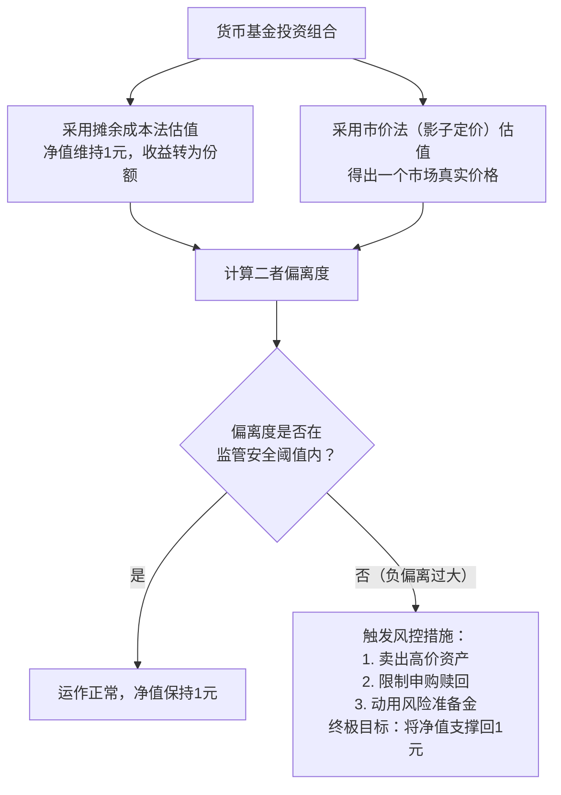

# 06. 证券投资基金

## 1. 基金交易核心操作：买卖与转换

在基金投资的日常实践中，投资者最频繁接触的核心业务无疑是围绕基金份额的买卖与转换展开的一系列操作。这些操作构成了基金投资活动的基础，直接关系到投资者资金的进出、投资组合的调整以及投资成本的控制。从基金募集期的认购，到基金成立后的申购与赎回，再到更为灵活的基金转换，每一项业务都有其特定的规则、费用结构和适用场景。深入理解这些核心交易操作的内在逻辑和外在表现，是投资者进行理性决策、优化投资策略、有效管理风险的前提。

### 1.1 基金认购 (Subscription)

基金认购是基金投资旅程的起点，特指投资者在开放式基金的募集期内，即基金尚未正式成立之前，申请购买基金份额的行为。这一阶段是基金管理公司为新基金募集资金的关键时期，投资者的认购行为直接决定了基金能否顺利成立以及其初始规模。与基金成立后的申购不同，认购通常伴随着一定的费率优惠，以吸引早期投资者。然而，由于基金在募集期内尚未开始投资运作，其未来的投资表现存在不确定性，因此认购行为也蕴含着对新基金投资策略、管理团队及市场前景的判断与预期。

#### 1.1.1 定义与适用场景

基金认购，根据兴业银行等代销机构的业务介绍，是指投资者在基金首次募集发行期间购买基金份额的行为 。这一过程发生在基金合同生效之前，是基金从概念走向现实的关键一步。对于投资者而言，选择认购新基金通常基于以下几种场景和考量：首先，**看好新基金的投资主题或策略**。例如，当市场出现新的投资热点，如人工智能、新能源或特定区域经济发展时，相关主题的新基金发行往往会吸引看好该领域长期发展的投资者。其次，**对基金管理团队的高度信任**。如果某家基金公司或某位基金经理过往业绩优异，市场声誉良好，其发行的新产品更容易获得投资者的青睐和认购。最后，**追求潜在的费率优势**。为了鼓励投资者在募集期参与，基金公司通常会设定较低的认购费率，甚至在某些促销活动中免除认购费，这对于注重成本控制的投资者具有一定吸引力。

#### 1.1.2 认购价格与费用

在基金募集期内，认购的价格是**固定的**，通常为**人民币1.00元/份**。这个价格是基金的面值，意味着无论投资者何时在募集期内提交认购申请，其购买份额的成本都是按1元/份计算。这种定价方式简单明了，便于投资者计算投入金额和预期获得的份额数量。例如，投资者投入10,000元认购费率为1.2%的基金，其净认购金额和份额计算如下：

*   **认购费用** = 10,000元 × 1.2% = 120元
*   **净认购金额** = 10,000元 - 120元 = 9,880元
*   **认购份额** = 9,880元 / 1.00元/份 = 9,880份

需要注意的是，认购费率会根据基金类型、销售渠道以及认购金额的大小而有所不同。通常，**股票型基金的认购费率会高于债券型基金和货币市场基金**。此外，通过不同的销售渠道（如银行、券商、第三方平台）认购，可能会享受到不同程度的费率折扣。

#### 1.1.3 认购期与确认时间

基金的募集期（认购期）由基金管理人根据市场情况和监管要求设定，通常为**1至3个月**。在此期间，投资者可以自由提交认购申请。募集期结束后，如果基金满足成立条件（例如，募集份额总额不少于2亿份，基金募集金额不少于2亿元人民币且基金份额持有人的人数不少于200人），基金将宣告成立，进入封闭期。在封闭期内，基金开始建仓，但投资者不能进行申购或赎回操作。关于认购的确认时间，投资者的认购款项在募集期间会产生利息，这部分利息会在基金成立时折算成基金份额，归投资者所有。基金成立后，投资者会收到认购成功的确认通知，其持有的基金份额正式生效。

### 1.2 基金申购 (Purchase)

基金申购是指投资者在基金成立并开放日常交易后，申请购买基金份额的行为。这是投资者在基金生命周期中最常见的买入方式，与认购相比，申购的价格不再是固定的1元，而是根据基金的实际运作情况每日波动。申购操作使得投资者可以随时将资金投入到已经运作的基金中，分享其未来的投资收益。

#### 1.2.1 定义与适用场景

基金申购是开放式基金区别于封闭式基金的核心特征之一，它为投资者提供了高度的流动性。投资者进行基金申购的场景非常广泛，主要包括：**首次建仓**，即投资者看好某只已成立的基金，决定开始投资；**追加投资**，即已持有某只基金的投资者，在持续看好其表现的情况下，增加投资金额；**调整投资组合**，将资金从其他资产类别（如银行存款、股票）转移到基金中，以优化整体资产配置。与认购新基金的不确定性相比，申购老基金的优势在于可以考察其过往的业绩表现、风险收益特征和基金经理的投资风格，决策依据更为充分。

#### 1.2.2 申购价格（未知价原则）

基金申购遵循**“未知价”原则**，也称为**“金额申购”原则**。这意味着投资者在提交申购申请时，并不知道确切的成交价格。申购的价格是**当日交易时间结束后计算出的基金份额净值（Net Asset Value, NAV）** 。具体来说，如果投资者在交易日的**15:00前**提交申购申请，则按当日收市后公布的净值成交；如果在**15:00后**提交，则视为下一个交易日的申请，按下一个交易日的净值成交。例如，投资者在周一上午10点申购某基金，其成交价格为周一晚上的净值；若在周一晚上8点申购，则成交价格为周二的净值。这种“未知价”原则确保了所有投资者在当天交易时间内申购的价格都是统一的，维护了公平性。

#### 1.2.3 申购费用与计算

申购基金需要支付申购费，这是基金销售过程中的一次性费用。申购费率同样因基金类型、销售渠道和申购金额而异。申购费用的计算方式通常采用**“外扣法”** ，即费用从申购总金额中扣除。计算公式如下：

*   **净申购金额** = 申购总金额 / (1 + 申购费率)
*   **申购费用** = 申购总金额 - 净申购金额
*   **申购份额** = 净申购金额 / 申购当日基金份额净值

例如，投资者投入10,000元申购某基金，申购费率为1.5%，当日净值为1.2000元。
*   **净申购金额** = 10,000 / (1 + 1.5%) ≈ 9,852.22元
*   **申购费用** = 10,000 - 9,852.22 = 147.78元
*   **申购份额** = 9,852.22 / 1.2000 ≈ 8,210.18份

### 1.3 基金赎回 (Redemption)

基金赎回是基金申购的反向操作，指基金份额持有人向基金管理人申请卖出其持有的基金份额，以换取相应现金的行为。赎回是投资者实现投资收益或止损退出的主要途径，是基金投资流程中至关重要的一环。

#### 1.3.1 定义与操作流程

投资者发起赎回操作，本质上是将手中持有的基金份额卖回给基金公司。操作流程通常通过投资者开户的销售渠道（如银行APP、券商交易软件、第三方基金平台）完成。投资者需要选择要赎回的基金，输入赎回的份额数量（或选择全部赎回），并确认提交。赎回操作一旦在交易日的规定时间（通常是15:00）前提交，即被视为当日有效申请。基金管理人会在收到申请后，按照当日的基金净值进行计算，并在规定的时间内将赎回款项划拨给投资者。

#### 1.3.2 赎回价格（未知价原则）

与申购一样，基金赎回也遵循**“未知价”原则**，也称为**“份额赎回”原则**。投资者在提交赎回申请时，同样不知道确切的赎回价格。赎回的价格同样是**当日交易时间结束后计算出的基金份额净值（NAV）** 。交易时间的划分与申购相同：**15:00前**提交的申请按当日净值计算，**15:00后**提交的申请按下一个交易日净值计算。例如，投资者在周三下午2点提交赎回申请，其赎回价格就是周三晚上公布的基金净值。这种机制确保了所有当日申请赎回的投资者都以同一价格成交，保证了交易的公平性。

#### 1.3.3 赎回费用与计算

赎回基金时，投资者可能需要支付赎回费。赎回费的设计主要是为了**抑制短期交易行为**，鼓励长期投资。因此，赎回费率通常与投资者**持有基金的时间长短成反比**，即持有时间越长，赎回费率越低，甚至可能为零。这种费率结构被称为**“阶梯式费率”** 。例如，某基金的赎回费率可能规定如下：

| 持有期限 (T) | 赎回费率 |
| :--- | :--- |
| T < 7天 | 1.5% |
| 7天 ≤ T < 30天 | 0.75% |
| 30天 ≤ T < 1年 | 0.5% |
| 1年 ≤ T < 2年 | 0.25% |
| T ≥ 2年 | 0% |

*Table 1: 典型的基金赎回费率阶梯表*

赎回费用的计算公式为：
*   **赎回总金额** = 赎回份额 × 赎回当日基金份额净值
*   **赎回费用** = 赎回总金额 × 赎回费率
*   **净赎回金额** = 赎回总金额 - 赎回费用

#### 1.3.4 资金到账时间

赎回操作完成后，投资者最关心的就是资金何时能到账。资金到账时间，也称为**“赎回款划付时间”** ，会因基金类型和销售渠道的不同而有显著差异。一般来说，货币市场基金的到账时间最快，通常为**T+1**日（T日为申请赎回日）。债券型基金的到账时间一般为**T+2至T+4**日。而股票型基金和混合型基金的到账时间最长，可能需要**T+4至T+7**日，甚至更久。这里的“T+”指的是工作日，不包括周末和法定节假日。投资者在进行赎回操作前，应了解清楚所投资基金的具体到账时间，以便合理安排资金使用计划。

### 1.4 基金转换 (Conversion)

基金转换是指投资者将其持有的某只基金的份额，直接转换为同一基金管理人管理的另一只基金的份额的行为。这是一种比“先赎回再申购”更为高效和经济的调整投资组合的方式。基金转换分为普通转换和超级转换两种模式，它们在转换范围和效率上有所不同。

#### 1.4.1 普通转换 (Regular Conversion)

**普通转换**是最常见的转换方式，其核心限制在于**转换的基金必须是同一家基金管理公司旗下的产品**。例如，投资者可以将持有的“易方达沪深300ETF联接A”转换为“易方达蓝筹精选混合”，因为两者都属于易方达基金公司管理。但如果想转换成“华夏上证50ETF联接A”，则无法进行普通转换，因为它们分属不同的基金公司。普通转换的优势在于操作便捷，通常可以**T+1**日确认转换结果，资金效率远高于“赎回再申购”的模式。

#### 1.4.2 超级转换 (Super Conversion)

**超级转换**是一种更为灵活的转换服务，它打破了普通转换只能转换同公司基金的限制。通过超级转换，投资者可以将持有的**任意一只基金的份额，转换为市场上几乎所有支持转换的开放式基金**，无论是否由同一家公司管理。这项服务通常由第三方基金销售平台（如蚂蚁财富、天天基金）提供。其背后的运作逻辑是，平台先为投资者垫付资金，以“先赎回再申购”的方式完成跨基金公司的转换，从而实现了“一键转换”的便捷体验。超级转换极大地提升了投资者调整投资组合的自由度和效率。

#### 1.4.3 转换费用与优势

基金转换的费用结构是其核心优势之一。转换费用通常由两部分组成：
1.  **转出基金的赎回费**：这部分费用是不可避免的，根据转出基金的持有时间和赎回费率计算。
2.  **转入基金的申购费补差**：如果转入基金的申购费率高于转出基金的申购费率，则需要补足差额；如果转入基金的申购费率更低或相等，则无需支付此项费用。

**基金转换的核心优势在于节省了时间和成本**。相比于“先赎回再申购”，转换操作至少可以**节省1-2个工作日**的时间成本，避免了资金在途期间的闲置。同时，通过申购费补差机制，投资者也避免了全额支付新基金的申购费，降低了交易成本。

#### 1.4.4 转换的限制与规则

尽管基金转换非常便捷，但仍存在一些限制和规则需要投资者注意：
*   **基金状态限制**：处于封闭期、暂停申购或暂停赎回状态的基金，无法进行转换。
*   **份额限制**：转换的份额必须是可用份额，且通常有最低转换份额的限制（如100份）。
*   **销售渠道限制**：并非所有销售渠道都支持基金转换，尤其是超级转换功能，通常只在大型第三方平台提供。
*   **巨额赎回限制**：如果转换申请触发了转入基金的巨额赎回条款，该转换申请可能会被部分确认或延迟处理。

| 特性 | 普通转换 | 超级转换 |
| :--- | :--- | :--- |
| **转换范围** | **仅限同基金公司旗下基金** | **可跨基金公司转换** |
| **操作平台** | 基金公司直销、多数代销机构 | 主要限于大型第三方销售平台 |
| **费用构成** | 转出基金赎回费 + 申购费补差 | 转出基金赎回费 + 新基金申购费 |
| **资金效率** | **T+1日**确认，效率高 | **T+1日**确认，效率高 |
| **核心优势** | 节省时间和部分申购费 | 极大提升投资灵活性，自由切换全市场基金 |

*Table 2: 普通转换与超级转换对比*

## 2. 基金投资自动化与策略性操作

除了单笔的买卖交易，现代基金投资还提供了多种自动化和策略性的操作工具，帮助投资者更科学、更便捷地执行长期投资计划。其中，定期定额投资和分红方式选择是两种被广泛应用且对投资结果有深远影响的策略性业务。

### 2.1 定期定额投资 (Dollar-Cost Averaging, DCA)

定期定额投资，简称**定投**，是指投资者在固定的时间（如每月1日）以固定的金额（如500元）投资到指定的基金中。这种投资方式通过自动化、纪律化的投资，旨在平滑市场波动，降低平均持仓成本，是一种非常适合普通投资者的长期投资策略。

#### 2.1.1 定义与核心优势

定投的核心机制在于**“分批买入”** 。无论市场行情是涨是跌，投资者都按照既定计划持续投入。当市场上涨时，固定的金额能买到较少的份额；当市场下跌时，同样的金额则能买到更多的份额。长期来看，这会使投资者的**平均持仓成本低于市场的平均价格**，从而在市场回升时获得收益。定投的主要优势包括：
*   **强制储蓄，积少成多**：通过定期扣款，帮助投资者养成储蓄和投资的习惯，避免“月光”。
*   **分散风险，平滑成本**：避免了因一次性投入在市场高点而“站岗”的风险，有效降低了择时的难度。
*   **省时省力，纪律投资**：无需频繁关注市场短期波动，避免了情绪化交易，让投资回归长期价值。

#### 2.1.2 如何设置定投计划

设置基金定投计划非常简便，通常可以通过基金销售平台的APP或网站完成。主要步骤如下：
1.  **选择基金**：选择一只适合长期定投的基金，通常是波动性较大、长期成长性较好的股票型或混合型基金。
2.  **设定扣款周期**：选择扣款的频率，常见的有**每周、每两周或每月**。
3.  **设定扣款金额**：输入每期投资的金额，需满足基金和销售渠道的最低要求（如100元起）。
4.  **设定扣款日期**：选择具体的扣款日，如每月的1号或15号。
5.  **绑定银行卡**：选择用于扣款的银行账户，并确保账户内有足够余额。
6.  **确认协议**：阅读并同意相关定投协议后，定投计划即设置成功。

#### 2.1.3 定投的适用场景与风险

定投并非适用于所有情况，其效果与市场环境密切相关。
*   **适用场景**：
    *   **震荡市和熊市**：在价格波动中，定投能更好地发挥其“摊低成本”的优势。
    *   **长期投资目标**：如为子女教育、退休养老等长期目标储备资金。
    *   **缺乏投资经验的投资者**：对于不擅长择时的普通投资者，定投是一种简单有效的参与方式。
*   **风险与局限性**：
    *   **单边上涨市**：在持续上涨的牛市中，定投的平均成本会不断抬高，其收益可能低于一次性投入。
    *   **基金选择错误**：如果选择的基金长期表现不佳甚至亏损，定投也无法改变其亏损的本质，只会越投越亏。
    *   **中途停止**：定投需要长期坚持才能显现效果，如果因短期市场下跌而恐慌停止，将无法实现投资目标。

### 2.2 分红方式选择 (Dividend Option)

基金分红是指基金将收益的一部分以现金或份额的形式派发给投资者。投资者在购买基金时，需要选择一种分红方式，这直接关系到投资收益的实现形式和再投资策略。

#### 2.2.1 现金分红 (Cash Dividend)

**现金分红**是指基金公司将分红款项以现金形式直接划拨到投资者的银行账户中。选择现金分红，相当于将基金投资产生的部分收益**落袋为安**。这种方式的优点在于：
*   **获得现金流**：可以为投资者提供稳定的现金收入，适合有定期资金需求的投资者，如退休人员。
*   **降低风险**：在市场高位时，通过分红收回部分本金，可以锁定部分收益，降低后续市场下跌带来的风险。

#### 2.2.2 红利再投资 (Dividend Reinvestment)

**红利再投资**是指将基金分红所得的现金，按照分红除息日的基金份额净值，自动转换为新的基金份额，并计入投资者的账户。这种方式的本质是**“利滚利”** ，是实现复利增长的关键。其优点在于：
*   **复利效应**：将分红继续投入，增加了投资的本金，长期来看可以显著放大投资收益。
*   **节省费用**：红利再投资通常**不收取申购费**，降低了再投资的成本。
*   **操作便捷**：自动完成份额的增加，无需投资者手动操作。

#### 2.2.3 如何修改分红方式

投资者可以根据自身的投资目标和市场判断，随时修改基金的分红方式。修改操作通常通过基金销售平台完成，路径一般为“我的持仓” -> 选择具体基金 -> “分红方式修改”。修改后的分红方式将在下一次分红时生效。对于追求长期资本增值的投资者，**红利再投资通常是更优的选择**；而对于需要现金流或希望规避部分风险的投资者，现金分红则更为合适。

| 分红方式 | 定义 | 优点 | 缺点 | 适用投资者 |
| :--- | :--- | :--- | :--- | :--- |
| **现金分红** | 将分红以现金形式派发给投资者 | 获得现金流，落袋为安，降低风险 | 无法实现复利增长，资金闲置 | 需要稳定现金流的投资者，风险规避型投资者 |
| **红利再投资** | 将分红自动转换为基金份额 | 实现复利效应，节省申购费，操作便捷 | 无法获得现金流，风险未降低 | 追求长期资本增值的投资者，年轻投资者 |

*Table 3: 现金分红与红利再投资对比*

## 3. 基金账户管理与资产转移

随着投资者在不同基金销售平台（如银行、券商、第三方平台）间的选择日益增多，如何高效地管理和转移自己的基金资产变得尤为重要。基金转托管和交易撤单是两项关键的账户管理业务，它们帮助投资者实现资产的自由流动和交易的灵活控制。

### 3.1 基金转托管 (Custody Transfer)

基金转托管，通俗地讲，就是**将您持有的基金份额从一个销售机构（券商/银行）的账户，转移到另一个销售机构的账户中**。这类似于将股票从一个券商账户转移到另一个券商账户。这项业务的核心在于**改变基金份额的“托管”关系，而基金份额本身的所有权并未改变**。

#### 3.1.1 定义与业务场景

投资者进行基金转托管，通常是出于以下几种场景：
*   **更换销售平台**：投资者可能因为费率优惠、服务质量、平台功能等原因，希望将基金从A银行转移到B券商，或从C平台转移到D平台。
*   **整合账户**：投资者可能在多个平台都购买了基金，为了方便统一管理，希望将所有基金份额集中到一个主要的平台上。
*   **参与特定活动**：某些销售平台可能会针对新转入的客户提供奖励或费率优惠，吸引投资者进行转托管。

#### 3.1.2 转托管流程与注意事项

基金转托管的流程相对复杂，需要投资者在原销售机构（转出方）和新销售机构（转入方）之间进行协调。主要步骤如下：
1.  **在转入方开立账户**：首先，需要在希望转入的新销售机构开立基金交易账户。
2.  **获取转入方席位号**：向新销售机构申请，获取其在中央登记结算公司（中登）的**席位号**（或称为“销售人代码”）。
3.  **在原销售机构提交申请**：携带有效身份证件，到原销售机构的柜台或通过其线上系统，提交转托管申请，并提供新销售机构的席位号。
4.  **确认转托管结果**：转托管申请提交后，通常需要**2-3个工作日**处理。投资者可以在转入方平台查询到基金份额是否到账。

**注意事项**：
*   **转托管费用**：部分销售机构可能会收取转托管手续费，具体费用需咨询相关机构。
*   **基金状态限制**：处于封闭期、冻结状态或正在办理赎回、转换等业务的基金份额，不能办理转托管。
*   **份额完整性**：转托管通常要求将某只基金的全部份额一次性转出，不能只转一部分。

#### 3.1.3 转托管的费用与时间

转托管的费用因机构而异，部分机构可能免费，部分可能收取固定费用（如20元/笔）。投资者在进行转托管前，应明确询问双方机构的收费政策。转托管的处理时间通常为**T+2**个工作日，即申请提交后的第二个工作日，投资者可以在转入方账户中看到基金份额。在此期间，基金份额处于冻结状态，不能进行任何交易操作。

### 3.2 交易撤单 (Order Cancellation)

交易撤单是指在基金交易申请被确认之前，投资者主动取消该笔交易的行为。这为投资者提供了在发现操作失误或改变主意时进行补救的机会。

#### 3.2.1 撤单的条件与时间限制

基金交易的撤单有严格的时间限制，通常遵循以下规则：
*   **交易日下午15:00前提交的申请**：可以在**当日15:00前**进行撤单。
*   **交易日下午15:00后或非交易日提交的申请**：可以在**下一个交易日的15:00前**进行撤单。

一旦超过上述时间窗口，交易申请将被提交给基金公司进行确认，此时就无法再撤单了。因此，投资者如果需要进行撤单操作，必须抓紧时间。

#### 3.2.2 撤单的操作流程

撤单操作通常非常便捷，投资者可以通过原交易渠道（如手机APP）的“交易记录”或“委托查询”功能找到待撤单的交易，点击“撤单”按钮即可。撤单成功后，如果是申购或转换转入，资金会立即解冻并返回投资者的账户；如果是赎回或转换转出，被冻结的基金份额也会立即解冻，恢复为可用份额。

## 4. 其他重要业务与概念

除了上述高频交易和账户管理业务，投资者还应了解一些基础的基金概念，如基金账户体系、基金清盘以及不同份额类别的区别，这些知识有助于更全面地理解基金投资的运作机制。

### 4.1 基金开户与账户体系

在进行任何基金交易之前，投资者必须首先开立相关的基金账户。中国的基金账户体系主要由**基金账户**和**交易账户**构成。

#### 4.1.1 基金账户与交易账户

*   **基金账户（TA账户）** ：TA是Transfer Agent的缩写，即注册登记机构。基金账户是由**中国证券登记结算有限责任公司（中登）或基金公司**为投资者开立的，用于记录投资者持有基金份额的账户。这个账户是唯一的，与投资者的身份证号绑定，相当于投资者在基金行业的“身份证”。
*   **交易账户（销售账户）** ：交易账户是由**基金销售机构（如银行、券商、第三方平台）** 为投资者开立的，用于记录投资者在该销售机构进行的基金交易活动和资金流水的账户。投资者在不同的销售机构开户，就会有不同的交易账户，但这些交易账户都关联到同一个唯一的基金账户。

#### 4.1.2 开户流程与所需材料

目前，基金开户流程已经非常便捷，绝大多数情况下都可以在线完成。投资者只需准备好**本人有效身份证件**和**一张银行卡**，通过基金销售平台的APP或网站，按照提示进行身份验证、风险测评、绑定银行卡等步骤，即可完成开户。整个过程通常只需几分钟。

### 4.2 基金清盘 (Liquidation)

基金清盘是指基金因各种原因终止运作，将基金资产全部变现，并按照持有人持有的份额比例进行分配的过程。这是基金生命周期的终点。

#### 4.2.1 基金清盘的触发条件

基金清盘通常由以下几种情况触发：
*   **基金规模过小**：根据规定，开放式基金在合同生效后，如果连续**60个工作日**基金资产净值低于**5000万元**，或者基金份额持有人数量连续**60个工作日**少于**200人**，基金管理人有权发起清盘。
*   **持有人大会决议**：经基金份额持有人大会表决通过，可以决定终止基金合同。
*   **基金合同到期**：部分封闭式基金或定期开放式基金在合同到期后，会进入清盘程序。
*   **法律法规或监管要求**：因法律法规变化或监管要求，基金需要终止运作。

#### 4.2.2 清盘流程与投资者权益

基金清盘流程一般包括：
1.  **发布清盘公告**：基金管理人发布基金终止上市或终止合同的公告。
2.  **停止交易**：基金进入清算程序，停止申购、赎回等一切交易。
3.  **资产变现**：基金管理人（清算组）将基金持有的所有证券资产卖出，变现为现金。
4.  **分配剩余财产**：将变现后的现金，在扣除清算费用后，按照投资者持有的份额比例进行分配。
5.  **注销登记**：完成财产分配后，基金注销登记，正式终止。

在清盘过程中，投资者的权益会得到保障，最终能拿回属于自己的那部分资产。但清盘过程可能耗时较长（通常需要**1-3个月**），且资产变现时可能因市场波动而产生损失。

### 4.3 基金份额分类 (Share Classes)

为了满足不同投资者的需求，同一只基金可能会设置不同的份额类别，最常见的是A类份额和C类份额。它们的主要区别在于收费模式的不同。

#### 4.3.1 A类份额与C类份额的区别

A类份额和C类份额在基金的投资运作上是完全相同的，它们共享同一个基金资产池，由同一个基金经理管理，唯一的区别在于**收费结构**。

| 特性 | A类份额 | C类份额 |
| :--- | :--- | :--- |
| **申购费** | **收取**，通常随申购金额增加而递减 | **不收取** |
| **赎回费** | 收取，通常随持有时间增加而递减 | 收取，通常随持有时间增加而递减 |
| **销售服务费** | **不收取** | **按日计提**，从基金资产中扣除 |
| **适合投资者** | **长期投资者**（通常持有超过1-2年） | **短期投资者**（通常持有少于1-2年） |

*Table 4: A类份额与C类份额收费模式对比*

#### 4.3.2 不同份额的收费模式

*   **A类份额（前端收费）** ：其特点是“**买时收费**”。投资者在申购时一次性支付申购费，之后不再收取与份额相关的销售费用。这种模式适合那些计划长期持有基金的投资者，因为申购费是一次性成本，持有时间越长，分摊到每年的成本就越低。
*   **C类份额（后端收费/持续收费）** ：其特点是“**卖时不收申购费，但持有期间收费**”。投资者申购时不收申购费，但基金公司会按日计提一定比例的销售服务费（如0.4%/年），直接从基金资产中扣除。这种模式适合那些不确定持有期限或计划短期持有的投资者，因为可以避免前端的一次性申购费。

投资者在选择A类还是C类份额时，应根据自己的**投资期限**进行判断。一个简单的经验法则是，如果计划持有时间**超过1-2年**，通常选择**A类份额**更划算；如果持有时间**短于1-2年**，则选择**C类份额**可能成本更低。

## 证券投资基金

通过发售基金份额向投资者**募集资金**，形成独立基金财产，委托**基金管理人**进行投资管理，由**基金托管人**进行资产托管。由基金投资人**共享投资收益、共担投资风险**的一种集合投资方式。

好的，没问题。作为一名金融从业者，掌握这些基础知识至关重要。本文将为您系统性地梳理证券投资基金的核心知识框架，并附上一份实用的术语表。

---

### **第一部分：证券投资基金基础知识详解**

#### **一、 什么是证券投资基金？**

**核心定义**：证券投资基金是一种**利益共享、风险共担**的集合投资方式。它通过公开发售基金份额，将众多投资者的资金汇集起来，形成独立财产，由**基金管理人**（基金公司）进行**管理和运作**，由**基金托管人**（商业银行）进行**财产保管**，以**投资组合**的方式进行**证券投资**，基金投资收益按基金份额持有人所占份额进行分配。

**简单理解**：就是大家凑钱，请一个专业的基金经理（基金管理人），找一个可靠的银行（基金托管人）帮忙管钱，然后一起去买股票、债券等，赚了钱大家分，亏了钱大家也一起承担。

#### **二、 核心参与方**

1.  **基金管理人**：负责基金的投资运作，是基金公司的核心角色。主要职责包括投资决策、向投资者提供基金报告等。
2.  **基金托管人**：通常由符合条件的商业银行担任。负责安全保管基金资产、执行基金管理人的投资指令、监督基金管理人的投资运作，确保基金资产不被挪用。**基金管理与托管分离是公募基金制度的基石，极大保障了资金安全。**
3.  **基金份额持有人**：就是投资者本人。购买基金份额后，即成为基金的所有者，享有收益分配、知情权和表决权等权利。
4.  **基金销售机构**：银行、证券公司、第三方独立销售平台（如天天基金、支付宝）等，负责基金的销售和申购赎回业务。

#### **三、 基金的运作流程**

1.  **募集**：基金公司公开发行基金，投资者认购。
2.  **投资**：基金成立后，基金管理人按照基金合同约定的投资范围和策略进行投资。
3.  **信息披露**：基金公司定期（每日、每季度、每年）公布基金净值、投资组合、运作报告等，保证透明度。
4.  **申购与赎回**：基金存续期内，投资者可随时向基金公司申请购买（申购）或卖出（赎回）基金份额。
5.  **收益分配**：基金将投资获得的收益（如股利、利息、已实现的资本利得）以现金或再投资的形式分配给持有人。

#### **四、 基金的核心分类（最重要）**

基金有多种分类维度，最常见的是按**运作方式**和**投资对象**划分。

**1. 按运作方式分类：**
*   **开放式基金**：基金份额**不固定**，投资者可以随时申购和赎回，基金规模随之变化。这是最常见的基金形式。
*   **封闭式基金**：基金份额在募集期内**固定不变**，投资者不能在到期前直接向基金公司赎回，但可以在二级市场（证券交易所）像买卖股票一样转让给其他投资者。

**2. 按投资对象分类（这是理解基金风险收益特征的关键）：**

| 基金类型 | 主要投资对象 | 风险收益特征 | 适合投资者 |
| :--- | :--- | :--- | :--- |
| **货币市场基金** | 短期国债、央行票据、银行存款、同业存单 | **风险极低，流动性极高**，收益略高于银行活期。可作为现金管理工具。 | 风险厌恶型，追求流动性和本金安全 |
| **债券型基金** | 国债、金融债、企业债等各类债券（资产80%以上投债券） | **风险较低，收益较稳定**，波动小于股票。收益主要来自利息和债券价格波动。 | 稳健型，追求稳定收益 |
| **股票型基金** | 上市公司股票（资产80%以上投股票） | **风险高，潜在收益也高**，波动大。收益主要来自股价增长和股息。 | 进取型，能承受较高风险，追求长期资本增值 |
| **混合型基金** | 股票、债券、货币工具等，比例灵活 | **风险收益介于债基和股基之间**，非常灵活。根据股票仓位高低，可分为偏股、偏债、平衡型等。 | 希望平衡风险与收益的投资者 |
| **指数基金** | **复制**特定市场指数（如沪深300、标普500）的成分股 | **被动管理**，费率低。收益与所跟踪指数表现一致。 | 看好市场或行业长期趋势，希望获得市场平均收益的投资者 |
| **QDII基金** | 海外市场的股票、债券等 | 允许境内投资者**投资境外市场**，分散地域风险。但也承担汇率风险。 | 希望进行全球资产配置的投资者 |

#### **五、 如何理解费用与净值？**

*   **基金净值 (NAV)**：即每份基金份额的净资产价值，是基金申购赎回的价格基础。
    *   **单位净值** = (基金总资产 - 基金总负债) / 基金总份额
    *   **累计净值** = 单位净值 + 基金成立以来每份份额的累计分红金额
*   **基金费用**：投资基金会产生成本，主要包括：
    *   **申购费/认购费**：购买基金时支付的一次性费用。
    *   **赎回费**：卖出基金时支付的一次性费用，通常持有时间越长费率越低。
    *   **管理费**：支付给基金公司的报酬，按日从基金资产中计提。
    *   **托管费**：支付给托管银行的报酬，按日从基金资产中计提。

---

### **第二部分：证券投资基金核心术语表**

| 术语 | 英文缩写/全称 | 解释 |
| :--- | :--- | :--- |
| **申购** | Purchase | 在基金成立后的存续期内，投资者申请购买基金份额的行为。 |
| **赎回** | Redemption | 投资者向基金公司申请卖出基金份额，收回现金的行为。 |
| **基金净值** | Net Asset Value (NAV) | 每份基金份额的净资产价值，计算公式为：(总资产 - 总负债) / 总份额。 |
| **单位净值** | NAV per Share | 每个基金份额的当前价值，是申购赎回的基准价格。 |
| **累计净值** | Accumulated NAV | 单位净值加上基金成立以来累计的单位分红金额，反映基金的历史总业绩。 |
| **基金管理人** | Fund Manager | 发行和管理基金的公司，负责基金的投资运作。 |
| **基金托管人** | Fund Custodian | 通常为银行，负责保管基金资产，监督基金管理人，保障资金安全。 |
| **投资组合** | Portfolio | 基金所持有的各种资产（如股票、债券）的集合。 |
| **仓位** | Position | 基金投资于股票、债券等资产的资金占基金总资产的比例。 |
| **申购费** | Front-end Load | 购买基金时支付的一次性销售费用。 |
| **赎回费** | Back-end Load / Redemption Fee | 卖出基金时支付的一次性费用，通常随持有时间增加而递减。 |
| **管理费** | Management Fee | 支付给基金管理人的年度费用，按日从基金资产中计提。 |
| **托管费** | Custody Fee | 支付给基金托管人的年度费用，按日从基金资产中计提。 |
| **业绩报酬** | Performance Fee | 某些基金（如私募）约定，当业绩超越基准时，管理人可提取的额外报酬。公募基金通常没有。 |
| **开放式基金** | Open-end Fund | 基金份额不固定，投资者可随时申购赎回的基金。 |
| **封闭式基金** | Closed-end Fund | 基金份额固定，在封闭期内不能申购赎回，但可在二级市场交易的基金。 |
| **ETF** | Exchange-Traded Fund | 交易型开放式指数基金。既可以在场内像股票一样买卖，也可以向基金公司申购赎回。 |
| **LOF** | Listed Open-ended Fund | 上市型开放式基金。既可以在场内买卖，也可以在场外申购赎回。 |
| **基金经理** | Fund Manager | 负责基金日常投资决策的专业人士。 |
| **基金合同** | Fund Contract | 规定基金管理人、托管人和持有人之间权利和义务的法律文件。 |
| **招募说明书** | Prospectus | 关于基金的详细说明文件，包括投资目标、策略、风险、费用等所有重要信息。 |

希望这份详细的基础知识介绍和术语表能对您的工作有所帮助！这些都是构建您基金知识体系的核心模块。

## 基金的净值
好的，非常乐意为您详细解释基金净值的计算方法。这对于金融从业者来说是核心基础知识。

### 一、核心概念：什么是基金净值？

**基金净值（Net Asset Value, NAV）**，通俗讲就是**一份基金份额的价值**，即每份基金值多少钱。它代表了基金在某一时点的真实价值，是基金申购、赎回和投资业绩评估的基础。

其核心逻辑是：基金的本质是将众多投资者的资金汇集起来，由基金经理进行投资，形成一个由股票、债券、存款等构成的资产组合。基金净值就是这个资产组合的总价值，平摊到每一份份额上的结果。

---

### 二、基金净值的计算公式

基金净值的计算遵循一个核心公式，但需要区分**基金资产净值（总净值）** 和**单位净值**。

#### 1. 基金资产净值（总净值）
这是计算所有份额总价值的公式：

**基金资产净值 = 基金总资产 - 基金总负债**

*   **基金总资产**：指基金拥有的所有资产的价值之和，主要包括：
    *   所持有的股票、债券等证券的市值（收盘价 × 数量）
    *   银行存款、清算备付金
    *   应收的申购款、股利、利息等
    *   其他资产（如权证等衍生品）
*   **基金总负债**：指基金运作及融资所形成的负债，主要包括：
    *   应付的赎回款、赎回费
    *   应付的管理费、托管费、销售服务费
    *   应付的券商交易佣金
    *   其他负债

#### 2. 基金单位净值（NAVPS）
这是投资者最常关注的，即**每一份基金份额的价值**。

**单位净值 = (基金总资产 - 基金总负债) / 基金总份额**

**单位净值 = 基金资产净值 / 基金总份额**

**举例说明：**
假设某只基金：
*   持有股票、债券等总市值为 **10亿元**
*   银行存款、应收利息等为 **0.5亿元**
*   应付管理费、赎回款等为 **0.3亿元**
*   当前发行的总份额为 **8亿份**

那么：
1.  **基金总资产** = 10亿 + 0.5亿 = **10.5亿元**
2.  **基金总负债** = **0.3亿元**
3.  **基金资产净值** = 10.5亿 - 0.3亿 = **10.2亿元**
4.  **基金单位净值** = 10.2亿元 / 8亿份 = **1.275元/份**

这意味着，每一份基金份额的价值是1.275元。如果您要赎回1000份，在没有赎回费的情况下，您将得到1275元。

---

### 三、估值：计算过程中的关键环节

计算净值最复杂和关键的环节是 **“估值”** ，即确定基金持有的各项资产的公允价值。

1.  **上市股票、债券、基金**：
    *   **通常以收盘价计算**。对于A股，通常以**证券交易所的当日收盘价**作为公允价值。对于流动性不好的股票（如停牌股），会采用专门的估值技术，如指数收益法、市盈率法等，以估算其公允价值。

2.  **交易所未上市/银行间市场债券**：
    *   采用**第三方估值机构（如中债登、中证登）** 提供的公允价值价格数据进行估值。这是行业标准做法，确保了公允性和一致性。

3.  **现金/存款**：
    *   以本金加应计利息计算。

4.  **衍生品（如期货、期权）**：
    *   通常以结算价或模型定价（如Black-Scholes模型）进行估值。

**估值的重要性**：准确估值是基金净值计算的生命线。不准确的估值会扭曲基金的真实表现，损害投资者利益。

---

### 四、计算频率与披露

*   **开放式基金**：通常**每个交易日**计算并披露一次单位净值。投资者在交易日收盘后看到的净值，是基金公司根据当日收盘价计算，并经托管银行复核后公布的结果。
*   **封闭式基金**：虽然交易频率低，但单位净值同样需要**每周至少公布一次**。

---

### 五、累计净值

除了单位净值，您还会经常看到一个指标：**累计净值**。

**累计净值 = 单位净值 + 基金成立以来每份份额的累计分红金额**

累计净值反映了基金自成立以来的**总增长情况**，考虑了分红因素。如果一个基金从未分过红，其单位净值就等于累计净值。

**举例**：某基金单位净值为1.5元，历史上每份份额曾分红0.7元，则其累计净值为2.2元。累计净值可以更好地衡量基金经理的长期历史业绩。

---

### 六、特殊情况的处理

1.  **大额申购/赎回（巨额赎回）**：
    当发生巨额赎回时，赎回可能会产生大量的**赎回费**，这部分费用会计入基金资产，导致基金净值在巨额赎回后出现**异常飙升**。这是因为剩余的基金份额持有人分摊了这笔额外的收入。

2.  **分红除权**：
    基金进行分红后，单位净值会**下降**。例如，分红前净值1.5元，每份分红0.2元，分红除息后净值变为1.3元。但投资者的总资产不变（持有1.3元的基金 + 0.2元的现金）。

### 总结

| 概念         | 定义                                         | 公式                                     | 作用                                     |
| :----------- | :------------------------------------------- | :--------------------------------------- | :--------------------------------------- |
| **基金总资产** | 基金拥有的所有资产的市场价值总和                 | -                                        | 净值计算的基础                             |
| **基金总负债** | 基金运作产生的所有负债总和                       | -                                        | 净值计算的基础                             |
| **基金资产净值** | 基金的总价值                                     | `总资产 - 总负债`                          | 代表全体基金持有人的权益总额                   |
| **基金单位净值** | **每一份**基金份额的价值                         | `(总资产 - 总负债) / 总份额` 或 `资产净值 / 总份额` | **申购、赎回的价格基准**，衡量基金即时价值         |
| **基金累计净值** | 单位净值 + 历史全部分红                         | `单位净值 + 单位份额累计分红`                | **衡量基金的长期历史业绩**，考虑了分红再投资的影响 |

希望这份详细的解释对您有所帮助！如果您对某些特定类型基金（如ETF、LOF）的净值计算有进一步疑问，我们可以继续探讨。

## 总资产、净资产与所有者权益

非常好的问题！这些是基金会计和估值中最核心的要素。作为一名金融从业者，清晰理解这些概念至关重要。下面我将为您详细拆解基金的总资产、总负债以及所有者权益。

---

### 一、基金的总资产 (Total Assets)

基金的总资产是指基金所拥有的、能以货币计量的全部财产、债权和权利。其核心是基金通过募集投资者的资金，进行投资所形成的投资组合及其他资产。

主要可以分为以下几大类：

| 资产类型 | 具体内容 | 估值方法（通常） |
| :--- | :--- | :--- |
| **1. 金融投资资产（核心）** | | |
| - 股票投资 | 在二级市场购入的A股、港股、美股等上市公司的股票。 | **公允价值**：按估值日在证券交易所的**收盘价**估值。 |
| - 债券投资 | 国债、金融债、企业债、公司债、可转债等。 | **公允价值**： 1. 交易所上市：按**收盘价**估值。 2. 银行间市场：按**第三方估值机构（如中债登、中证登）** 提供的价格数据估值。 |
| - 基金投资 | 投资于其他公募基金（FOF基金）。 | 按所投资基金**公布的当日净值**估值。 |
| - 衍生金融工具 | 股指期货、国债期货、期权等。 | **公允价值**：按估值日的**结算价**或采用估值模型（如Black-Scholes模型）确定。 |
| **2. 货币资金类资产** | | |
| - 银行存款 | 存放在银行的活期、定期存款。 | 按本金加应计利息计算。 |
| - 结算备付金 | 为证券交易资金结算预先存入证券登记结算机构的款项。 | 按账面价值计算。 |
| - 存出保证金 | 为交易结算（如期货）而存出的保证金。 | 按账面价值计算。 |
| **3. 应收项目（应计收入）** | | |
| - 应收申购款 | 投资者申购基金，资金尚未划入基金账户的部分。 | 按应收金额计算。 |
| - 应收股利 | 持有的股票已宣告但尚未发放的现金股利。 | 按宣告的金额计算。 |
| - 应收利息 | 持有的债券、存款等已产生但尚未收到的利息。 | 按日计提，计入资产。 |
| - 应收证券清算款 | 已卖出但尚未完成结算交割的证券款项。 | 按应收金额计算。 |

---

### 二、基金的总负债 (Total Liabilities)

基金的总负债是指在基金运作过程中产生的各种债务，需要在未来用基金资产予以偿还。

| 负债类型 | 具体内容 |
| :--- | :--- |
| **1. 应付项目（应计费用）** | |
| - 应付赎回款 | 投资者赎回基金，应付但尚未支付的款项。 |
| - 应付管理人报酬 | 已计提但尚未支付给基金公司的管理费。 |
| - 应付托管费 | 已计提但尚未支付给托管银行的托管费。 |
| - 应付销售服务费 | 已计提但尚未支付给销售机构的服务费（针对C类份额等）。 |
| - 应付交易费用 | 应付给券商的交易佣金等。 |
| **2. 其他负债** | |
| - 应交税费 | 基金运作中产生的相关税费（如印花税）。 |
| - 其他应付款 | 其他临时性的应付项目。 |

**特别注意**：基金通常**不通过负债进行杠杆融资**（法规有严格限制），因此其负债主要来源于**运营过程中产生的应计费用和应付款项**，而不是像企业那样通过借款产生负债。

---

### 三、所有者权益 (Owner's Equity) —— 在基金中的特殊含义

在普通公司会计中，所有者权益是一个复杂的概念，包括股本、资本公积、盈余公积、未分配利润等，它代表了公司所有者（股东）对净资产的所有权。

**然而，在基金会计中，这个概念被极大地简化了：**

**基金的所有者权益 ≈ 基金资产净值 (Net Assets)**

**基金资产净值 = 基金总资产 - 基金总负债**

**基金所有者权益的核心构成就是“基金净值”本身。** 它直接、完全地归属于基金份额持有人。基金会计中没有“股本”和“资本公积”科目，因为基金份额的申购和赎回本身就是“所有者权益”的增增减减。

*   **当投资者申购基金时**：资金流入，总资产增加，同时所有者权益（即基金净值）等额增加。
*   **当投资者赎回基金时**：资金流出，总资产减少，同时所有者权益（即基金净值）等额减少。
*   **当基金投资盈利时**：投资的公允价值上升，总资产增加，直接体现为所有者权益（即基金净值）的增加。
*   **当支付费用时**：总资产减少（支付现金）或负债增加（计提费用），最终都会导致所有者权益（即基金净值）的减少。

### 总结与三者关系

我们可以用一个经典的会计恒等式来理解，这个等式在基金中永远成立：

**资产 (Assets) = 负债 (Liabilities) + 所有者权益 (Owner‘s Equity)**

将其替换为基金术语，就是：

**基金总资产 = 基金总负债 + 基金资产净值 (NAV)**

**基金资产净值 = 基金总资产 - 基金总负债**

这个等式清晰地表明：
1.  **基金的总资产**是基金的所有“家底”。
2.  **基金的总负债**是基金需要先偿还的“债务”。
3.  **扣除负债后剩下的部分（基金资产净值）**，才真正完全属于**基金份额持有人**，这就是他们在基金中的**所有者权益**。

**最终，这份总额为【基金资产净值】的所有者权益，平摊到每一份基金份额上，就是我们每天看到的【基金单位净值】。** 这就是为什么基金净值能够准确反映每一位持有人投资价值的原因。

### 一个完美的比喻：贷款买房

假设您想买一套价值1000万的房子。
1.  **您的自有资金**：300万（这相当于您的**所有者权益**）
2. 您从**银行贷款**：700万（这相当于**负债**）

现在，我们来分析一下您的“总资产”：

*   **钱去哪了？** 您的300万和银行的700万，合并成一个1000万的“资金包”，并转化成了**一套房子**。这套房子就是您拥有的**全部经济资源**，它的总价值就是1000万。
*   **这就是您的【总资产】= 1000万（这套房子）**

*   **钱从哪来？** 这1000万的资产来源有两个渠道：
    *   银行借给您的700万（**负债**）
    *   您自己投入的300万（**所有者权益**）

**结论：**
*   **资产**指的是您**拥有什么**（那套房子）。
*   **负债和权益**指的是您拥有这些东西的**钱是从哪来的**（是借的还是自己的）。

银行对这700万负债拥有绝对的索取权，您对这300万权益拥有所有权。但无论如何，这两笔钱共同形成的最终形态——那套房子——在还清贷款之前，**完全属于您名下的资产**。

---

### 把这个比喻代入基金

现在我们把“贷款买房”的比喻换成“基金运作”：

一家基金公司发行了一只基金。
1.  **投资者申购**：投资者们共投入了 **8亿元**（这相当于基金的**所有者权益**，即“净资产”或“净值”）
2.  **产生应付费用**：在运作过程中，该付给基金经理的管理费、付给托管银行的托管费等共 **0.3亿元** 还没支付（这相当于**负债**）。这些费用是基金“欠”别人的钱。

现在，基金经理拿着这8亿元（权益）和“欠着”的0.3亿元（负债）所带来的资金，去进行投资。

*   **钱去哪了？** 这 **8.3亿元** 的资金被投资出去了，变成了：
    *   股票、债券等金融资产（市值 **10.2亿元**）
    *   银行存款、应收利息等（**0.3亿元**）
    *   **总资产 = 10.2 + 0.3 = 10.5亿元**

*   **钱从哪来？** 构成这10.5亿资产的资金来源有两个：
    *   欠别人的 **0.3亿元**（**负债**）
    *   真正属于基金份额持有人的 **10.2亿元**（**所有者权益**，即**基金资产净值**）

**所以，基金的会计恒等式永远成立：**
`10.5亿 (总资产) = 0.3亿 (总负债) + 10.2亿 (所有者权益)`

### 直接回答您的观点

> “我有点不理解的是，为什么总资产里面还包括负债？我能否这样理解：负债意味着别人“借”给你钱，只是你现在还没还。这是我的权益，不是你的。”

*   **您的理解前半句完全正确**：负债就是别人“借”给你的钱（或你欠别人的服务费），你还没还。
*   **需要调整的是后半句**：这笔“借来”的钱，在你还款之前，**确实暂时是你的资产**，因为你可以支配和使用它（比如用它去买股票、债券）。**但是，这笔钱所对应的“权益”不属于你**，你未来必须把它还回去。

**关键在于：资产和权益（所有权）是两回事。**
*   **资产**代表**控制权**（我暂时可以使用的经济资源）。
*   **权益**代表**所有权**（扣除所有负债后，真正属于我的部分）。

### 总结

1.  **总资产**：回答“**基金现在有什么？**”——> 它拥有股票、债券、存款等价值多少亿的资产。这个数字反映了基金投资组合的**总规模**。
2.  **总负债**：回答“**基金拥有的东西里，有多少是欠别人的？**”——> 这些资产的一部分资金来源是欠款（如应付费用）。
3.  **所有者权益（基金净值）**：回答“**扣除欠款后，剩下真正属于投资者的部分还有多少？**”——> 这是资产的最终归属。

所以，**总资产里不是“包括”了负债，而是总资产的“资金来源”有一部分来自于负债**。负债是资产形成的“因”之一，而不是资产本身的“组成部分”。

希望这个解释彻底解决了您的疑惑！这是会计学中最基础也最重要的逻辑之一。

## 货币基金
好的，没问题。作为金融技术供应商的客服人员，理解这些基础金融概念对于您更好地支持客户（如基金公司、券商）至关重要。

以下为您详细梳理货币基金及相关术语，采用清晰的笔记风格，并融入技术视角的解释。

---

### **1. 什么是货币基金？**

**核心概念**：货币市场基金（Money Market Fund, MMF）是一种主要投资于**短期货币市场工具**的开放式基金。其特点是**高流动性、低风险、收益稳定**，被视为现金管理工具。

**投资标的（它买什么）**：
*   **现金**：银行存款。
*   **短期国债**：1年以内的中央政府发行的债券，信用等级最高。
*   **中央银行票据**：央行发行的短期债券。
*   **政策性金融债**：国家开发银行等政策性银行发行的债券。
*   **高信用等级企业债/短期融资券**：信用评级高的企业发行的短期债务工具。
*   **同业存单**：银行在全国银行间市场上发行的记账式定期存款凭证。
*   **债券回购**：通过质押债券进行短期资金融通，风险极低。

**主要特点**：
*   **风险极低**：投资标的违约可能性很小。
* **流动性极高**：通常支持T+0或T+1赎回，很多产品可实现快速赎回（但受监管限额约束，通常单日1万元内）。
*   **收益稳定**：每日计息，每日收益结转（或再投资），净值波动极小。
*   **成本低**：通常免申购、赎回费，管理费、托管费率也相对较低。
*   **净值恒定**：国内货币基金通常将份额净值固定为 **1.00元**，收益通过新增份额的形式体现。

**技术视角**：在恒生等基金投资交易系统中，货币基金有独立的投资模块和风控规则，严格控制投资品种的期限和信用等级，并需要与销售系统、TA（登记过户）系统紧密对接，以实现快速的申赎和收益结转。

---

### **2. 什么是万份收益？**

**核心概念**：**“万份收益”** 全称为“**每万份基金份额净收益**”。它是指**每一万份货币基金份额（对应1万元资金）在当日实际获得的收益金额**。

*   **计算公式**：
    `每日万份收益 = [当日基金净收益 / 当日基金总份额] * 10000`
*   **单位**：**元**
*   **举例**：
    *   某货币基金某日的万份收益为 **0.6542元**。
    *   这意味着，如果您持有 **1万元** 该基金，您当天实际获得的收益就是 **0.6542元**。
    *   如果您持有 **5万元**，当天收益就是 `0.6542 * 5 = 3.271元`。

**重要地位**：这是反映货币基金**真实盈利能力的最核心、最直接的指标**。它每天都会波动，取决于基金持有的资产当日产生的利息收入和买卖价差。

---

### **3. 什么是七日年化收益率？**

**核心概念**：**“七日年化收益率”** 是将货币基金**过去连续七天（包括当天）的万份收益**进行年化计算后得出的**预估收益率**。

*   **计算公式（简化理解）**：
    `七日年化收益率 = (过去7天万份收益总和 / 7) * 365 / 10000 * 100%`
*   **单位**：**%**
*   **目的**：为了给投资者一个更直观的、可与银行存款利率或其他理财产品对比的**收益参考指标**。
*   **注意**：它是一个**历史指标**，是对过去7天盈利水平的反映，**不代表未来的实际收益**。万份收益才是你当天实实在在拿到手的钱。

**万份收益 vs 七日年化收益率**：
| 指标 | **万份收益** | **七日年化收益率** |
| :--- | :--- | :--- |
| **含义** | **当日实际收益** | **过去7天的年化预估收益** |
| **反映** | **绝对值**（你拿到多少钱） | **相对值**（折算成年收益率是多少） |
| **性质** | **实时性、真实性** | **历史性、参考性** |
| **关系** | **是计算七日年化的基础** | **由万份收益推导而来** |

---

### **4. 什么是货币基金的升降级？**

**核心概念**：**“升降级”** 是一种**针对同一基金管理人旗下同一货币基金的不同份额级别（A类份额和B类份额）之间的自动转换机制**。

*   **A类份额**：**针对小额投资者**。起购门槛低（通常1元、100元起），但销售服务费率相对较高，因此万份收益和七日年化收益率通常略低于B类。
*   **B类份额**：**针对大额投资者或机构客户**。起购门槛高（通常100万、500万起），但销售服务费率较低，因此收益通常高于A类。

**升降级规则**：
*   **升级**：当投资者持有的**A类份额基金资产净值**在某个时间点（通常为每个交易日收盘后）**达到或超过B类份额的起点门槛**（如500万元），系统将**自动**将其A类份额升级为B类份额。
*   **降级**：当投资者持有的**B类份额基金资产净值**在某个时间点**低于B类份额的起点门槛**时，系统将**自动**将其B类份额降级为A类份额。

**目的与好处**：
1.  **公平性**：资金量大的投资者享受更低费率，符合商业逻辑。
2.  **自动化**：投资者无需自行赎回和申购，系统自动无缝转换，体验流畅。
3.  **留住客户**：避免大额客户因追求更高收益而赎回并重新申购B类份额的麻烦，增强客户黏性。

**技术视角**：升降级功能需要在**TA系统（登记过户系统）** 中设置相应的业务规则和批量处理流程，通常在日终清算时自动执行。恒生电子的TA系统就需要支持这种复杂的份额类别转换和费用计算。

---

### **5. 其他重要货币基金金融术语**

1.  **销售服务费**
    *   **是什么**：用于支付销售机构的佣金、基金营销费用等，**从基金资产中每日计提**。
    *   **影响**：直接影响基金收益。费率越高，投资者拿到手的净收益就越低。这就是B类份额收益高于A类的主要原因。

2.  **快速赎回 / 普通赎回**
    *   **快速赎回**：通常指“T+0”赎回，提交申请后资金几乎实时到账（通常有额度限制，如单日1万元）。这背后往往是基金公司或销售机构先行垫资。
    *   **普通赎回**：通常指“T+1”或“T+2”到账，资金按清算流程划付，无垫资。

3.  **收益结转**
    *   **是什么**：将每日计提的收益定期转化为基金份额的过程。
    *   **方式**：
        *   **每日结转，按月支付**：每日计算收益，但累积到每月特定日期才统一增加为份额（常见）。
        *   **每日结转，每日支付**：每日收益次日就自动转为份额（也越来越普遍）。

4.  **影子定价 & 摊余成本法**
    *   **摊余成本法**：货币基金主流的估值方法。将投资债券的利息收益**平摊到每一天**来计算，从而使净值稳定在1元。
    *   **影子定价**：为了防范风险，监管要求基金公司同时使用**市场价**对投资组合进行估值（即影子定价），并将结果与摊余成本法下的净值进行对比。
    *   **目的**：确保两者偏离度（负偏离）不能过大，防止出现系统性风险。这是货币基金稳健运作的关键风控机制。

5.  **流动性资产比例**
    *   **是什么**：基金投资组合中，现金、国债、中央银行票据等极高流动性资产所占的比例。
    *   **目的**：为了应对投资者的赎回要求。监管对此有明确下限要求，以确保基金在面临大额赎回时有足够的现金类资产应对。

希望这份详细的梳理能帮助您更好地理解货币基金产品，从而在日常客服工作中更加游刃有余！

您观察得非常准确，这确实是货币基金与普通基金（如股票型、混合型基金）一个最核心的区别。您提到的“普通基金的每个份额有净值概念”完全正确，那个叫 **“市价法”估值**。

而货币基金能做到一份始终是一块钱，其核心奥秘在于它采用了另一种特殊的估值方法——**“摊余成本法”**，并辅以严格的监管和风控手段。

下面我为您详细解释这背后的逻辑。

---

### **核心原因：两种不同的估值方法**

我们可以用一个简单的比喻来理解：
*   **普通基金（市价法）**：就像**实时竞价的二手房**。房子的价值（基金净值）会随着市场供需、业主心态（市场情绪）随时波动，可能今天报价500万，明天就跌到490万了。所以它的净值（每平米单价）每天都在变。
*   **货币基金（摊余成本法）**：就像**一笔固定利息的存款**。你存入10000元，年化利率2%，你很清楚这笔钱每天会给你带来多少利息（比如约0.55元），你的本金看起来依然是10000元，但实际上它在默默生息。货币基金就是把每天赚到的利息平摊下来，让你感觉“净值”没变。

---

### **1. 摊余成本法：维持“1元”面值的会计魔法**

货币基金主要投资于存款、短期债券等**固定收益类品种**。这些资产的本金和未来利息收入是可以大致算出来的。

*   **什么是“摊余成本法”？**
    这是一种会计处理方法，它将投资对象（比如一只90天到期的债券）在持有期内预计可以获得的**所有收益（利息）**，平摊到每一天。

*   **如何运作？**
    1.  **折价/溢价购买**：货币基金可能会以低于面值的价格（折价）或高于面值（溢价）买入一只短期债券。
    2.  **每日计提收益**：假设一只基金用99.8元买了一张100元、30天到期的债券。这1.2元的差价就是持有到期的收益。摊余成本法会**将这1.2元的收益，平均分摊到未来的30天里**，每天增加0.04元的收益。
    3.  **净值体现**：这笔每日0.04元的收益，并不会直接体现在基金份额净值上（净值仍显示为1.0000元），而是会转化为**新增的基金份额**分配给投资者。这就是您看到的 **“万份收益”** 的来源。

**所以，货币基金的净值恒定1元，是一种会计处理上的“表象”**，它的真实价值通过每日新增的份额来体现。

---

### **2. 影子定价：严控偏离度的风控卫士**

如果只用摊余成本法，可能会有一个问题：万一市场利率急剧变化（比如央行突然大幅加息），基金持有的债券市场价会下跌，此时基金的“摊余”价值（1元/份）就可能高于其真正的市场价值，这被称为 **“负偏离”** ，通俗讲就是“亏了但账上没体现”。

为了防止这种情况，中国证监会引入了 **“影子定价”** 机制。

*   **什么是“影子定价”？**
    要求货币基金每天同时用 **“市价法”** （就像普通基金一样）给它的投资组合再算一次账，得出一个“影子价格”。

*   **核心风控指标：偏离度**
    监管机构会严格监控**摊余成本法计算出的净值**与**市价法计算出的影子价格**之间的偏离程度。
    *   **偏离度 = （摊余成本法估值 - 影子定价法估值） / 摊余成本法估值**

    当**负偏离**度过大时（例如超过-0.5%），就意味着基金资产的实际市场价值已经显著低于账面价值，监管机构会要求基金管理人采取措施，甚至可能动用风险准备金来弥补亏损，以将净值“拉回”1元，防止出现系统性风险。

---

### **3. 为什么货币基金要这么做？—— 产品定位决定**

货币基金的核心定位是 **“现金管理工具”** ，而不是“投资工具”。投资者对它的首要要求是：
*   **极致稳定性**：像现金一样安全，不能今天1万明天变9900。
*   **高流动性**：随时可以赎回使用。
*   **稳定收益**：虽然不高，但能有一点比活期存款高的利息。

如果货币基金也像普通基金一样净值波动，今天1.0002元，明天0.9998元，它就失去了作为“准现金”的功能，也会给投资者的心理带来不必要的波动。因此，“1元净值”的设定是为了**契合其现金管理工具的本质属性**，提供极致的稳定性和投资者体验。

### **总结与对比**

| 特性 | **货币市场基金** | **普通基金（股票/混合型）** |
| :--- | :--- | :--- |
| **估值方法** | **摊余成本法**为主，辅以**影子定价**风控 | **市价法** |
| **净值表现** | **恒定1元** | **每日波动**，可能大于1或小于1 |
| **收益体现** | 通过**新增份额**（万份收益）体现 | 通过**净值增长**体现 |
| **投资目标** | 保持本金安全性和流动性，获得稳定收益 | 追求资本增值，承担较高风险 |
| **产品定位** | **现金管理工具** | **投资工具** |

所以，您可以将货币基金的“1元”理解为一个**计价基准**，而不是其资产价值的实时反映。它就像一把刻度永远不变的尺子，我们通过看它每天量出了多少“额外长度”（万份收益）来知道它的增长。这套复杂的机制背后，是严格的金融监管和产品设计智慧，旨在为投资者提供一个安全、稳定的现金管理港湾。

## 业务流程

好的，没问题。我将完全仿照您提供的“小红ETF”案例的风格和结构，为您创作一个关于场外基金（此处以普通开放式基金为例）申赎交易的对话与解说过程。

---

**假设小明是投资者，小蓝是“蓝海成长混合”基金（一只普通的场外开放式基金）的基金经理。**

**7.1 T 日：申购申请与未知价原则**

**小明**：我看好了你的“蓝海成长混合”基金，我想买点。
**小蓝**：欢迎申购。你想买多少？我们这只基金没有“创设单位”的概念，最低100元就能买。
**小明**：那我买10万元。
**小蓝**：好的。不过你需要明白，我们场外基金采用的是 **“未知价”** 原则申购。
**小明**：什么叫“未知价”原则？
**小蓝**：意思是，你今天（T日）提交申购申请时，并不知道你最终能以什么价格成交。你的申购金额会先按照今天的**预估净值（IOPV）** 折算成预估份额，但最终确认的份额，要等到**今天（T日）收盘后**，我根据基金实际持仓的收盘价计算出**T日的实际基金份额净值（NAV）** 后才能确定。

**小明**：也就是说，我今天付10万元，但具体能买到多少份基金，要今天晚上才知道。
**小蓝**：正是如此。这是场外基金与场内ETF一个巨大的不同。ETF申购是“已知价”，按PCF清单精确交付；我们这是“未知价”，按金额申购，份额确认。

**小明**：那我需要给你哪些东西？
**小蓝**：你只需要支付10万元现金即可。我们基金不接收股票，只接收现金。你的申购对价就是纯现金。

**小明**：你是怎么计算基金净值的？
**小蓝**：每天晚上，基金会计会根据基金持有的所有资产（股票、债券、存款等）的**T日收盘价**，加上应收利息，减去各项费用和负债，得出基金总资产净值，然后再除以基金总份额，就得到了**T日的基金份额净值（NAV）**。公式是：
`NAV = (基金总资产 - 基金总负债) / 基金总份额`

**小明**：我申购的10万元，什么时候从我的账户划走？
**小蓝**：通常是T+1日。你的10万元申购款会在账户里被冻结，T+1日才正式划拨到基金托管账户。

**7.2 T 日：费率与份额计算**

**小蓝**：另外，申购我们基金会产生**申购费**。这是支付给销售渠道（比如银行、券商）的佣金。我们的申购费率是1.5%。
**小明**：啊？还有费用？那怎么扣？
**小蓝**：有两种模式，一种是**内扣法**，一种是**外扣法**。现在监管要求都用**外扣法**，这样对你更公平，实际买入的基金资产更多。

*   **外扣法公式**：`净申购金额 = 申购金额 / (1 + 申购费率)`
*   `申购费用 = 申购金额 - 净申购金额`
*   `确认份额 = 净申购金额 / T日基金份额净值`

我们假设T日收盘后算出的实际净值是 **2.0000元**。
我们来算一下你的情况：
`净申购金额 = 100,000 / (1 + 1.5%) = 100,000 / 1.015 ≈ 98,522.17元`
`申购费用 = 100,000 - 98,522.17 = 1,477.83元`
`确认份额 = 98,522.17 / 2.0000 = 49,261.085份`

**小明**：所以我花了100,000元，但只有98,522.17元真正变成了基金资产，另外1,477.83元是手续费，最后我得到了49,261.085份基金。
**小蓝**：理解完全正确。

**7.3 T+1 日：确认与资金划转**

**时间** | **流程** | **说明**
:--- | :--- | :---
T日 | 小明提交申购申请，支付资金（被冻结） | 按T日未知价原则申请，销售机构将申请数据发送给基金管理人（小蓝）和登记结算机构。
T日夜间 | 基金管理人（小蓝）计算T日基金份额净值(NAV=2.0) | 基金会计根据收盘价精确计算。
T+1日 | 登记结算机构根据T日净值确认小明申购的份额(49,261.085份) | 并将确认结果发送给销售机构和管理人。
T+1日 | 销售机构将小明被冻结的100,000元申购资金划入基金托管账户 | 申购资金正式到位。申购费归销售渠道，净资产增加98,522.17元。
T+1日 | 小明账户中可以看到持有的基金份额更新为49,261.085份 | 申购流程完成。

**7.4 T+2 日及以后：赎回**

*(过了几周，基金净值涨了)*

**小明**：我想赎回我全部的基金份额。
**小蓝**：好的。赎回也遵循 **“未知价”** 原则。你今天（T日）提交赎回申请，赎回价格以**今天（T日）收盘后计算出的净值为准**。赎回款通常要在**T+3日或更晚**才能到账。

**小明**：为什么这么慢？ETF好像快很多。
**小蓝**：这是因为我们的清算交收流程不同。我需要时间卖出股票变现来准备资金。监管为了公平对待所有投资者，防止短期套利，也规定了资金到账时间。  **赎回费率** 根据持有时间长短不同，你持有超过7天但不足1年，费率是0.5%。

假设T日收盘后算出的基金净值为 **2.1000元**。
`赎回总额 = 赎回份额 × T日净值 = 49,261.085 × 2.1000 = 103,448.28元`
`赎回费用 = 赎回总额 × 赎回费率 = 103,448.28 × 0.5% = 517.24元`
`赎回净额 = 赎回总额 - 赎回费用 = 103,448.28 - 517.24 = 102,931.04元`

**时间** | **流程** | **说明**
:--- | :--- | :---
T日 | 小明提交赎回申请 | 按T日未知价原则申请。
T日夜间 | 基金管理人计算T日基金份额净值(NAV=2.1) | 
T+1日 | 登记结算机构确认赎回申请和金额 | 
T+2日 | 基金管理人准备资金，并将赎回款划给托管行 | 这是最耗时的环节，需要协调资金流。
T+3日 | 托管行将赎回净额(102,931.04元)划拨到小明的资金账户 | 赎回款到账。赎回费归入基金资产，补偿给未赎回的持有人。

**小蓝**：完事了。你最初投入10万，最终赎回拿到约10万3千元，扣除一买一卖总共约2千元的手续费，这笔投资你赚了不到3千元。

**小明**：也就是说，我场外基金申赎，核心是 **“金额申购、份额赎回”** 和 **“未知价”** 原则，整个过程主要是现金的交收和份额的登记，没有股票交换，所以耗时比ETF长。
**小蓝**：正是如此。**ETF更像是一种“物物交换”，而场外基金是纯粹的“现金买卖”**。它更简单，但效率也相对低一些。

---

### 总结对比（仿照您的风格）

| 特性 | 场内ETF申购赎回 | 场外普通基金申赎 |
| :--- | :--- | :--- |
| **价格原则** | **已知价**：按PCF清单交付，价格确定 | **未知价**：按当日收盘净值成交，价格不确定 |
| **对价形式** | **一篮子股票+现金**（实物申赎） | **纯现金** |
| **交收效率** | **高**（T日申赎，份额和股票T日交收，现金T+2日内清算） | **低**（申购T+1确认，赎回款T+3或更晚到账） |
| **门槛** | **高**（通常需数十万至数百万的创设单位） | **低**（通常几十元至几百元起投） |
| **费用** | 主要隐含在买卖价差和现金替代退补中 | 明确的申购费、赎回费（通常持有时间越长费率越低） |
| **复杂度** | **高**（涉及成分股、现金替代、退补款等复杂概念） | **低**（现金进出，简单直观） |

希望这个仿写版本同样达到了专业又通俗易懂的效果！