# 11. ETF基金
## 1. 官方网站
### 1.1 沪深PCF清单、交易规则说明
- 上交所ETF官方网站：[首页  | 上海证券交易所 | 基金网站](https://etf.sse.com.cn/home/)
- 上交所ETF专栏：[ETF专栏  | 上海证券交易所](https://www.sse.com.cn/assortment/fund/etf/home/)
- 上交所PCF清单：[ETF公告申购赎回清单  | 上海证券交易所](https://www.sse.com.cn/disclosure/fund/etflist/)
- 深交所PCF清单：[深交所主页](http://www.szse.cn/disclosure/fund/currency/index.html)

- 上海证券交易所交易型开放式指数基金业务实施细则：[上海证券交易所交易型开放式指数基金业务实施细则 | 上海证券交易所](https://www.sse.com.cn/assortment/fund/etf/rules/c/c_20150911_3985181.shtml)

- 关于交易型开放式指数基金网上现金认购业务有关事项的通知：[关于交易型开放式指数基金网上现金认购业务有关事项的通知
        | 上海证券交易所](https://www.sse.com.cn/lawandrules/sselawsrules/fund/listing/c/c_20250523_10779816.shtml)

### 1.2 指数公司（权重文件）

- **中证指数有限公司**：中证指数有限公司提供沪深300、上证50等指数的成分股名单和权重数据。您可以在其官网免费下载这些数据。中证指数官网：https://www.csindex.com.cn/
- **国证指数网**：国证指数网也提供指数相关数据，包括样本股清单、权重等。国证指数网：http://www.cnindex.com.cn/

### 1.3 ETF招募说明书

- 华宝中证新材料主题交易型开放式指数证券投资基金招募说明书：https://www.sse.com.cn/disclosure/fund/announcement/c/new/2025-07-17/516360_20250717_O7AE.pdf

- 富国中证1000 ETF招募说明书：https://www.fullgoal.com.cn/wbs-file/fund_report/20250509/CN_50100000_159629_FA010030_20250001.pdf

### 1.4 交易所相关改造

- **上交所多码合一改造**：深交所 ETF 目前代码段只有二级市场交易代码作为唯一交易代码，上交所 ETF 有一级市场申赎代码、二级市场交易代码、沪市资金代码、非沪市资金代码、港市资金代码，多代码。不容易理解，且容易混淆，此次改造拟==取消一级市场申赎代码，取消沪市资金代码、非沪市资金代码、港市资金代码==，竞价撮合平台的 ETF 申赎业务（单市场/跨市场股票 ETF、科创板 ETF 等申赎）迁移至综合业务平台，未来所有 ETF 业务都在综合业务平台开展，并以唯一的交易市场代码+业务类型的形式识别。

    

- 交易型开放式基金风险管理改造：
    - 深交所：关于发布《深圳证券交易所证券投资基金业务指引第4号—交易型开放式基金风险管理》的通知：[关于发布《深圳证券交易所证券投资基金业务指引第4号—交易型开放式基金风险管理》的通知](https://www.szse.cn/lawrules/rule/fund/list/t20250704_614738.html)
    - 上交所：关于发布《上海证券交易所基金自律监管规则适用指引第4号——交易型开放式基金风险管理》的通知[关于发布《上海证券交易所基金自律监管规则适用指引第4号——交易型开放式基金风险管理》的通知：
        | 上海证券交易所](https://www.sse.com.cn/lawandrules/sselawsrules/fund/listing/c/c_20250704_10783950.shtml)

### 1.5 参考资料

- 《深圳证券交易所证券投资基金交易和申购赎回实施细则（2020年12月修订）》：[关于修改《深圳证券交易所证券投资基金交易和申购赎回实施细则》相关条款的通知](https://www.szse.cn/www/disclosure/notice/general/t20201204_583675.html)

- 上海证券交易所交易型开放式指数基金业务实施细则：[上海证券交易所交易型开放式指数基金业务实施细则 | 上海证券交易所](https://www.sse.com.cn/assortment/fund/etf/rules/c/c_20150911_3985181.shtml)

- 《上海证券交易所 特定参与者接口规格说明书 （基金公司卷） 2.0 版》2025年3月
    - 交易系统和基金管理公司之间的接口的功能和技术规格文档，包括交易系统和基金管理公司的关于交易所基金（ETF）业务的接口

- 《中国证券登记结算有限责任公司上海分公司交易型开放式基金登记结算业务指南》

## 2. 什么是ETF？

### 2.1 ETF的概念
交易型开放式指数基金（Exchange Traded Fund，简称ETF），是一种**在交易所上市交易的、基金份额可变**的开放式基金。

ETF结合了封闭式基金和开放式基金的特点，既可以向基金管理公司申赎基金份额，又可以像股票一样在二级市场买卖。

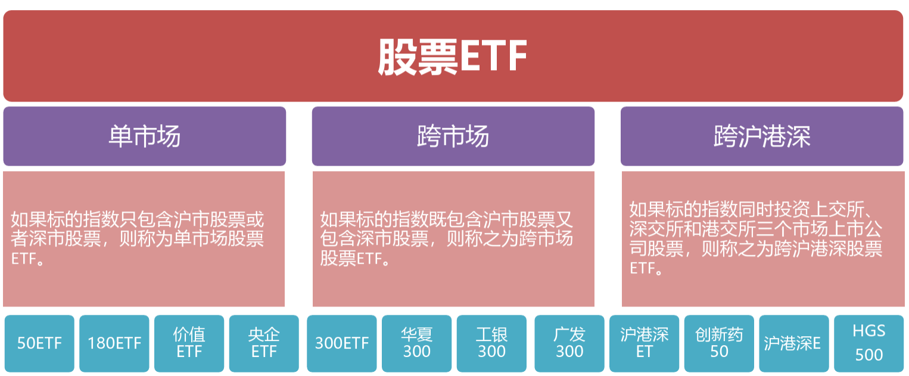

- ETF只能通过交易所申赎，无法在场外申赎

- ETF申购有最低的数量限制，在一级市场，ETF的申购门槛一般为几十万到几百万份。在二级市场交易门槛相对较低，最低购买单位为1手，即100份。

- 跨市场ETF是以跨市场指数（如沪深300指数）为跟踪标的的ETF。其中跨市场指数是指成分证券包括深交所和上交所上市证券的指数。

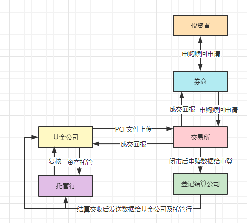

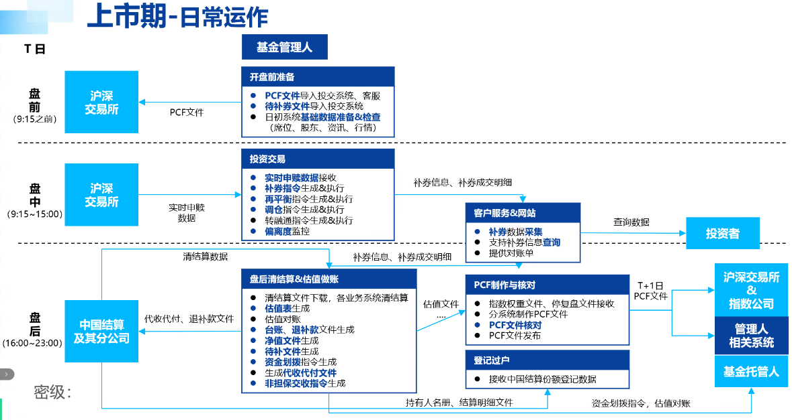

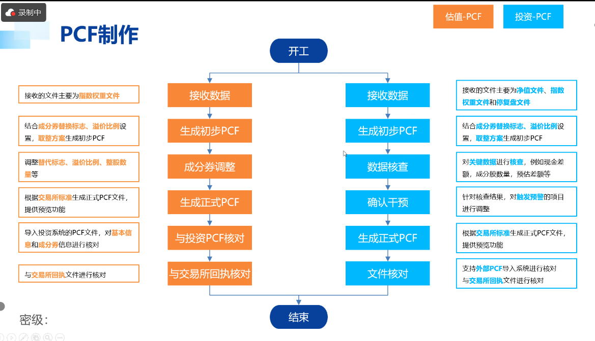

### 2.2 ETF的特点

#### 1. 同时具有开放式基金与封闭式基金的特点
ETF基金集合了开放式基金与封闭式基金的特点，即发行端申购赎回，也可在二级市场进行份额买卖。

- ==开放式基金==：基金成立后，基金份额不固定，投资者依然可以向基金发行端（发行基金的基金公司）进行申购赎回操作，申购即增加对应基金的份额，赎回即减少对应基金的份额。
- ==封闭式基金==：基金成立后，基金份额固定，投资者不能再向基金发行端进行申购赎回操作，但是可以在二级市场进行份额买卖。
    - 二级市场基金份额买卖与发行端申购赎回的区别：二级市场的份额买卖并不会影响该封闭式基金的份额，因为二级市场基金的份额买卖是在投资者之间进行的，与基金发行端无关。而发行端申购赎回是基金投资者与基金发行人（基金公司）之间的交易，会直接影响到基金份额的变动。
    - 且一级市场(发行端申赎)与二级市场本质区别是，二级市场中基金购买者支付的资金并不会流向基金发行人，而是流向基金的销售者。

ETF=交易+指数+基金

- 交易：ETF可以在证券交易所二级市场买卖(【证券交易】页面进行ETF基金买卖操作)
- 指数：ETF是以特定指数为模板的被动型指数基金;
- 基金：ETF是可以随时进行申赎的开放式基金(【ETF交易】页面进行的ETF基金申赎操作);

#### 2. ETF基金规模较为稳定
一般开放式基金，受到申赎的影响，基金规模很难做到稳定，但是ETF基金有申赎门槛要求，一般是100万或200万，份额一般是50~100万份之间，所以不适合普通投资者，因此可做到规模稳定。

#### 3. ETF的资金利用效率是所有基金中最高的
ETF虽然可以像开放式基金一样，开放申购赎回，但是受其实物申赎规则的影响，投资者申购是用的一篮子股票，换同样属于资产的基金；赎回时用属于资产的基金，换回同样属于资产的股票。因此大大减小了建仓的难度，且不必预留相当一部分资金应对投资者的赎回需求，资金利用率很高。

#### 4. ETF基金跟踪指数走势精确
相比于普通的指数基金，ETF基金可以将股票仓位提高到98%~99%其至更多，但是普通的指数基金，为了应对投资者的赎回需求，仓位一般只有90%左右。

对于普通的指数基金，股市疯狂下跌时，投资者大量赎回，基金管理人就不得在低位卖出股票，导致更大的亏损;而股市上涨时，投资者大量申购，导致基金规模迅速膨胀，基金经理来不及建仓，就会导致基金的资金利用率下降，因此指数基金的真实涨幅会远远跑输指数的理论涨幅。

因此ETF基金是所有被动型基金中，跟踪指数走势精度最高的基金。
#### 5. 二级市场投资门槛低
虽然ETF基金一级市场申赎有最小申赎单位限制，但是ETF基金二级市场最小买卖单位与股票相同，都是100（即1手，100基金份额）。

#### 6. 资金周转率高
二级市场卖出ETF份额，与二级市场卖出股票基本一致，资金都是当日可用，次日可取；而普通的开放式基金需要等待一天才能够申购确认成功，赎回需要三四天才能够资金到账。因此，ETF的资金周转率要明显优于一般的开放式基金。

#### 7. 管理费用低
ETF管理费低，实物申赎，不需要基金经理操太多心，因此管理费很低，一般只有0.3~0.5%一年，是所有偏股型基金中管理费最低的。

#### 8. 均为场内交易
与一般的开放式基金需要在场外进行申赎不同，ETF由于实物申赎机制，申赎也在场内进行。
- 上交所在 **综合业务平台** 处理ETF申赎业务
- 深交所在 **非交易处理平台** 处理ETF申赎业务。

### 2.3 ETF基金的分类
根据所跟踪标的类别的不同，可以将ETF基金分为股票ETF、债券ETF、商品ETF、货币ETF(交易型货币基金)、跨境ETF；根据所跟踪标的是否属于单一市场，还可将ETF分为单市场ETF、跨市场ETF

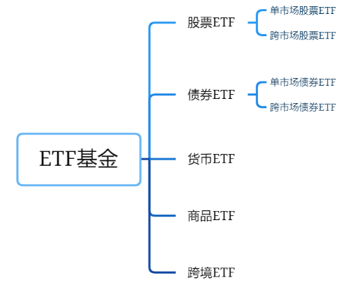

### 2.4 ETF基金和其他基金的区别

| 特性维度         | ETF 基金                                  | 普通指数基金                             | 普通开放式基金 (主动型)                  | LOF基金                                  |
| :--------------- | :---------------------------------------- | :--------------------------------------- | :--------------------------------------- | :--------------------------------------- |
| **全称**           | 交易型开放式指数基金                          | 场外开放式指数基金                           | 开放式基金 (通常指主动管理型)                  | 上市型开放式基金                             |
| **投资目标**       | 被动跟踪标的指数，最小化跟踪误差                  | 被动跟踪标的指数，最小化跟踪误差                 | **追求超额收益**，力图跑赢市场基准        | **因产品而异**，既有被动指数型，也有主动管理型 |
| **交易市场**       | 一级市场（场内实物申赎）+ 二级市场（场内买卖）        | 场外一级市场（现金申赎）；无二级市场              | 场外一级市场（现金申赎）；无二级市场              | **场内 + 场外双市场** （可交易可申赎）          |
| **买卖方式**       | 场内像股票一样实时撮合；一级市场用“一篮子股票”申赎     | 场外按“当日收盘净值”现金申赎                 | 场外按“当日收盘净值”现金申赎                 | **场内像股票一样实时买卖**； 场外按净值申赎       |
| **交易时间**       | 交易所开市时段（9:30-11:30, 13:00-15:00） | 15:00前下单按当日净值，15:00后顺延下一交易日    | 15:00前下单按当日净值，15:00后顺延下一交易日    | 场内：交易时间； 场外：申赎时间同普通基金         |
| **最小交易单位**   | 场内1手（100份）起；一级市场通常30万～100万份起 | 门槛很低，适合普通投资者                    | 门槛很低，适合普通投资者                    | 场内1手（100份）起； 场外门槛低                |
| **价格形成**       | 场内实时价格（可折溢价）；IOPV每15秒刷新       | 当日收盘后统一净值                         | 当日收盘后统一净值                         | **场内实时交易价格**； 场外为当日收盘净值         |
| **折溢价**         | 可能出现，但套利机制使其贴近净值                 | 无折溢价，始终按净值                       | 无折溢价，始终按净值                       | **场内价格可能相对净值出现折溢价**               |
| **申购赎回对价**   | 实物股票篮子 ± 现金差额                     | 现金 | 现金 | 现金（无论场内场外申赎） |
| **赎回到账**       | 场内卖出T+1可取；一级市场赎回股票T+2           | 赎回T+1～T+3资金到账                    | 赎回T+1～T+3资金到账                    | 场内卖出T+1可取； 场外赎回T+1～T+3到账        |
| **交易成本**       | 场内佣金低，无印花税；一级市场固定申赎费           | 申购费0～1.5%，赎回费0～0.5%              | **申购费1.2%～1.5%**，赎回费0～1.5%        | 场内交易佣金同股票； 场外申赎费同普通基金         |
| **管理费**         | **0.15%～0.5%/年，普遍更低**                | 0.5%～1.0%/年                         | **1.2%～1.5%/年，普遍更高**                | 指数LOF同指数基金； 主动LOF同主动基金         |
| **托管费**         | **0.05%～0.1%/年**                        | 0.1%～0.2%/年                         | 0.1%～0.25%/年                        | 指数LOF同指数基金； 主动LOF同主动基金         |
| **信息披露**       | 每日公布PCF清单 + 实时IOPV                 | 每日公布净值；持仓每月/季披露                 | 每日公布净值；持仓每季披露（滞后）          | 每日公布净值；持仓按季报披露 |
| **透明度**         | **极高，持仓、权重每日可查**                  | 较高，但滞后                            | **较低，仅季报/年报重仓股**                 | 同普通开放式基金                           |
| **跟踪误差**       | 通常<0.2%/年（实物复制+套利）                | 0.3%～0.5%/年（现金拖累+费用）              | **不适用**（追求主动偏离）                   | 指数LOF有跟踪误差； 主动LOF不适用            |
| **分红方式**       | 现金分红或红利再投，可场内卖出                 | 现金分红或红利再投                       | 现金分红或红利再投                       | 现金分红或红利再投                         |
| **产品举例**  | 华泰柏瑞沪深300ETF（510300）               | 华夏沪深300指数A（000051）               | 易方达消费行业股票（110022）               | 富国天惠成长混合(LOF)（161005） |
{.small}

## 3. 什么是ETF联接基金？

“联接基金”就是一只普通开放式基金，它自己不直接买股票，而是把绝大部分资产拿去买一只指定的 ETF，相当于帮投资者“间接”持有那只 ETF。

很多投资者没有股票账户，没法买 ETF；联接基金让他们也能参与。

- ETF负责场内，主要满足场内交易者的需求；
- ETF联接负责场外，主要满足基金投资者的需求。

## 4. 什么是PCF文件?

### 4.1 PCF文件的概念

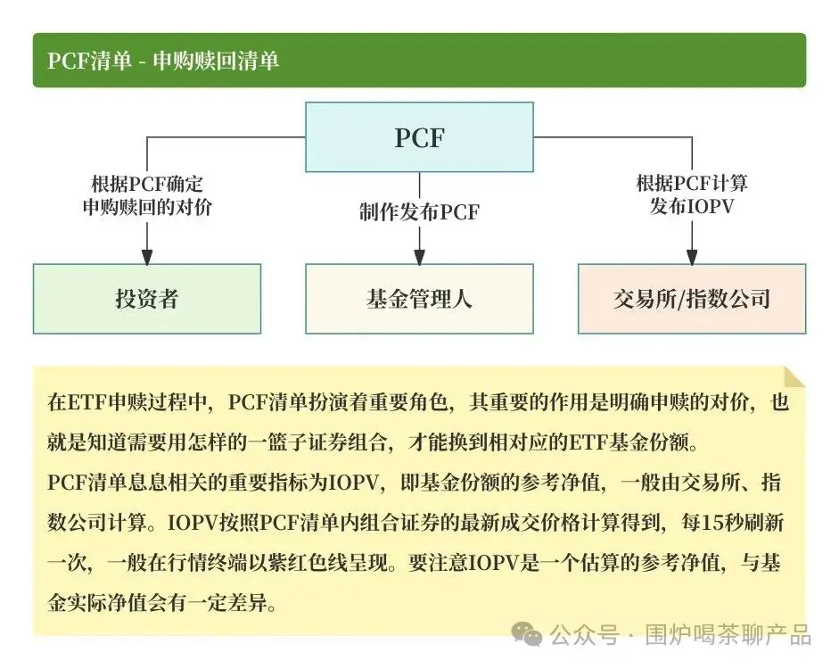
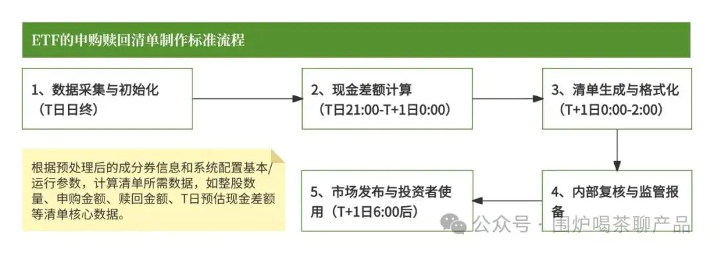

PCF是ETF基金的 **申购赎回清单** 文件，全称为Portfolio Composition File 。

PCF文件说明了要申购一个“**最小申购赎回单位**”的ETF份额时需要提供的证券种类和数量。

PCF申购赎回清单文件，是根据基金资产净值、目标指数的成份股情况由基金公司生成、在每个交易日8点之前发给交易所(深交所可以提前一天发送)。交易所确认后将在网站上公布PCF文件，列出当日进行实物中购赎回时应交付的一篮子股票清单和现金差额，投资者可依据该清单内容进行当日的申购赎回。

ETF发行管理系统中PCF文件制作系统的作用，就是为ETF基金的管理人计算投资者每日申购赎回ETF时应交付的一篮子股票数量及预估现金差额，并生成对应的申购赎回清单文件。

ETF管理人(基金公司)每日开市前会根据基金净值、投资组合以及目标指数的成份股等等情况，公布申购赎回清单文件，文件中列明了当日进行实物申购赎回时所应交付的一篮子股票清单，一般来说很多基金公司T日的PCF会在T-1日晚上就公布出来。

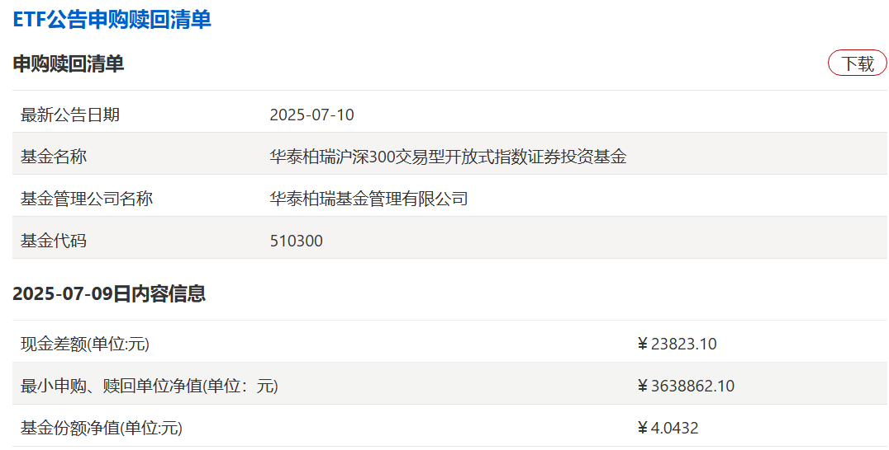
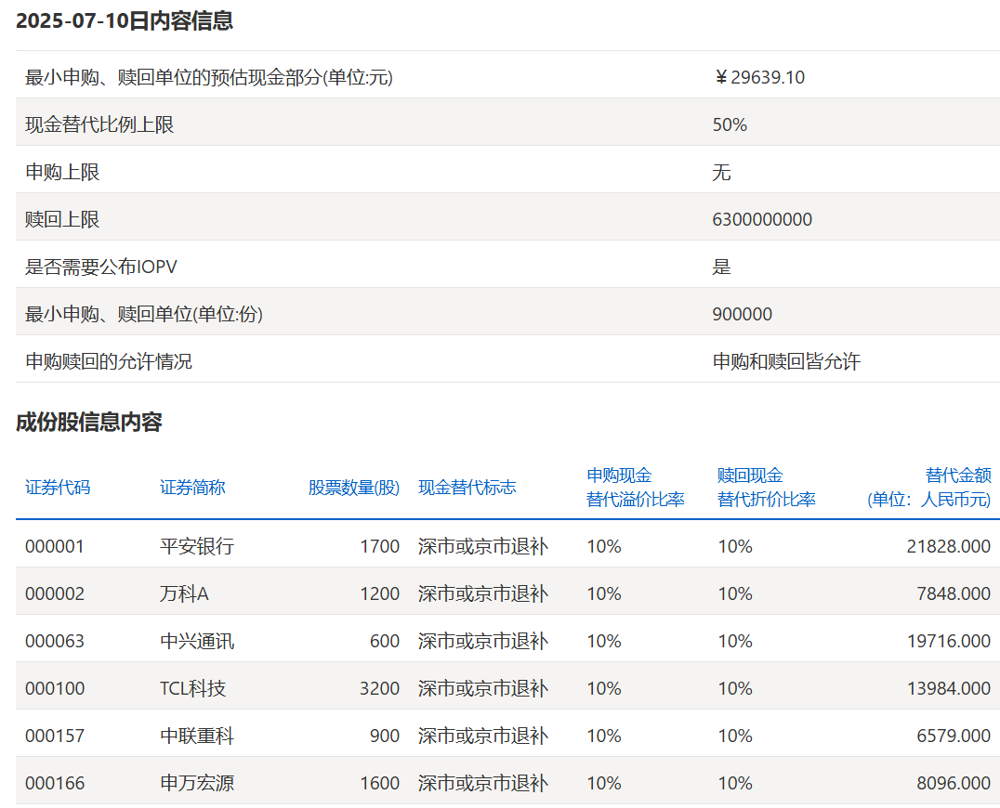

### 4.2 上个交易日信息
- **现金差额**：T-1日最小申赎单位的资产净值-(按当日收盘价计算的最小申赎单位中组合证券市值+现金替代)
    - 现金差额是指在申购赎回过程中，**==基金净值与成分股组合市值之间的差额==**。这个差额通常用于补平因为成分股数量取整、交易成本或市场波动等因素导致的差异。
- **基金份额净值**：基金单位净值，和普通的开基净值计算公式一样，（总资产-负债）÷基金份额。每天收盘后计算一次，T1公布。
- **最小申购赎回单位净值**：最小申购赎回单位×基金份额净值

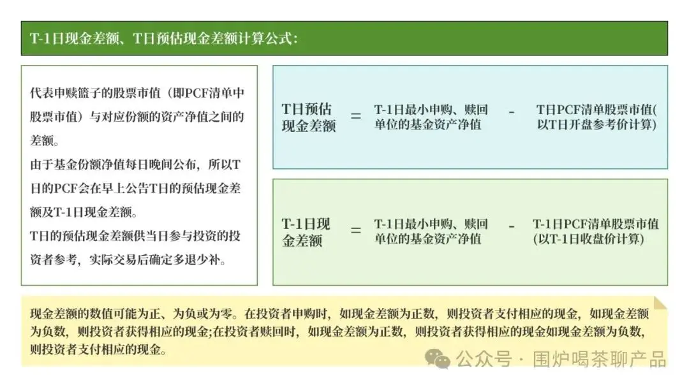

### 4.3 当天交易日信息

- **预估现金差额**：T-1日基金最小申赎单位资产净值-通过==预估开盘价==计算一篮子股票的市值。
- **最小申购赎回单位（创设单位）**：由基金管理人规定的最小申赎单位(份)，是基金申购份额、赎回份额的最低数量，一般是30万份、50万份、100万份或其整数倍。
- **现金替代比例上限**（最大现金替代比例）：ETF基金申购时，部分成分股可以用现金替代申购，但是应满足现有现金替代比例≤最大现金替代比例;现有现金替代比例=∑(替代证券数量x替代证券参考价格)÷申购赎回资产净值

- **是否需要公布IOPV**（Indicative Optimized Portfolio Value）：基金份额参考净值，是ETF基金的参考净值，是交易所根据基金公司提供的ETF申购赎回清单，以及成份股的实时成交价格计算的ETF基金参考净值，IOPV是动态更新的，每十五秒更新一次。
    - 计算公式为:基金份额参考净值＝（PCF中必须用现金替代的替代金额＋申购、赎回清单中可以用现金替代成份证券的数量与 **最新成交价**相乘之和＋申购、赎回清单中禁止用现金替代成份证券的数量与**最新成交价**相乘之和＋申购、赎回清单中的预估现金部分）/创设单位的份额。
    - ETF在盘中交易时的“实时净值”，它告诉你现在一份ETF大概值多少钱。
    - 因为ETF是像股票一样在交易所买卖的，价格随时在变动，而基金的真实净值（NAV）每天只公布一次（收盘后），所以盘中交易时，投资者需要一个实时参考值来判断ETF是否被高估或低估。
    - 判断ETF是否溢价或折价：
        如果 ETF 的市场价格 > IOPV → 溢价；
        如果 ETF 的市场价格 < IOPV → 折价；

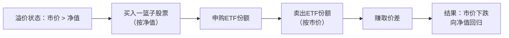

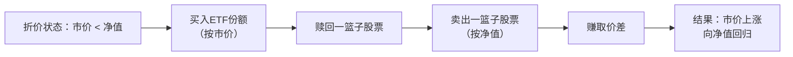

### 4.4 ETF的T日预估现金差额和T-1日现金差额

ETF基金的现金差额是指在申购赎回过程中，**基金净值与成分股组合市值之间的差额**。这个差额通常用于补平因为成分股数量取整、交易成本或市场波动等因素导致的差异。

ETF每天会公布申购赎回清单，里面有一篮子股票的组成及现金差异部分。现金差异的产生主要由于申购赎回清单一篮子股票里的成分股股数经过计算取整，与实际股数有一定差异，所以需要用一些现金来补平。

预估现金差额 和 现金差额 均是现金差异部分。不同的是，预估现金是对未来一日现金差异的估计值，现金差额是当日现金差异的实际值。两者计算公式差不多，只不过预估现金用的是==预计开盘价==，现金差额用的是==收盘价==来计算的。

换句话说，T-1日现金差额是给昨天申购了ETF基金的人用的，预估现金差额是给今天申购ETF基金的人用的。

做申赎的话，得用一个单位的申赎份额（100万份，上证50ETF），100万份的基金资产代表了多少资金，而你用篮子申购时，篮子的资产可能会大于或小于100万份所代表的资金，造成不等价，所以会有现金差额这一说。

如果T日一个申赎单位的基金资产为1000元，无论当前篮子股票代表的资产是否满足申赎，都会冻结现金差额，但是这个现金差额是“预估现金差额”，它是“T-1日的一个申赎基金净值资产”减去“T日开市前用预开盘价算出的篮子资产”。

等T日日终后，基金公司会计算T日的真实现金差额，等T+1会再根据T日的实际现金差额对T日冻结的预估现金差额做处理；

举个例子：

如果T日预估现金差额为1000元，那么T日：

- 做申购时，会冻结1000元，也就是说你用不足的钱（篮子），得到了多余的钱（基金），所以要冻结你差的那部分钱；

- 做赎回时，你就会以过多的成本得到不足的收益，也按1000元给你；

等T+1时T日实际现金差额出来了，再做计算，如果T日实际现金差额为800元，那么：

- T日做的申购，那就是多冻结了200元，要解冻200元；

- T日做的赎回，那就是多给了200，还要扣掉你200元。

如果T日实际现金差额为1100元，那么：

- T日做的申购，那就是少冻结了100元，要再扣除100元；

- T日做的赎回，那就是少给了100，还要再给100元。

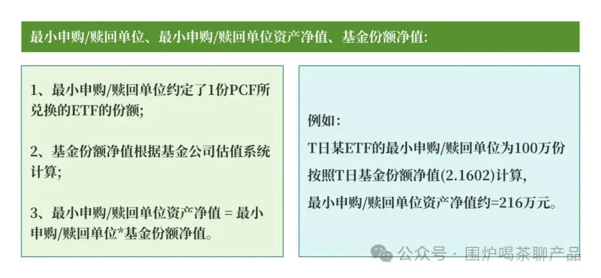
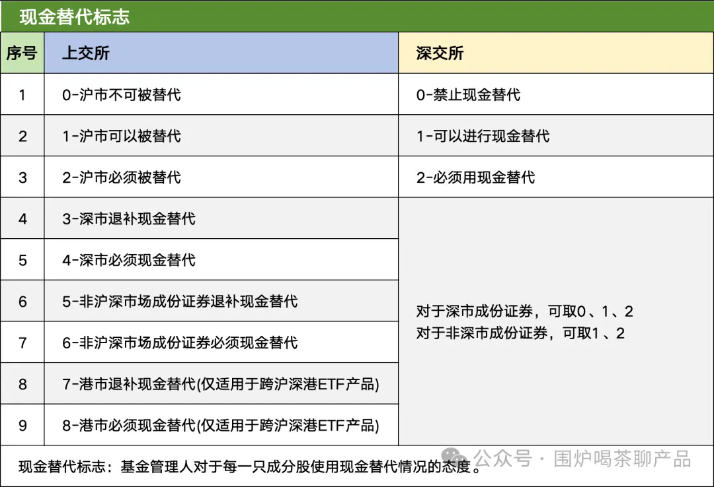

| 标志值   | 名称                      | 含义 |
| ----- | -------------------------- | ------------------------------- |
| **0** | **沪市禁止现金替代**               | 该沪市证券只能交股票，不接受现金。               |
| **1** | **沪市允许现金替代**               | 沪市证券先用股票，差额可补现金；赎回时必须给股票。       |
| **2** | **沪市必须现金替代**               | 沪市证券只能用固定现金，不能交股票。              |
| **3** | **深市或京市退补现金替代**            | 深市/京市证券只能用现金，实际买价高于/低于预付时需多退少补。 |
| **4** | **深市或京市必须现金替代**            | 深市/京市证券只能用固定现金，无退补环节。           |
| **5** | **成份证券退补现金替代（仅 ETF 现金申赎）** | 现金申赎 ETF 专用，退补机制同 3。            |
| **6** | **成份证券必须现金替代（仅 ETF 现金申赎）** | 现金申赎 ETF 专用，固定现金无退补。            |
| **7** | **港市退补现金替代**               | 港股通成份股，现金替代+退补。                 |
| **8** | **港市必须现金替代**               | 港股通成份股，固定现金无退补。                 |
{.small}

### 4.5 成分股信息

- 股票数量：（创设单位净值 – 创设单位分红） \* 指数权重 / 除权后昨收盘价，然后对计算结果四舍五入或截取到个位数。

- **现金替代-禁止**：申赎基金份额时，该成分证券不允许使用现金替代。

- **现金替代-允许**：指申购基金份额时，允许使用现金替代部分股票，但是赎回基金份额时，基金管理人不允许使用现金进行替代(即投资者申购时可以用钱买，但是投资者赎回时基金管理人(基金公司)必须给投资者证券)。

- **现金替代-必须**：指申购基金份额时，必须使用固定代替金额进行代替(一般这类证券都是从指数中即将剔除的成分股或者这个证券长期停牌，或者是该证券复牌后连续涨停，无论是投资者还是基金管理人都很难从市场上买到的证券);在投资者进行赎回操作时，基金管理人也是用现金替代成分股票。

- **现金替代-深市或京市退补**：对于上海跨市场ETF里非沪市的成分股，投资者申购基金份额时可以使用现金替代，把钱交给管理人去相应市场上买券；有两种情况会产生退补款：
    - 该券大涨，投资者给基金管理人的钱不够买相应数量的证券，这时候投资者需要补交对应的差额现金。
    - 该券大跌，基金管理人用投资者的钱买完对应的证券还有一定的资金剩余，则此时基金管理人会将这部分剩余退还至投资者手中。

- **现金替代-深市或京市必须**：主要针对上海跨市场ETF中，申赎基金份额时，必须使用固定金额进行替代，无退补环节。

- **现金替代-溢价比例**：对于现金替代部分的证券，基金管理人从投资者手中收取现金时，为了应对市场证券价格的波动，基金管理人会在证券参考价格的基础之上多收取一定比例的现金即现金替代溢价比例，比如多收取10%，为了防止有人趁机占便宜，基金公司得先估个“溢价”也就是多收一点钱，以防股票价格突然暴涨。

- **现金替代-折价比例**：在ETF赎回过程中，投资者使用现金替代某些证券时，基金管理人会把赎回金额打个折扣。这个折扣是相对于证券的参考价格（通常是T-1日收盘价）计算的。

- **现金替代金额**=替代证券数量×替代证券参考价格×(1+现金替代溢价比例)
    - 证券参考价格的一般确认原则：该证券正常交易时，采用最新成交价：该证券正常交易中出现涨停跌停时，采用涨停/跌停价格;该证券牌且当日有成交时，采用最新成交价;该证券停牌且当日无成交时，采用前收盘价。

- **现金替代-退补款**：申购ETF基金份额时，基金管理人对投资者现金替代部分的资金进行多退少补。退补款通常是在

### 4.6 现金替代的退补款和现金差额的区别

这两条数据不能弄混淆

- 现金替代的多退少补：是 **买股票实际成交价** 和 **现金替代的成分股加上溢价比率的预付价** 的差额，纯粹是交易层面的找零。
    - 如果预先收取的金额高于基金购入该部分证券的实际成本，则基金管理人将退还多收取的差额;如果预先收取的金额低于基金购入该部分证券的实际成本，则基金管理人将向投资者收取欠缺的差额。

- 现金差额、预估现金差额：是 **基金净资产** 和 **篮子市值** 的轧差，是篮子股数取整、当天分红到账、交易税费结算等机械性差异，在 T 日收盘后一次性算清，第二天就轧平。

::: tip

现金替代退补款 = 预付现金 与实际成交价 的找零，发生在 补券环节；

现金差额 = 基金净资产 与 篮子市值 的轧差，发生在 收盘后；
两条线互不干扰，但都会体现在 T+2 日资金流水 里。
:::

## 5. 什么是补券？

### 5.1 补券的概念
当投资者用 **现金替代** 申购 ETF 时，基金管理人必须在规定时间内，把 **投资者预付的现金** 拿到二级市场 **真正买回** 缺位的成分股，并把买到的股票 **过户进基金证券账户**，使基金投资组合与标的指数保持 **权重匹配**。

### 5.2 需要补券的业务场景
- **允许现金替代**  
 投资者申购时选择“用钱代替”B 股票 2,900 股，基金管理人收到 58,000 × (1+10%) = 63,800 元，必须在 **T+2** 内买回 2,900 股 B 股票。  
- **必须现金替代**  
 C 股票因停牌或涨停，PCF 标记“必须现金替代”，投资者预付 800×600×1.0 = 480,000 元，基金管理人同样要补券。
    - 必须现金替代的成份股，申购者给钱，赎回时也给的是钱；但是投资经理收到钱后还得去二级市场买成份股，以缩小指数跟踪误差
- **深市退补**  
 D、E、F 等深市成分股被标记“深市退补”，基金管理人用投资者预付现金在深交所市场 **逐笔成交**，成交结果与预付金额之间的差额 **多退少补**。

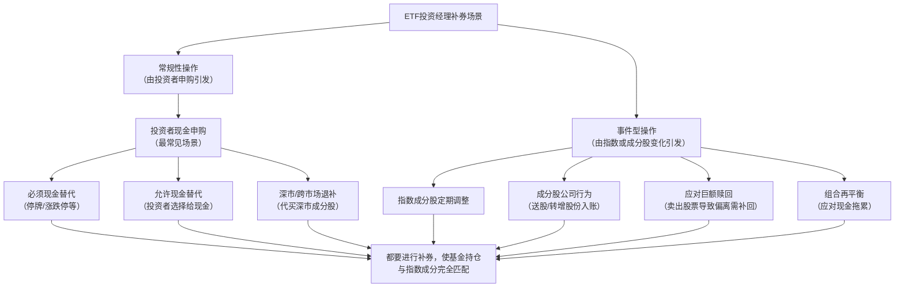

## 6. 业务流程举例

假设小明是投资者，小红是一个上交所跨市场ETF基金“小红ETF”的管理人。小红ETF跟踪“x指数”，这个指数有六个成分股，里面有上交所三个成分股ABC，深交所三个成分股DEF。

---

### 6.1 T 日 PCF（申购赎回清单）

| 股票 | 代码 | 市场 | 替代标志 | 股数 | 昨收盘 | 参考开盘价 | 权重 | 市值 | 申购现金替代溢价比率 | 赎回现金替代折价比率 |
| --- | -- | :---: | --- | --- | -- | --- | -- | --- | --- | -- |
| A 华夏银行 | 600015 | 上交所 | 允许 | 1300 | 93 | 93 | 11.8497% | 120900 | 10% | 0% |
| B 民生银行 | 600016 | 上交所 | 允许 | 2900 | 20 | 20 | 5.873% | 58000 | 10% | 10% |
| C 中国石化 | 600028 | 上交所 | 必须 | 800 | 600 | 600 | 48.3736% | 480000 | 0% | 0% |
| D 爱施德 | 002416 | 深交所 | 深市退补 | 13900 | 11.1 | 11.1 | 15.4482% | 154290 | 10% | 10% |
| E 亚太科技 | 002540 | 深交所 | 深市退补 | 7500 | 5.35 | 5.35 | 4.0198% | 40125 | 0% | 0% |
| F 万和电气 | 002543 | 深交所 | 深市退补 | 13600 | 10.6 | 10.6 | 14.4357% | 144160 | 10% | 10% |
| T日预估现金差额 | | 998639.2531-997475=1164.25 {colspan=9} |
| 创设单位 | | 1000000 份 {colspan=9} |
| T-1日基金的份额净值 | | 0.998639元 {colspan=9} |
| T-1日现金差额 | | 1164.25{colspan=9} |
{.small}

小明：我要申购ETF基金。
**小红**：你要申购多少？你必须申购==最小申赎单位==（也叫创设单位）的==整数倍==。

小明：我要申购一个创设单位的ETF基金。
**小红**：好。拿一个**申购对价**过来。
小明：什么叫申购对价？
**小红**：申购对价就是你为了拿到基金份额，必须一次性交给我的等价物。这个等价物可以是股票、现金，必须使我们在当日收盘后的基金净值尺度上“等价”，谁也不吃亏，谁也不白拿。你要申购一个创设单位的ETF基金，就要交给我一个“篮子”，这个篮子里装着一揽子股票＋应补/应退的现金差额＋可能产生的现金替代款项。
小明：也就是说，今天我付出的东西，总价值要和我申购的基金份额今天收盘后的净值要相等。
**小红**：正是如此。

小明：我要给你哪些东西？
**小红**：给你一张PCF清单，按照这上面的要求给我股票和现金就行。
小明：你是怎么做出这张清单的？
**小红**：昨天晚上我拿到指数公司给我的指数收盘文件（里面包含成分股权重、参考开盘价、除权除息停牌事件等要素）、基金会计给我的估值表（包括基金T-1日份额净值等）、交易所规则（监管要求、涨跌停幅度等）、临时公告（成分股停牌信息、配股送股等），加上我自己的判断，就能制作出来。

小明：拿到这些文件后，你自己能决定的事情有哪些？
**小红**：我的目标是**跟踪指数**，尽量使**小红**ETF的表现接近指数的表现。我可以决定股票数量不为100整数倍时向上还是向下取整、可以决定每只成分股的折溢价比例、可以一定程度上决定每个成分股的现金替代标志等。

小明：你这个清单里，每个成分股的股数是怎么计算的？为什么我要给你这么多的股票？
**小红**：股数是**按指数权重×创设单位净值÷昨收价**。公式就长这样：
单只股票应配股数 ＝（指数权重 × 创设单位净值）÷ 昨收价，再四舍五入到整数股。

小明：你算出来的股票应该是有零头的吧？用创设单位净值*指数权重÷昨收价，不满一百的股票零头要怎么处理？
**小红**：拿今天T日的PCF制作过程举例：
- 昨晚创设单位净值＝1000000 份 × 0.9986392531元＝998639.2531 元；
- A 在指数里权重 11.8497%，昨收 93 元，于是（11.8497% * 998639.2531）÷93＝1272.4274。
我先把小数部分四舍五入，然后再向上取整得到1300股。
所有算出的股数加起来，总市值尽量逼近创设单位净值，误差就靠预估现金差额一次性找平。

### 6.2 T 日申购

**小红**：现在你要交给我：
1、股票：1300股A和2900股B，当然你也可以用现金替代；
2、现金替代款：480000+(154290+144160)*1.1+40125 = 848420
小明：我决定A股不用现金替代，其他全部使用现金替代。
小红：那你要给我63800+480000+(154290+144160)*1.1+40125 = 912220，加上1300股A。

小明：为什么你要在PCF里给成份股设置一个溢价？
**小红**：对于能使用现金替代的证券，我得在证券恢复交易后买入，而**实际买入价格**（买入成本）加上相关交易费用后，与你申购时的参考价格可能有所差异。而且谁知道这个券会不会停牌、涨停？所以我在PCF中预先设置溢价比例。如果预收的金额高于我购入该部分证券的实际成本，会退给你多收取的差额；如果预收的金额低于实际购入成本，我还得将向你追缴欠缺的差额。

小明：你收了我的现金替代款，深交所的券什么时候买入？
**小红**：在 T 日后被替代的成份证券有正常交易的 2 个交易日（ T+2 日）内，我会尽力以收到的替代金额买入被替代的部分证券。但你知道，如果这个券涨停我买不到也没办法。流程是这样：

| 时间 | 流程 | 说明 |
| :------- | :----------------------------------------------------------------------- | :------------------------------------------------------------------- |
| **T日**    | 投资者申购，按PCF清单支付**替代金额**（含溢价）                         | 基金管理人预先收取资金，用于后续购买被替代的证券                                 |
| **T+2日内** | 基金管理人用收到的替代金额，在二级市场**买入**被替代的成分证券                 | 力求在T+2日内完成购买                                                      |
| **T+2日日终** | **根据实际买入情况，计算并确定应退还小明，或小明应补交的款项**（退补款） | 对比替代金额与实际购入成本（包括买入价格和交易费用）的差额 |
| | **若全部购入**：替代金额 与 全部实际购入成本的差额 | 多退少补 |
| | **若未全部购入**：替代金额 与 (已购入部分实际成本 + 未购入部分T+2日收盘价计算的价值) 的差额 | 即使未能全部购入，也需按规则进行结算 |
{.small}

#### 申购与赎回的清算交收

投资者T日申购成功后，中登
- 在T日收市后办理上交所上市的成份股交收与基金份额的交收登记以及现金替代的清算；
- 在T+1日办理现金替代的交收以及现金差额的清算；
- 在T+2日办理现金差额的交收，并将结果发送给申购赎回代理券商、基金管理人和基金托管人。

投资者T日赎回成功后，登记结算机构
- 在T日收市后办理上交所上市的成份股交收与基金份额的注销以及现金替代的清算；
- 在T+1日办理现金替代的交收以及现金差额的清算；
- 在T+2日办理现金差额的交收，并将结果发送给申购赎回代理券商、基金管理人和基金托管人。 

---

### 6.3 T+1 日：补券C、D与退补款

| 股票 | 替代标志     | 替代数量 | T日参考价格 (元) | 现金替代溢价比例 | T日预付金额 | T+1日实际成交价 | 交易费用 | 实际总成本 | T+1日退补款 | 说明 |
| :--- | :----------- | :------- | :--------------- | :--------------- | :--------------------------------------------- | :------------------- | :-------------------- | :--------------------------------------------- | :--------------------------------------------- | :----------------------------------------------------------- |
| 公式 | | | | | 数量×参考价×(1+溢价比例) | | 假设0.05% | 数量×实际成交价 + 交易费用 | 预付金额 - 实际总成本 | |
| B    | 允许现金替代 | 2,900股  | 20.00 | 10%  | 2,900 × 20 × (1+10%) = **63,800**  | 20.50    | 63,800 × 0.05% = 32  | 2,900 × 20.50 + 32 = **59,482**    | 63,800 - 59,482 = **+4,318**       | 需退4,318元 |
| C    | 必须现金替代 | 800股    | 600.00 | 0% | 800 × 600 × (1+0%) = **480,000**  | 605.00 | 480,000 × 0.05% = 240 | 800 × 605 + 240 = **484,240**        | 480,000 - 484,240 = **-4,240**       | 小明需补4,240元 |
| D    | 深市退补     | 13,900股 | 11.10 | 10% | 13,900 × 11.10 × (1+10%) = **169,719**        | 11.00 | 169,719 × 0.05% = 85 | 13,900 × 11.00 + 85 = **152,985**    | 169,719 - 152,985 = **+16,734**      | 需退16,734元 |
| E    | 深市必须     | 7,500股  | 5.35   | 0%     | 7,500 × 5.35 × (1+0%) = **40,125** | 5.40     | 40,125 × 0.05% = 20 | 7,500 × 5.40 + 20 = **40,520**     | 40,125 - 40,520 = **-395**         | 小明需补395元 |
| F    | 深市退补     | 13,600股 | 10.60 | 10%  | 13,600 × 10.60 × (1+10%) = **158,576**        | 10.70 | 158,576 × 0.05% = 79 | 13,600 × 10.70 + 79 = **145,559**  | 158,576 - 145,559 = **+13,017**    | 需退13,017元 |
| **汇总** | **退补款 = +4,318 -4,240 +16,734 -395 +13,017 = +29,434元** {colspan=6} | 总体预付金额超出实际成本，小红需净退还给小明29,434元{colspan=4} |
{.small}

#### 现金替代、退补款的清算与交收

- ETF 二级市场交易的清算交收
    ETF 二级市场交易由中登作为共同对手方，按照货银对付的原则，实行多边净额结算。
- ETF 申购赎回的清算交收原则
    - 单市场股票ETF、单市场债券ETF申购赎回的清算交收：对于投资标的为沪市组合证券的单市场 ETF，其申购、赎回涉及的 ETF 份额、组合证券及其现金替代，中登提供净额结算服务；对申购赎回涉及的现金差额、现金替代退补款，本公司提供代收代付服务。
    - 跨市场股票 ETF 申购赎回的清算交收：对于投资标的涉及沪深市场组合证券的跨市场股票 ETF，其申购、赎回涉及的 ETF 份额、沪市组合证券及其现金替代，以及深市组合证券的现金替代，中登提供净额结算服务。对于跨市场股票 ETF 申购赎回涉及的现金差额、现金替代退补款，中登提供代收代付服务。

*   **资金交收**：中国结算在T+1日会办理现金替代的交收
*   **退补款清算**：小红**退还给小明29,434元**。这笔退补款通常会在T+3日左右到账。基金管理人完成补券或现金退补后，于 T+3 日完成资金结算。但交易所没有硬性规定，通常由基金招募说明书中自行规定。
*   **现金差额清算**：同时，登记结算机构也会在T+1日办理T日现金差额的清算。

### 6.4 T+2 日：现金差额交收

到了T+2日，主要处理的是现金差额的最终交收。现金差额是T日**最小申赎单位的实际资产净值**与**其成分证券市值**之间的差额，用于处理股数取整、分红、费用等造成的差异。

*   **T日预估现金差额**（来自PCF清单）：**1,164.25元**
*   **T日实际现金差额**（基金会计根据T日收盘价等精确计算）：假设为 **1,500.00元**

| 项目           | 金额 (元) | 说明                                                                                             |
| :------------- | :-------- | :----------------------------------------------------------------------------------------------- |
| T日预估现金差额 | 1,164.25  | T日申购时小明预先支付的金额                                                                        |
| T日实际现金差额 | 1500 | T日收市后根据真实数据计算的结果 |
| **差额**       | **-335.75** | 实际差额大于预估差额（1,500 > 1,164.25），意味着小明T日少支付了这部分现金，**因此小明需要补交335.75元**。 |
{.small}

*   **现金差额交收**：登记结算机构在T+2日办理现金差额的交收。因此，小明需要补交这335.75元。
*   **最终资金流动**：
    *   **T+1日退补款结果**：小红退还小明 29,434
    *   **T+2日现金差额结果**：小明需补交 335.75
    

小红：完事了，T2你要补交335.75的现金差额，这个钱中登代收代付自动划款。至于现金替代的退款29434元，我会尽可能快地还给你，比如T＋2日后第 1个工作日。另外，这两笔钱不轧差。

小明：也就是说，我用912220+335.75-29434 = 883121.75元，加上1300股A，换来了1000000份小红ETF。
小红：正是如此。

### 6.5 流程示意图

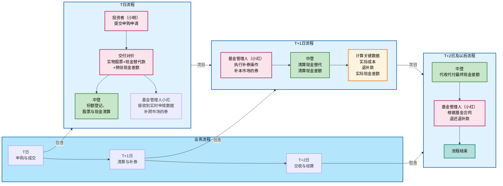

## 7. 可用时点说明

- ETF是==T0交收==还是==T1交收==？
目前，国内部分ETF品种支持T+0交易，比如，债券ETF、黄金ETF、跨境ETF、货币ETF；但是，股票ETF实施T+1交易。

- T日==申购==的ETF基金，T日可以==卖出、赎回==吗？
    - 上交所股票ETF，当日申购，当日可以卖出，当日不可赎回。

- T日==买入==的ETF基金，T日可以==卖出、赎回==吗？
    - 上交所股票ETF，当日买入，当日可以赎回，当日不可卖出。

- T日==赎回==的ETF基金成份股，T日可以用来==申购、卖出==吗？
    - 上交所股票ETF，当日赎回，**当日不可申购**，当日可以在二级市场卖出。

- T日在二级市场==买入的证券==，同日可以用于==卖出==，或==申购基金份额==吗？
    - 上交所股票ETF，T日在二级市场买入的成份股，当日不可卖出，但同日可以用来申购ETF。

- T日申购的ETF基金，现金差额什么时候清算、什么时候交收？
    - 上交所股票ETF，T1清算，T2交收

- T日申购的ETF基金，退补款什么时候交收？退款什么时候到账，补款什么时候扣除？
    - 主要看基金招募说明书的规定。行业惯例是T+2日后几个工作日内。

## 8. PCF文件的制作过程
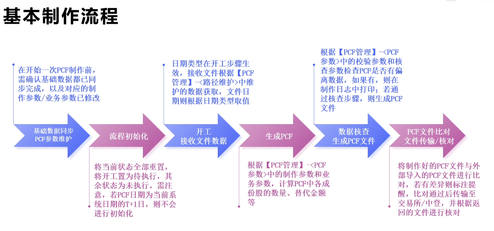
### 8.1 PCF文件的制作时间

PCF文件（Portfolio Composition File，即ETF申购赎回清单）是由ETF基金管理人在每个交易日开市前制作并公布的。通常，PCF文件会在交易日的前一天晚上或当天早晨完成制作，并在交易所官方网站和基金公司网站上披露。

### 8.2 PCF文件的制作步骤简述

- **数据准备**：
   - 获取指数公司提供的成分股权重文件（如中证指数公司提供的权重数据）。
   - 获取基金公司估值系统计算的基金净值信息。
   - 获取成分股的停牌、分红派息等临时公告信息。

- **计算清单内容**：
   - 根据成分股权重和基金净值计算每只成分股的数量。具体计算公式为：
     
     $$
     \text{某只成分股数量} = \frac{\text{该成分股权重*最小申购单位总市值}}{\text{股票收盘价}}
     $$

   - 对计算得到的成分股数量进行**取整处理**，以确保交易的整数股要求。
   - 计算现金差额，用于补平因成分股数量取整而产生的差额。

- **数据核对与校验**：
   - 使用系统自动校验功能，检查数据的一致性和完整性。
   - 通过人工复核，确保关键数据的准确性，例如现金差额与净值计算的准确性。
   - 对比第三方提供的清单文件，确保数据无误。

- **文件生成与提交**：
   - 生成PCF文件，并按照交易所的要求提交至交易所系统。

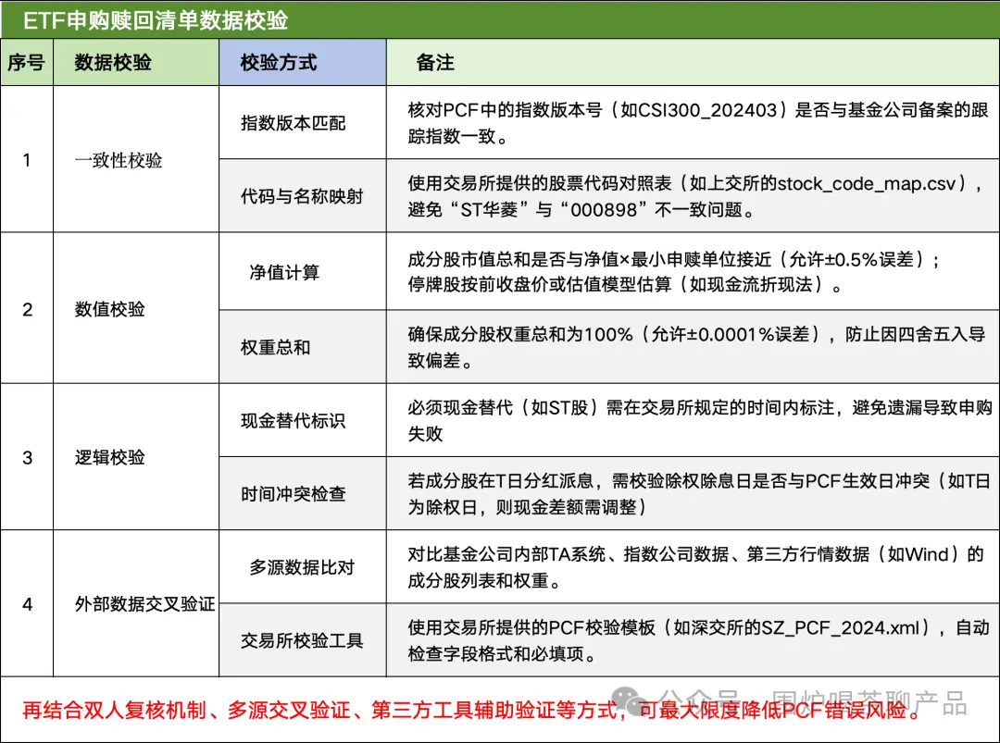

## 9. 清算结算处理流程
在 ETF 业务中提供多边净额结算、逐笔全额结算（包括实时逐笔全额结算 Real Time Gross Settlement 即RTGS和日终逐笔全额非担保结算）、资金代收代付业务三种服务

## 10. 术语表

| 术语 | 说明 |
| :--- | :--- |
| **ETF** | 交易型开放式指数基金。一种在交易所上市交易、基金份额可变的开放式指数基金。 |
| **PCF** | **申购赎回清单**。由基金管理人每日发布，列明投资者申购/赎回一个最小单位的ETF份额时，应交付的一篮子成分证券及现金差额等信息的文件。 |
| **IOPV** | **基金份额参考净值**。交易所根据PCF文件和成分股实时成交价格计算并发布的ETF实时参考净值，每15秒更新一次，用于判断ETF交易的折溢价。 |
| **最小申购赎回单位** | **创设单位**。投资者申购、赎回ETF份额的最低单位，通常为数十万份甚至数百万份基金份额。 |
| **现金差额** | 在申购赎回过程中，**T日最小申赎单位的实际资产净值**与**其成分证券市值**之间的差额。用于处理股数取整、分红、费用等造成的差异。T+1日清算，T+2日交收。 |
| **预估现金差额** | 对**T日现金差额的预测值**。在T日开盘前根据预估开盘价计算得出，用于T日申购赎回时的资金冻结。 |
| **现金替代** | 在ETF申购赎回时，允许、必须或禁止使用现金来代替部分成分股的操作。 |
| **现金替代-允许** | 申购时允许使用现金替代该成分股，赎回时基金管理人必须交付实物股票。 |
| **现金替代-必须** | 申购和赎回时都必须使用现金替代该成分股（通常因成分股停牌、涨跌停无法交易等原因）。 |
| **现金替代-禁止** | 申购和赎回时都禁止使用现金，必须使用实物股票。 |
| **现金替代-深市退补** | 针对沪市跨市场ETF中的深市成分股。申购时用现金替代，基金管理人于T+1日至T+2日实际买入股票，并根据**实际成交价与预付金额**进行多退少补。 |
| **现金替代溢价比例** | 申购时，对允许现金替代的成分股，在参考价格基础上额外收取一定比例现金，用于覆盖买入成本和价格波动风险。 |
| **退补款** | 专指在**现金替代**过程中，因**实际成交价**与**预付金额**不同而产生的多退少补款项。 |
| **补券** | 指基金管理人收到投资者**现金替代**的资金后，在二级市场**买入**所缺成分股，以充实基金资产的行为。必须在T+2日内完成。 |
| **一篮子股票** | 指构成一个最小申购赎回单位所对应的全部成分证券组合。 |
| **一级市场** | 指投资者与基金公司之间进行ETF份额**申购和赎回**的市场。 |
| **二级市场** | 指投资者之间在证券交易所**买卖**已发行的ETF份额的市场。 |
| **折价** | ETF的**二级市场交易价格**低于其**IOPV**的现象。 |
| **溢价** | ETF的**二级市场交易价格**高于其**IOPV**的现象。 |
| **跟踪误差** | ETF基金收益率与所跟踪指数收益率之间的偏差程度，是衡量ETF管理能力的关键指标。 |
| **ETF联接基金** | 一种将其绝大部分基金财产投资于跟踪同一标的指数的目标ETF，方便场外投资者间接投资ETF的基金。 |
| **综合业务平台** | 上交所处理ETF**申购赎回**等非交易业务的平台。 |
| **跨市场ETF** | 跟踪的指数成分券包含沪深两个交易所上市证券的ETF。涉及特殊的“深市退补”等现金替代模式。 |
| **单市场ETF** | 跟踪的指数成分券仅包含一个交易所（仅沪或仅深）上市证券的ETF。 |
{.small}