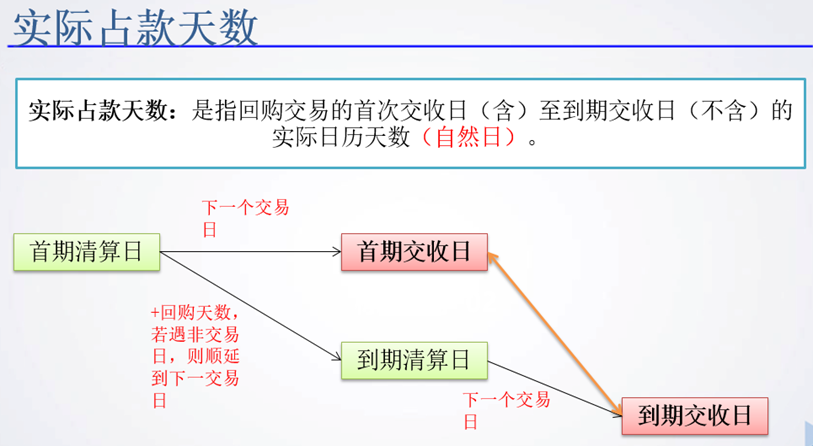
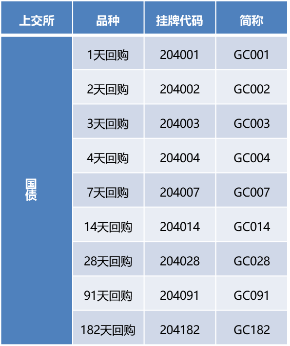

# 06_债券质押式回购

## 概念
- 质押式回购：债券质押式协议回购交易（以下简称“协议回购”）是指回购双方自主协商约定，由资金融入方（以下简称“正回购方”）将债券出质给资金融出方（以下简称“逆回购方”）融入资金，并在未来返还资金和支付回购利息，同时解除债券质押登记的交易。

- 正逆回购方：出质债券并融入资金的交易方为正回购方，融出资金的交易方为逆回购方。
- 回购利率：即正回购方支付给逆回购方在回购期间融入资金的利息与融入资金的比例，以年利率（%）表示，保留三位小数。
- **质押券面值总额**：即用于协议回购的质押券的面值的总和；
- **折算比例**：即成交金额占质押券面值总额的百分比；
- **成交金额**：即正回购方实际融入金额（不含其它费用），单位为元，保留两位小数；
- **回购利息**：即正回购方在到期结算日应当支付的利息。回购利息=成交金额×回购利率×实际占款天数/365，单位为元，保留两位小数；
- **到期结算金额**：即到期结算日正回购方应当支付的金额，等于成交金额与回购利息之和，单位为元，保留两位小数。

### 几个重要的日期

#### 1. 首期清算日（成交日）

首期交易日，也叫回购日期，是交易双方达成回购交易的日期。

#### 2. **首次结算日（首期交收日）**

因为沪深交易所实行T1交割，所以==首次结算日=首期交易日+1交易日==，为交易双方首次完成资金与质押券交割的固定日期；

对于协议回购，是T0交割，所以首期结算日就是首期清算日。

#### 3. **法定到期日**：首期交易日+回购天数
- 也叫**法定购回日期**=回购日期+回购天数，如果法定购回日期是周末，则同实际购回日期不同。

#### 4. **回购到期日（到期清算日）**

即回购双方约定回购到期的日期；**首期交易日+回购品种天数（名义天数），遇非交易日顺延到下一交易日**。

#### 5. **到期结算日（到期交收日）**

即回购双方履行到期结算义务的日期。回购到期日为本所交易日的，到期结算日为回购到期日；回购到期日非本所交易日的，到期结算日顺延至回购到期日的下一交易日；

- 即回购到期日+1个交易日，因为通用质押式回购是T+1交收

#### 6. 实际购回日期
回购日期+实际占款天数。由于工作日关系，实际购回日期和法定购回日期可能不同。也可以理解为到期结束日期

#### 回购期限
即成交日至回购到期日的实际天数。回购期限按自然日计算，以天为单位，含成交日，不含回购到期日；

#### **实际占款天数**

即==首次结算日（首期交收日）==至==到期结算日==的实际天数。实际占款天数按自然日计算，以天为单位，含首次结算日，不含到期结算日；

## 品种
### 上交所
一、上海交易所现有实行标准券制度的债券质押式回购有1天、2天、3天、4天、7天、14天、28天、91天、182天9个品种代码分别为204001（GC001）、204002（GC002）、204003（GC003）、204004（GC004）、204007（GC007）、204014（GC014）、204028（GC028）、204091（GC091）和204182（GC182）。

### 深交所
二、深圳交易所现有实行标准券制度的债券质押式回购有1天、2天、3天、4天、7天、14天、28天、63天、91天、182天、273天11个品种代码分别为131810（R-001）、131811（R-002）、131800（R-003）、131809（R-004）、131801（R-007）、131802（R-014）、131803（R-028）、131805（R-091）、131806（R-182）。
三、深交所企业债回购期限有1天、2天、3天、7天4种。
四、3天和7天的国债和企业债回购是包括周末的，比如在星期五做了一笔，周末是有利率收入的。

## 深交所业务规则
通用回购的证券代码为“1318**”, 简称为“R-***”，简称后三位是以天数表示的通用回购期限。

通用回购交易可以采用匹配成交、点击成交、询价成交、竞买成交、协商成交以及本所认可的其他交易方式达成。

### 债券可用时点
- 当日买入的债券，当日可申报作为质押券；
- 当日提交的质押券，在确认质押成功后，当日可用于相应的通用回购交易。
- 当日申报解除质押的债券，当日可以卖出，或再次申报转入质押库。

质押库内的质押券在质押期间，正回购方不得卖出、转股、换股和回售。

### 回购交易的价格

通用回购的价格单位为“每百元资金到期年收益”。
采用匹配成交方式的，申报价格最小变动单位为 0.005 元；采用
其他成交方式的，申报价格最小变动单位为 0.0001 元。