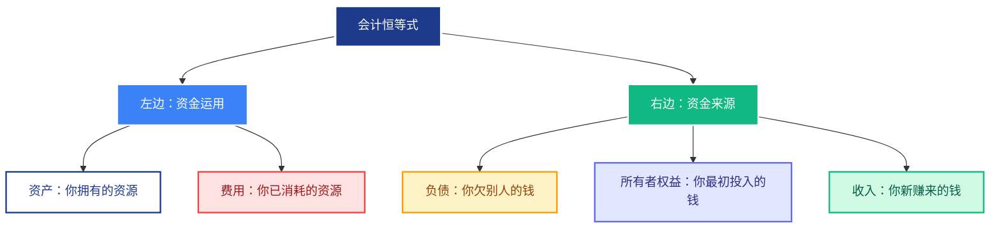

# 00. 会计知识基础

## 1. 会计是干什么的？  

把「钱从哪儿来、到哪儿去」用**数字+文字**记录下来，让老板、政府、投资人一眼看懂。

### 1.1 会计只干 3 件事  

1. 记账（发生业务 → 立刻写一笔）  
2. 算账（月底把账整理成报表）  
3. 报账（把报表给老板/税务局）


### 1.2 会计的事项只有 5 类

| 类别 | 是什么？ | 常见类别 | 在报表的位置 |
|------|--------|------------|--------------|
| **资产** | 我有的钱和东西，或者说，我能使用的钱和东西 | 现金、银行存款、应收账款、库存商品 | 资产负债表左边 |
| **负债** | 我欠别人的钱 | 应付账款、短期借款 | 资产负债表右边上半 |
| **所有者权益** | 真正属于我的钱，净值 | 实收资本、本年利润 | 资产负债表右边下半 |
| **收入** | 赚进来的钱 | 主营业务收入、其他收入 | 利润表上半 |
| **费用** | 花出去的钱 | 房租、工资、水电费 | 利润表下半 |
{.small}

## 2. 静态会计恒等式  
**“资产 = 负债 + 所有者权益”**

无论发生什么事，这句话永远成立。

::: tip 恒等式
Asset（**资产**）=Liability（**负债**）+ Equity（**权益**）
等式的左边为Debit（==借方==、用途、我的钱花在了哪里）
右边为Credit（==贷方==、来源、我的钱从哪来？）。

:::

公式左边说明了钱的用途，右边是说明钱的来源。所以他们其实是同一事物的一体两面，当然是相等的。

它可以近似地简化理解为，左边的资产是“欠”的（==资产的用途==），右边是“欠谁的”（==资产的来源==）。这里的“借”和“贷”，更大程度上是记账符号，无论是汉语还是英语，都不能直接用字面意思去理解。

复式薄记相当于今天的“大数据”工具。其主要的核心思想就是从两个角度记录同一个经济事件，从而避免了错记，漏计的情况发生。

最简单的例子就是：A借给B 100元钱，用复式记账的思维看就是两点：

从A的角度记录：A借给B 100元，（借）

从B的角度记录：B欠A 100元借款。（贷）

这样从A，B两个人的角度都记录同一事件，双重核帐，对账的时候就能保证准确性。

### 2.1 借 与 贷

- **借（Debit）**：写在左边  
- **贷（Credit）**：写在右边  

规则：
- 资产增加 → 资产科目记 **借**；资产减少 → 资产科目记 **贷**  
- 负债/权益增加 → 负债/权益科目记 **贷**；减少 → 负债/权益科目记 **借**  
- 收入增加 → 收入科目记 **贷**；
- 费用增加 → 费用科目记 **借**  

::: tip 借 与 贷
- 借方 = 左手（往外拿东西）
- 贷方 = 右手（往内收东西）

发工资：右手收工资（贷：收入），左手把钱存银行（借：存款）
买Switch：右手付钱（贷：存款），左手拿到游戏机（借：固定资产）

借方和贷方同时发生，就像你左手拿东西，右手必须付钱
:::


### 2.2 分录

分录是记录一笔经济业务的记账指令，明确指定：
- 哪个科目记借方
- 哪个科目记贷方
- 记多少钱

吃了一碗拉面，资产减少，现金科目减少，记贷方；费用增加，餐饮费增加，记借方。

## 2.3 动态会计恒等式

::: tip 动态会计恒等式
Asset（资产）+ Expense（费用） = Liability（负债） + Equity（所有者权益）+ Income （收入）
:::




## 2.4 动态与静态会计恒等式的本质区别

**静态会计恒等式**  
`资产 = 负债 + 所有者权益`  
- **时点概念**：反映**某一天**（如2024年12月31日）的财务状况
- **存量思维**：像给财富拍"快照"，记录那一刻你"有多少钱"
- 静态恒等式就像水库蓄水量，这个等式告诉你**此刻水库有多少水**
```
2024年1月1日：水量 = 1000万立方米
2024年12月31日：水量 = 1200万立方米
```
---

**动态会计恒等式**  
`资产 + 费用 = 所有者权益 + 负债 + 收入`  
- **期间概念**：反映**某段时期**（如2024年全年）的经营成果
- **流量思维**：像录"视频"，记录这段时间你"赚了多少钱"
- **动态恒等式就像水流进出量**，这个等式告诉你**这一年净增加了多少水**

```
2024年：流入量 - 流出量 = +200万立方米
```

### 2.4.1 对比表

| **维度** | **静态恒等式** | **动态恒等式** |
|----------|----------------|----------------|
| **时间属性** | 特定时点（月末、年末） | 特定期间（本月、本年度） |
| **变量性质** | **存量**（余额） | **流量**（发生额） |
| **哲学本质** | **状态**（Being） | **过程**（Becoming） |
| **对应报表** | 资产负债表 | 利润表 |
| **数据特征** | 累积值，可结转 | 时期值，需清零 |
| **恒等关系** | 永远成立，必须相等 | 计算得出，反映盈亏 |
{.small}


### **2.4.2 在基金估值表中的体现**

**静态恒等式（可见）**  
基金估值表最底部一行：
```
总资产：10亿元
- 总负债：0.5亿元
= 基金资产净值（所有者权益）：9.5亿元
```
**你能直接在估值表里看到这个等式成立**

**动态恒等式（不可见）**  
估值表显示：
```
股票投资 - 估值增值：+5000万元
```
这5000万元既是**资产增加**（静态），也是**收入增加**（动态），但估值表**不单独列示收入科目**，其影响已折算在资产中。

---

### 2.4.3 二者如何衔接

**桥梁公式**：
```
期末所有者权益 = 期初所有者权益 + 本期利润
```

**完整推演**：
```
期初：资产100 = 负债30 + 权益70

期间：收入50 - 费用30 = 利润20

期末：资产120 = 负债30 + 权益90
（其中权益70 + 利润20 = 90）
```

期末时，所有损益类科目（收入、费用）余额**清零**，其差额（利润）**结转到所有者权益**科目。

---

::: tip 为什么两个都必要
**静态恒等式**：告诉你"**你现在有多少钱**"  
**动态恒等式**：告诉你"**你的钱是怎么变的**"

**没有动态恒等式**：你只能看到结果，不知道钱从哪来  
**没有静态恒等式**：你只能看到过程，不知道最终有多少

**二者关系**：动态过程最终要沉淀为静态结果，利润最终要转化为权益。这是会计从"记录"到"报告"的完整逻辑闭环。
:::


### 报表  
- **资产负债表**：某一天的“照片”——我有多少钱、欠多少钱。  
- **利润表**：整个月的“录像”——赚了多少钱、花了多少钱。  

画成图：  
```
资产负债表（2025-07-31）
┌──────────┐      ┌──────────────┐
│ 资产 5万 │  =   │ 负债 2万     │
│          │      │ + 权益 3万   │
└──────────┘      └──────────────┘

利润表（2025-07）
┌──────────────────┐
│ 收入 2万         │
│ - 费用 1.5万     │
│ = 利润 0.5万     │
└──────────────────┘
```
