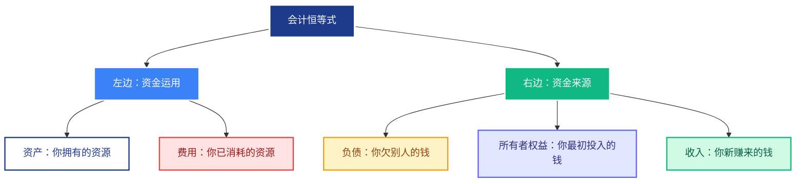

# 02. 会计核算方法_借贷记账法_复式记账法

## 1. 什么是复式记账法
**复式记账法：对任何一笔经济业务，都必须用相等金额分别在 借方 和 贷方 录入两个或两个以上有关科目。**

**每笔交易必须记在至少两个不同科目上，一个借方、一个贷方，金额相等。**
::: tip 恒等式
Asset（**资产**）=Liability（**负债**）+ Equity（**权益**）
:::

等式的左边为Debit（借方），右边为Credit（贷方）。

公式左边说明了钱的用途，右边呢是说明钱的来源。所以他们其实是同一事物的一体两面，当然是相等的。

它可以近似地简化理解为，左边的资产是“欠”的（==资产的用途==），右边是“欠谁的”（==资产的来源==）。这里的“借”和“贷”，更大程度上是记账符号，无论是汉语还是英语，都不能直接用字面意思去理解。

复式薄记相当于今天的“大数据”工具。其主要的核心思想就是从两个角度记录同一个经济事件，从而避免了错记，漏计的情况发生。

最简单的例子就是：A借给B 100元钱，用复式记账的思维看就是两点：

从A的角度记录：A借给B 100元，（借）

从B的角度记录：B欠A 100元借款。（贷）

这样从A，B两个人的角度都记录同一事件，双重核帐，对账的时候就能保证准确性。所以，会计在做账的时候一直唠叨，账平不平，就是指两个维度统计后金额是否一样。

再进一步来说，因为公司是会赚钱也会亏本的，所以上述恒等式还可以扩展成这样的形式：

::: tip 
Asset（资产）+ Expense（费用） = Liability（负债） + Equity（所有者权益）+ Income （收入）
:::




仔细观察一下这个恒等式，会发现：

- 等式左边表示钱/东西到哪里去了（要么还在公司手上，要么被公司花了）；当左侧增加，则记为(借)Debit，减少的话记为(贷)Credit；

- 右边表示钱/东西从哪里来的，右侧增加的话记为（贷）Credit增加，减少则记为（借）Debit。

本质上，商业活动无非就是资产的交换流动，是故【有借必有贷，借贷必相等】是复式薄记的核心原则。


## 2. 复式记账法有什么好处？

**复式借贷记账法的核心好处：记录完整轨迹，自动防止错误。**


1. **来龙去脉清晰**：每笔交易同时记录"钱从哪来"和"钱到哪去"，无法抵赖。比如你吃拉面20元，必须同时记录"现金减少20"和"餐饮费增加20"，不能只记一半。

2. **自动平衡校验**：借方总额必须等于贷方总额，不等就说明记错了，这是防错机制。

3. **全面财务视图**：所有科目联动，任何时候都能生成完整资产负债表和利润表，不会出现"钱对不上数"的情况。

4. **防止舞弊**：虚构交易必须同时伪造借贷双方，难度翻倍。单式记账只记一边，容易造假。

5. **便于审计追溯**：任何数字都能追溯到原始凭证和对应科目，查错效率极高。


## 3. 科目

- 所有科目都属于五类事项之一（资产、费用、负债、所有者权益、收入）

- 科目之间是联动的。科目在某些情况下发生变化，那么必然要在这个科目上记借或者贷。A科目记了借，必然有B科目要记贷！

- 同一个科目，可能记借，也可能记贷，取决于它是增加还是减少。
    - 科目性质决定它什么时候记借、什么时候记贷，而不是固化在某个方向。资产类科目增加时借、减少时贷；负债类科目增加时贷、减少时借；费用类增加时借；收入类增加时贷。

- 发生额平衡：所有分录借方合计 = 贷方合计
- 余额平衡：资产 + 费用 = 负债 + 权益 + 收入

现金科目
| 交易场景          | 现金变动   | 记账方向   | 分录                       | 说明          |
| ------------- | ------ | ------ | ------------------------ | ----------- |
| **收到工资5000元** | **增加** | **借方** | 借：现金 5000<br>贷：工资收入 5000 | 钱进来，资产增加记借方 |
| **吃饭花现金100元** | **减少** | **贷方** | 借：餐饮费 100<br>贷：现金 100    | 钱出去，资产减少记贷方 |
{.small}

- 科目余额是多方联动、加上自己轧差的结果。

再举一个：应收账款科目


| 交易场景 | 应收账款变动 | 记账方向 | 分录 | 说明 |
|----------|--------------|----------|------|------|
| **卖东西，客户欠你200元** | **增加** | **借方** | 借：应收账款 200<br>贷：销售收入 200 | 你有权收钱，资产增加记借方 |
| **客户还款200元** | **减少** | **贷方** | 借：现金 200<br>贷：应收账款 200 | 你收到钱，应收减少记贷方 |
{.small}

科目性质决定它**什么时候记借、什么时候记贷**，而不是固化在某个方向。资产类科目**增加时借、减少时贷**；负债类科目**增加时贷、减少时借**；费用类**增加时借**；收入类**增加时贷**。

### 一级科目分类

| 类别        | 编号规则 | 记账方向 | 期末余额 |
| --------- | ---- | ---- | ---- |
| **资产**    | 1 字头 | 增借减贷 | 借方   |
| **负债**    | 2 字头 | 增贷减借 | 贷方   |
| **所有者权益** | 4 字头 | 增贷减借 | 贷方   |
| **收入**    | 6 字头 | 增贷减借 | 无余额  |
| **费用**    | 5 字头 | 增借减贷 | 无余额  |
{.small}

### 常见业务处理
假设我有1000元入账，早上花20元吃了一碗拉面。

科目设置
```
1001 现金（资产类）
1005 费用（费用类）
  100502 餐饮费
    10050201 早餐
1003 所有者权益（权益类）
  100301 期初余额
```

**记账分录：**

**1. 初始状态（手上有1000元现金）**
```
借（资产费用增加记借）：现金        1000
贷（负债权益增加记贷）：期初余额    1000
```

**2. 吃早餐拉面20元**
```
借（资产费用增加记借）：餐饮费-早餐    20
贷（资产减少记贷）：现金           20
```

---

**最终简化估值表：**
| **资产** | **金额** | **权益** | **金额** |
|----------|----------|----------|----------|
| 现金 | 980 | 期初余额 | 1000 |
| | | **本期利润** | **-20** |
| **资产合计** | **980** | **权益合计** | **980** |
{.small}


