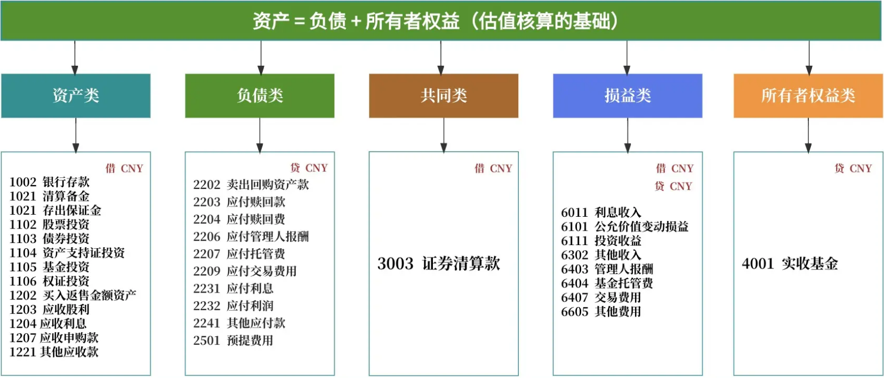

# 基金会计估值表

## 1. 会计科目

### 1.1 会计科目的定义与本质

#### 1.1.1 定义：对会计要素的具体内容进行分类核算的项目

会计科目是对会计要素（资产、负债、权益、收入、费用）的具体内容进行分类核算的项目。

会计要素，如资产、负债、所有者权益、收入和费用，是对企业经济活动的宏观概括。

例如，资产要素细分为"银行存款"、"股票投资"等科目，每个科目代表一类相同经济性质的业务，为财务报告和核算提供规范。

#### 1.1.2 本质：代表特定的经济内容或业务活动

会计科目的本质在于其能够精确地**代表特定的经济内容或业务活动**。每一个会计科目都不仅仅是一个名称或代号，它背后承载的是基金在运营过程中发生的具体经济事项。

例如，“银行存款”科目不仅代表了基金在银行账户中的资金，更反映了这些资金的流入和流出活动，如申购款到账、赎回款支付、投资收益分配等。

同样，“交易性股票投资”科目不仅记录了基金持有的股票资产，还涵盖了与股票投资相关的成本、估值增值或减值等详细信息 。

### 1.2 会计科目的核心作用

#### 1.2.1 复式记账法的基础

复式记账法的核心原则是“有借必有贷，借贷必相等”，它要求每一笔经济业务都必须同时在两个或两个以上相互关联的会计科目中进行记录，以反映资金运动的来龙去脉。

例如，当基金买入一只股票时，会计分录为：借记“交易性股票投资-成本”，贷记“证券清算款” 。这个分录清晰地表明，基金的资产形态发生了变化：一部分资金（证券清算款）转化为了另一种资产（股票投资）。

同样，在估值日，如果股票价格上涨，会计分录为：借记“交易性股票投资-估值增值”，贷记“公允价值变动损益” 。

这个分录则反映了基金资产价值的增加以及由此产生的未实现收益。

#### 1.2.2 系统记录与分类经济业务

会计科目的核心作用之一是对基金发生的纷繁复杂的经济业务进行系统化的记录和分类。基金在日常运作中会涉及大量的交易，包括股票、债券的买卖，申购赎回，利息股利的收取，以及各种费用的支付等。如果没有一个统一的分类标准，这些交易记录将变得杂乱无章，难以管理和分析。会计科目体系通过将经济业务按照其性质和内容归入不同的类别，如资产、负债、损益等，使得每一笔交易都能被清晰地定位和追踪。例如，所有与银行存款相关的收支都记录在“银行存款（1002）”科目下，所有与股票投资相关的成本和估值变动都记录在“交易性股票投资（1102）”科目下 。这种系统化的分类不仅便于日常的账务处理，也为后续的财务分析提供了便利。基金管理人可以通过查询特定科目的余额和发生额，快速了解某一类资产或负债的规模和变动情况，从而做出更明智的投资和管理决策。

#### 1.2.3 提供编制财务报表的数据基础

会计科目是编制财务报表的原始数据基础。财务报表，如资产负债表、利润表等，是对基金财务状况和经营成果的高度概括和综合反映。这些报表中的每一个数据项，都来源于相应的会计科目。例如，资产负债表中的“资产总计”是由所有资产类科目的余额汇总而来，而“负债总计”则是由所有负债类科目的余额汇总而来。利润表中的“投资收益”和“公允价值变动损益”等项目的金额，则直接取自相应的损益类科目 。因此，会计科目记录的准确性和完整性直接决定了财务报表的质量。只有确保每一笔经济业务都被正确地记入相应的会计科目，才能保证最终生成的财务报表真实、公允地反映基金的财务状况和经营成果，为投资者、监管机构等利益相关者提供可靠的决策依据。

## 2. 估值表与科目编号

### 2.1 估值表是什么

```
估值表 = 日终科目余额汇总表
```

你可以通过余额加加减减得出**静态恒等式**：
```
资产类借方余额合计
- 负债类贷方余额合计
= 所有者权益类贷方余额合计（基金资产净值）
```
这个等式必须在估值表上**精确相等**，否则报表错误。

---

**但你无法通过估值表余额得出动态恒等式**：
```
收入贷方余额 - 费用借方余额 = 利润
```

**原因**：
- **费用和收入科目在每日日终余额为0**
- 它们的当日发生额已**自动结转**到"本期利润"（所有者权益科目）
- 这个过程叫"损益结转"，在估值表生成前已完成

**举例：**
- 今天股票涨了100万：先记"借：股票投资 100，贷：公允价值变动损益 100"
- 日终结转后：再记"借：公允价值变动损益 100，贷：本期利润 100"
- 估值表上只显示： **"股票投资 +100"，"本期利润 +100"**
- **公允价值变动损益这个科目余额=0**，所以你看不到它

估值表是**已结转后的余额快照**，只能验证静态恒等式，动态过程藏在结转分录里。




#### 2.1.1 估值表常见科目
| 顺序号                             | 编号   | 会计科目名称    |
| ------------------------------- | ---- | --------- |
| <td colspan="3">**资产类**</td> {colspan=3 align="center"}|
| 1 | 1002 | 银行存款      |
| 2 | 1021 | 结算备付金     |
| 3 | 1031 | 存出保证金     |
| 4 | 1102 | 股票投资      |
| 5 | 1103 | 债券投资      |
| 6 | 1104 | 资产支持证券投资  |
| 7 | 1105 | 基金投资      |
| 8 | 1106 | 权证投资      |
| 9 | 1202 | 买入返售金融资产  |
| 10 | 1203 | 应收股利      |
| 11 | 1204 | 应收利息      |
| 12 | 1207 | 应收申购款     |
| 13 | 1221 | 其他应收款     |
| 14 | 1501 | 待摊费用      |
| <td>**负债类**</td> {colspan=3 align="center"}|
| 15 | 2001 | 短期借款      |
| 16 | 2101 | 交易性金融负债   |
| 17 | 2202 | 卖出回购金融资产款 |
| 18 | 2203 | 应付赎回款     |
| 19 | 2204 | 应付赎回费     |
| 20 | 2206 | 应付管理人报酬   |
| 21 | 2207 | 应付托管费     |
| 22 | 2208 | 应付销售服务费   |
| 23 | 2209 | 应付交易费用    |
| 24 | 2221 | 应交税费      |
| 25 | 2231 | 应付利息      |
| 26 | 2232 | 应付利润      |
| 27 | 2241 | 其他应付款     |
| 28 | 2501 | 预提费用      |
| <td colspan="3">**共同类**</td> {colspan=3 align="center"}|
| 29 | 3003 | 证券清算款     |
| 30 | 3101 | 远期投资      |
| 31 | 3102 | 其他衍生工具    |
| 32 | 3201 | 套期工具      |
| 33 | 3202 | 被套期项目     |
| <td colspan="3">**所有者权益类、即净资产类**</td> {colspan=3 align="center"} |
| 34 | 4001 | 实收基金      |
| 35 | 4011 | 损益平准金     |
| 36 | 4103 | 本期利润      |
| 37 | 4104 | 利润分配      |
| <td colspan="3">**损益类**</td> {colspan=3 align="center"}|
| 38 | 6011 | 利息收入      |
| 39 | 6101 | 公允价值变动损益  |
| 40 | 6111 | 投资收益      |
| 41 | 6302 | 其他收入      |
| 42 | 6403 | 管理人报酬     |
| 43 | 6404 | 托管费       |
| 44 | 6406 | 销售服务费     |
| 45 | 6407 | 交易费用      |
| 46 | 6411 | 利息支出      |
| 47 | 6605 | 其他费用      |
| 48 | 6901 | 以前年度损益调整  |
{.small}

#### 2.1.2 估值表常见概念解释

### 2.1 科目编号的规则与意义

编号的第一位数字通常用于区分会计要素的大类，如资产、负债、共同类等。后续的位数则用于进一步细分，形成总账科目、二级科目、三级科目乃至四级科目等多层次的科目结构。

这种层级化的编号方式，使得会计信息系统能够方便地进行数据汇总、分类查询和权限管理。

#### 2.1.1 编号规则：按类别和层级编排

基金会计科目的编号规则通常采用层次码（Hierarchical Code）的编排方式，即每一位或几位数字代表不同的层级和分类信息。这种编码方式使得科目体系结构清晰，便于计算机处理和人工识别。

通常，编号的第一位数字代表会计要素的**大类**，例如：
*   **1** 代表 **资产类** 科目
*   **2** 代表 **负债类** 科目
*   **3** 代表 **共同类** 科目（这类科目性质特殊，可能既有资产性质又有负债性质，如证券清算款）
*   **4** 代表 **所有者权益类** 科目
*   **5** 代表 **成本类** 科目
*   **6** 代表 **损益类** 科目

在第一位大类编码之后，后续的位数则用于表示更细的分类和层级。

例如，第二位和第三位数字可能代表**总账科目**，第四位和第五位代表**二级科目**，以此类推。

以“1002”为例，“1”表示资产类，“002”则代表“银行存款”这个总账科目。如果再细分，“100201”中的“01”可能代表“活期存款”这个二级科目。

这种层级化的编码规则，使得整个科目体系如同一棵倒置的树，从顶端的总类逐级向下细分到末端的明细项目。

#### 2.1.2 资产类科目（1字头）

在基金会计科目体系中，所有以数字“1”开头的科目均属于**资产类**科目。

::: tip 资产
资产是指基金过去的交易或事项形成的、由基金拥有或者控制的、预期会给基金带来经济利益的资源。
:::

资产类科目用于核算和反映基金所拥有或控制的各项资产的增减变动及结存情况。

根据流动性的不同，资产类科目通常可以进一步细分为流动资产和非流动资产。

流动资产是指在一年或一个营业周期内能够变现或耗用的资产，如“1001现金”、“1002银行存款”、“1101交易性金融资产”等。

非流动资产则是指流动资产以外的资产，如“1201长期股权投资”、“1301固定资产”等。在基金会计中，资产类科目的设置尤为细致，以准确反映基金投资组合的构成。例如，“1101交易性金融资产”下会根据投资品种（股票、债券、基金等）和市场（上海、深圳等）设置多个子级科目，以便精确核算各类投资的成本和公允价值变动。资产类科目的期末余额通常在借方，反映在资产负债表的左方，是构成基金资产净值的重要组成部分。

#### 2.1.3 负债类科目（2字头）

以数字“2”开头的会计科目被归类为**负债类**科目。
::: tip 负债
负债是指基金过去的交易或事项形成的、预期会导致经济利益流出基金的现时义务。
:::

简单来说，就是基金需要偿还的债务。

负债类科目用于核算和反映基金所承担的各项负债的形成、偿还及结存情况。

与资产类似，负债也可以根据偿还期限的长短分为流动负债和非流动负债。流动负债是指在一年或一个营业周期内需要偿还的债务，如“2001短期借款”、“2101应付证券清算款”、“2201应付管理人报酬”等。非流动负债则是指偿还期在一年以上的债务，如“2501长期借款”等。在基金运作过程中，负债类科目记录了基金因申购赎回、交易结算、费用计提等产生的各项债务。例如，当投资者赎回基金份额时，基金需要支付赎回款，这会形成一笔“应付赎回款”负债。负债类科目的期末余额通常在贷方，反映在资产负债表的右方，是计算基金资产净值时需要扣除的部分。

#### 2.1.4 共同类科目（3字头）

以数字“3”开头的科目在基金会计中被称为**共同类**科目。这类科目的性质比较特殊，它们既可能具有资产的性质，也可能具有负债的性质，具体取决于其余额的方向。

共同类科目主要用于核算在特定业务中，资产和负债相互交织、难以明确区分的项目。最典型的共同类科目就是“==3003证券清算款==”。在证券交易中，T日（交易日）发生的买卖，其资金的交割通常在T+1日或更晚完成。在T日收盘后，基金已经卖出了证券但尚未收到款，此时“证券清算款”科目就表现为一种**资产**（应收款）；反之，如果基金买入了证券但尚未支付款，该科目就表现为一种**负债**（应付款）。

因此，共同类科目的余额方向（借方或贷方）决定了其在资产负债表中的归属。

如果期末余额在借方，则作为资产列示；如果在贷方，则作为负债列示。

这种科目的设置，能够更准确地反映基金在特定时点的结算状态，避免了将一笔未完成的交易强行拆分为资产和负债两部分。

### 2.2 子级科目的定义与作用

#### 2.2.1 定义：对总账科目的进一步细分

子级科目，也称为明细科目，是对总账科目（一级科目）核算内容进行的进一步细分。总账科目通常只提供总括性的核算指标，例如“1002银行存款”科目，它只能反映基金银行存款的总额。然而，在实际的基金管理中，仅仅知道总额是远远不够的。基金可能同时在多家银行开设账户，并且存款的形式也多种多样，如活期存款、定期存款、协议存款等。为了更精细地管理和核算这些不同性质和来源的资金，就需要在“1002银行存款”这个总账科目下设置多个子级科目，如“100201活期存款”、“100202定期存款”等。这些子级科目就是二级科目。如果需要更详细的核算，还可以继续设置三级、四级科目。例如，在“100201活期存款”下，还可以按开户银行设置“10020101XX银行活期存款”等三级科目。这种层层细分的科目结构，形成了一个从总括到明细的核算体系，使得会计信息既能反映总体情况，又能深入到具体的细节。

#### 2.2.2 作用：满足更精细的核算与管理需求

设置子级科目的核心作用，在于满足基金内部精细化核算与管理的多元化需求。首先，**满足监管要求**。金融监管机构通常要求基金对资产进行详细的分类和披露，例如，需要分别报告在不同市场（上交所、深交所）的投资情况，或者不同类型存款（活期、定期）的余额。通过设置相应的子级科目，基金公司可以轻松地从会计系统中提取这些监管所需的数据，确保信息披露的准确性和合规性。其次，**支持内部管理与决策**。基金经理和投资团队需要了解投资组合的详细构成，例如，持有某只股票的股数、成本、市值等。通过在“交易性金融资产”科目下按股票代码设置明细科目，可以精确追踪每一只股票的投资情况，为投资决策提供数据支持。财务部门也需要通过明细科目来管理现金流，例如，通过“活期存款”和“定期存款”科目，可以清晰地掌握基金的流动性状况，合理安排资金的调度。最后，**便于对账与审计**。子级科目可以与银行对账单、券商对账单等外部凭证进行一一对应，极大地简化了对账工作，降低了差错率。在审计过程中，清晰的明细账目也使得审计师能够更有效地进行核查，提高了审计效率。

### 2.3 具体科目与子科目示例解析

#### 2.3.1 资产类科目示例：1002现金余额

“1002现金余额”是基金会计中一个典型的资产类总账科目，用于核算基金持有的所有现金及现金等价物。这个科目是基金资产中流动性最强的部分，直接关系到基金的日常运作和支付能力。为了精确管理和反映现金的不同存在形式和存放状态，该科目下通常会设置多个子级科目，进行明细核算。这种细分不仅有助于内部管理，也是满足信息披露和监管要求的重要手段。通过对不同子级科目的余额进行分析，基金管理人可以获得关于基金流动性、资金收益和潜在风险的全面视图。例如，活期存款的比例过高可能意味着资金利用效率有待提升，而定期存款和协议存款的比例则直接关系到基金的利息收入水平。因此，“1002现金余额”及其子级科目的设置，是基金流动性管理和收益管理的基础。

##### 2.3.1.1 100201活期存款

“100201活期存款”是“1002现金余额”下的一个二级科目，专门用于核算基金存放在银行或其他金融机构的、可以随时支取的存款。这类存款的特点是流动性极高，但利率通常较低。在基金会计中，该科目记录了所有活期存款账户的收支变动情况。基金管理人需要密切关注该科目的余额，以确保基金有足够的资金应对日常的赎回请求、支付各项费用以及抓住随时可能出现的投资机会。该科目的期末余额直接反映了基金最具即时支付能力的资金规模。在编制现金流量表时，该科目的变动是计算经营活动、投资活动和筹资活动现金流量的重要依据。通过对该科目交易流水的分析，可以清晰地看到基金的资金流向，例如，资金是从哪个账户划出用于购买证券，或是从哪个账户收到赎回款。

##### 2.3.1.2 100202定期存款

“100202定期存款”是“1002现金余额”下的另一个二级科目，用于核算基金与银行约定存期、到期一次性支取本息的存款。与活期存款相比，定期存款的流动性较差，在存期内提前支取通常会损失部分利息，但其利率相对较高，能够为基金带来更稳定的利息收入。基金管理人通常会根据对未来资金需求的预测，将一部分暂时不用的闲置资金配置为定期存款，以提高资金的整体收益水平。该科目的设置，使得基金能够清晰地核算和管理这部分具有特定到期日的资产。在资产负债表中，定期存款需要根据到期日的长短，分别列示为“货币资金”或“其他流动资产”。例如，到期日在三个月以内的定期存款通常被视为现金等价物，计入“货币资金”；而到期日超过三个月的，则可能计入“其他流动资产”。

##### 2.3.1.3 100203协议存款

“100203协议存款”是“1002现金余额”下的一个较为特殊的二级科目，用于核算基金根据与银行签订的协议存入的、利率和期限由双方协商确定的存款。协议存款通常是大额存款，其利率一般高于同期的定期存款利率，是基金管理人进行现金管理、提高资金收益的重要工具。该科目的设置，专门用于区分这类通过特殊协议安排的存款，便于对其进行单独的核算和管理。协议存款的条款（如利率、期限、提前支取条件等）通常比较复杂，通过设立独立的会计科目，可以更好地跟踪和管理这些协议的具体执行情况。在信息披露时，协议存款通常也需要作为“银行存款”的一个子项进行单独说明，以向投资者揭示这部分资产的性质和风险收益特征。

##### 2.3.1.4 100206应计利息

“100206应计利息”是“1002现金余额”下的一个备抵或附加性质的二级科目，更准确地说，它通常作为“应收利息”科目下的一个明细科目，用于核算基金持有的银行存款（包括活期、定期、协议存款等）在报告期内已经发生但尚未收到的利息收入。根据权责发生制原则，只要利息收入的权利已经产生，无论款项是否收到，都应在当期确认为收入。因此，在每个估值日（通常是每个工作日），基金需要计算截至当日累计的应收利息，并进行相应的会计处理。该科目的设置，确保了利息收入在时间和金额上的准确计量，使得基金的收益能够平滑、持续地反映在净值中，而不是在利息实际到账时才一次性确认。这有助于更真实地反映基金的日常经营成果，避免了收益的剧烈波动。

#### 2.3.2 共同类科目示例：3003证券清算款

“3003证券清算款”是基金会计中一个典型的共同类科目，用于核算基金在进行证券买卖交易后，与证券登记结算机构（如中国证券登记结算有限责任公司）之间发生的、尚未完成最终资金交收的款项。这个科目的性质非常特殊，它兼具资产和负债的双重属性。当基金卖出证券时，在资金到账前，这笔应收的款项就记在“证券清算款”的借方，表现为基金的资产；反之，当基金买入证券时，在资金划出前，这笔应付的款项就记在“证券清算款”的贷方，表现为基金的负债。该科目的设置，精确地反映了基金在交易日（T日）和交收日（T+1日）之间的资金结算状态，是连接证券交易和资金变动的关键环节。为了清晰地核算不同市场、不同交易品种的清算情况，该科目下通常会设置详细的子级科目。

##### 2.3.2.1 300301上海证券清算款

“300301上海证券清算款”是“3003证券清算款”下的一个二级科目，专门用于核算基金在上海证券交易所（SSE）进行证券买卖所产生的清算款项。由于中国证券市场分为上海和深圳两个独立的交易系统，其清算规则和结算机构也有所不同，因此需要分别设置科目进行核算。这个科目下会汇总所有在上海市场进行的股票、债券、基金等交易的应收应付资金。例如，基金在T日卖出了一只在上交所上市的股票，那么在T日估值时，这笔交易的成交金额（扣除相关费用后）就会作为一笔应收款，借记“300301上海证券清算款”科目。通过设置这个科目，基金管理人能够清晰地掌握在上海市场的交易结算情况，便于与上交所的结算数据进行对账，确保资金清算的准确无误。

##### 2.3.2.2 30030101上交所证券清算款

“30030101上交所证券清算款”是“300301上海证券清算款”下的一个三级科目，其核算内容与上级科目基本一致，但可能在内部管理或系统设置上用于更精细的区分。在某些会计系统中，可能会将“上交所”和“上海新股”等不同类型的清算业务在三级科目层面进行划分。例如，这个科目可能专门用于核算在上海市场进行的已上市证券（股票、债券等）的二级市场买卖所产生的清算款。通过这种更细化的科目设置，可以进一步加强对不同交易类型的管理和监控。例如，在进行对账时，可以将二级市场的交易清算数据与新股发行的清算数据分开核对，提高了对账的效率和准确性。这种精细化的科目体系，体现了基金会计核算的严谨性和对风险控制的高度重视。

##### 2.3.2.3 30030102上海新股清算款

“30030102上海新股清算款”是“300301上海证券清算款”下的另一个三级科目，专门用于核算基金参与在上海市场发行的新股（IPO）申购、中签及缴款等过程中产生的清算款项。新股申购和交易与二级市场的买卖在业务流程和资金结算上有所不同。例如，申购新股时需要冻结资金，中签后需要缴款，未中签部分资金会解冻退回。这些特殊的资金流动需要通过专门的会计科目进行核算。设置“上海新股清算款”这个子级科目，可以将新股相关的资金往来与日常的证券交易清算清晰地区分开来，便于基金管理人准确追踪每一笔新股申购的资金状态（冻结、缴款、退回），并进行相应的会计核算。这对于管理基金的现金流、计算新股投资的成本和收益至关重要，同时也满足了监管机构对于新股申购业务信息披露的要求。

## 3. 主要账务处理规则

### 3.1 资产类

#### 1002 银行存款 
一、本科目核算存入银行或其他金融机构的各种款项，包括活期存款、协议存款和定期存款等。

二、本科目可按存款种类等设置“银行存款日记账”，并根据收付款凭证，按照业务的发生顺序逐笔登记。每日终了，应结出余额。

三、银行存款的主要账务处理
（一）增加银行存款，借记本科目，贷记有关科目；减少银行存款做相反的会计分录。
（二）在存款期内逐日计提银行存款利息，按约定利率确认存款利息收入，借记“应收利息”科目，贷记“利息收入（存款利息收入）”科目；实际结息时，借记本科目，贷记“应收利息”科目。
四、本科目期末借方余额，反映实际存在银行或其他金融机构的款项。

#### 1021 结算备付金

一、本科目核算为证券交易的资金结算而存入证券登记结算机构的款项。
二、本科目可按不同证券登记结算机构进行明细核算。
三、结算备付金的主要账务处理

（一）将款项存入证券登记结算机构，借记本科目，贷记“银行存款”科目；从证券登记结算机构划回资金做相反的会计分录。
（二）通过证券交易所买卖证券，资金交收日应分别以下情况进行账务处理：
1．如果买入证券成交总额大于卖出证券成交总额，按资金交收日实际交收的款项，借记“证券清算款”科目，贷记“银行存款”或本科目。
2．如果卖出证券成交总额大于买入证券成交总额，按资金交收日实际收到的款项，借记“银行存款”或本科目，贷记“证券清算款”科目。
（三）逐日计提结算备付金的利息，借记“应收利息”科目，贷记“利息收入（存款利息收入）”科目；实际结息时，借记“银行存款”或本科目，贷记“应收利息”科目。
四、本科目期末借方余额，反映实际存入证券登记结算机构尚未用于结算的款项。

### 3.2 负债类

### 3.3 共同类

#### 3003 证券清算款

一、本科目核算因买卖证券、回购证券、申购新股、配售股、ETF 现金替代等业务而发生的，应与证券登记结算机构或证券易对手方办理资金结算的款项。
二、本科目可按不同证券登记结算机构或证券交易对手方等进行明细核算。
三、证券清算款的主要账务处理
（一）基金因买卖证券、回购证券、申购新股、配售股票等业务而发生的，应与证券登记结算机构或证券交易对手方办理资金结算的款项，比照相关资产或负债类科目的有关规定进行账务处理。

（二）ETF 现金替代和现金差额
投资者申购、赎回 ETF 时，应设置“现金替代款”和“现金差额”明细科目分别反映所产生的现金替代款和现金差额等。

1.“现金替代款”明细科目核算投资者采用现金替代方式申购、赎回 ETF 基金时尚未交收的现金替代金额。申购 ETF 发生现金替代时，借记本科目（现金替代款）等科目，贷记有关科目。结转现金替代款时，借记“银行存款”或“结算备付金”等科目，贷记本科目（现金替代款）。赎回 ETF 发生现金替代时，借记有关科目，贷记本科目（现金替代款）等科目。结转现金替代款时，借记本科目（现金替代款），贷记“银行存款”或“结算备付金”等科目。

2.“现金差额”明细科目核算申购、赎回份额的资产净值与按当日收盘价计算的申购、赎回份额中组合证券市值和现金替代的差额。确认申购 ETF 份额及构成、并计算现金差额时，借记本科目（现金差额）等科目，贷记有关科目。结转现金差额时，借记“银行存款”或“结算备付金”科目，贷记本科目（现金差额）。确认赎回 ETF 份额及构成、并计算现金差额时，借记有关科目，贷记本科目（现金差额）等科目。结转现金差额时，借记本科目（现金差额），贷记“银行存款”或“结算备付金”科目。

四、本科目所属明细科目期末借方余额，反映尚未收回的证券清算款；本科目所属明细科目贷方余额，反映尚未支付的证券清算款。

## 3. 复式记账法在基金估值中的应用与示例

### 3.1 基金估值的核心：公允价值计量

#### 3.1.1 估值日的定义与重要性

基金估值日是指基金管理人按照基金合同的约定，对基金资产进行估值并计算基金份额净值的特定日期。通常，**开放式基金每个交易日都会进行估值**，并公布当日的基金份额净值。估值日的设定对于基金的运作具有至关重要的意义。首先，它是计算基金份额净值的基础。基金份额净值是基金资产净值除以基金总份额得出的结果，是投资者申购、赎回基金份额的价格依据。准确的估值是确保交易公平性的前提。其次，估值日是评估基金投资业绩的关键时点。通过比较不同估值日的基金净值，可以计算出基金的收益率，从而评估基金管理人的投资管理能力。最后，估值也是基金会计核算的核心环节。在每个估值日，基金管理人需要根据市场公允价值对所有投资资产进行重新计量，并将公允价值的变动计入当期损益，这直接关系到基金的财务报表和投资者的最终收益。

#### 3.1.2 公允价值变动对基金净值的影响

公允价值变动是影响基金净值的最主要因素。基金持有的股票、债券等金融资产，其市场价格会随着宏观经济、行业政策、公司经营状况等多种因素而波动。在每个估值日，基金管理人需要将这些资产按照当日的公允价值（通常是收盘价）进行重新估值。如果资产的市场价格高于其上一估值日的账面价值，就产生了**估值增值**，这将增加基金的资产净值；反之，如果市场价格低于账面价值，则产生**估值减值**，会减少基金的资产净值。这种因公允价值变动而产生的未实现损益，通过“公允价值变动损益”科目计入当期利润，并最终影响基金的累计净值和可供分配利润。因此，公允价值的变动直接决定了基金净值的涨跌，是投资者关注的核心指标。

### 3.2 估值调整的会计处理：复式记账法实例

#### 3.2.1 股票估值增值的会计分录

当基金持有的股票在估值日出现价格上涨，即发生估值增值时，基金管理人需要进行相应的会计处理，以反映这部分未实现的收益。根据《证券投资基金会计核算业务指引》，具体的会计分录如下 ：

##### 3.2.1.1 借：交易性股票投资（估值增值）

在股票估值增值的情况下，会计分录的借方是“交易性股票投资”科目下的“估值增值”子级科目。这个科目的借方发生额表示基金持有的股票投资因市场价格上涨而增加的账面价值。

通过借记该科目，基金的资产总额相应增加，这直接体现在资产负债表的资产方。这一处理符合会计准则中关于以公允价值计量的金融资产应按公允价值进行后续计量的要求，确保了基金资产账面价值与市场价值的一致性。

##### 3.2.1.2 贷：公允价值变动损益

会计分录的贷方是“公允价值变动损益”科目。这个科目属于损益类科目，用于核算基金持有的以公允价值计量的金融资产因公允价值变动而形成的利得或损失。当股票估值增值时，贷记“公允价值变动损益”科目，表示基金产生了一笔未实现的收益。这笔收益将计入当期的利润表，增加基金的当期利润。通过这种方式，复式记账法不仅调整了资产的账面价值，同时也确认了由此产生的损益，完整地反映了经济业务的实质。

#### 3.2.2 股票估值减值的会计分录

与估值增值相反，当基金持有的股票在估值日出现价格下跌，即发生估值减值时，会计处理的方向会完全相反。具体的会计分录如下 ：

##### 3.2.2.1 借：公允价值变动损益

在股票估值减值的情况下，会计分录的借方是“公允价值变动损益”科目。借记该科目表示基金因股票价格下跌而产生了一笔未实现的损失。这笔损失将冲减当期的利润，体现在利润表的“公允价值变动损益”项目中。通过这种方式，基金的当期收益会受到负面影响，这真实地反映了市场波动对基金投资组合价值的侵蚀。

##### 3.2.2.2 贷：交易性股票投资（估值增值）

会计分录的贷方是“交易性股票投资”科目下的“估值增值”子级科目。如果该科目原先有借方余额（即之前有过估值增值），则通过贷记该科目来冲减其账面价值。如果股票价格下跌的幅度超过了之前的增值部分，甚至可能导致“估值增值”科目出现贷方余额，或者需要进一步冲减“成本”科目。通过贷记“估值增值”科目，基金的资产总额相应减少，这直接体现在资产负债表的资产方。这一处理同样确保了基金资产账面价值能够及时、准确地反映其市场公允价值。

### 3.3 基金估值表：复式记账结果的集中体现

#### 3.3.1 估值表的结构

基金估值表是基金每日会计核算结果的集中体现，它就像一面“镜子”，清晰地展示了基金资产的价值构成、净值变化及投资组合情况 。估值表的结构通常包括三个主要部分：表头、科目体系和统计指标。

##### 3.3.1.1 表头：统计维度与数据来源

估值表的表头部分定义了报表的统计维度和数据来源。它通常包含多个栏目，如“科目”、“数量”、“成本”、“行情”、“估值增值”等 。这些栏目体现了估值表数据的统计维度和来源。“科目”栏列出了基金所涉及的所有会计科目；“数量”栏记录了持有的证券数量；“成本”栏记录了投资的初始成本；“行情”栏则反映了证券在估值日的市场价格；而“估值增值”栏则是“成本”与“行情”计算得出的结果，直接体现了公允价值的变动。现代估值表多为多行表头，尤其是在涉及本币外币汇兑的情况下，表头会更加复杂，以提供更全面的信息。

##### 3.3.1.2 科目体系：资产、负债与共同类科目

估值表的中间部分是其核心，即科目体系。这部分汇总了基金所有的资产、负债和共同类科目，并最终计算出基金的单位净值（NAV）。根据基金会计的惯例，估值表主要展现资产类（1字头）、负债类（2字头）和共同类（3字头）科目 。资产类科目汇总了基金持有的所有资产市值，如股票、债券、银行存款等；负债类科目汇总了基金应承担的所有负债金额，如应付赎回款、应付管理费等；共同类科目则反映了基金在途的资金或证券。通过资产总额减去负债总额，即可得到基金的净资产，再除以基金份额总数，就得到了基金的单位净值。


#### 3.3.2 估值表中的科目层级

##### 3.3.2.1 四级科目展示

为了满足精细化核算和管理的需求，基金会计科目通常设置为四级结构，而估值表科目一般也能按四级进行展示 。这种层级化的科目结构使得信息可以从宏观到微观逐层展开。第一级是总账科目，如“1102 股票投资”；第二级可以是按投资类型或市场分类的科目，如“110201 上海股票投资”；第三级可以是具体的证券代码，如“11020101 A公司股票”；第四级则可以是最明细的核算项目，如“1102010101 成本”、“1102010102 估值增值”。这种四级结构使得估值表既能提供总体的投资组合概览，也能深入到每一笔投资的细节，为多维度的分析和管理提供了可能。

##### 3.3.2.2 所有者权益与损益类科目的处理

在基金估值表中，通常不直接展示所有者权益类（4字头）和损益类（6字头）科目 。这是因为估值表的核心目的是展示基金在某一特定时点（通常是交易日收盘后）的资产、负债和净值状况，是一个静态的“快照”。所有者权益类科目，如“实收基金”、“本期利润”等，其变动情况通常在所有者权益（基金净值）变动表中详细列示。而损益类科目，如“公允价值变动损益”、“投资收益”等，其发生额和累计额则在利润表中反映。估值表通过计算资产减去负债的差额，直接得出基金的净资产，这个净资产就代表了所有者权益的总额。虽然损益类科目不直接出现在估值表中，但“估值增值”等项目实际上就是损益类科目“公允价值变动损益”在资产类科目中的体现，是复式记账法在报表中的具体应用。